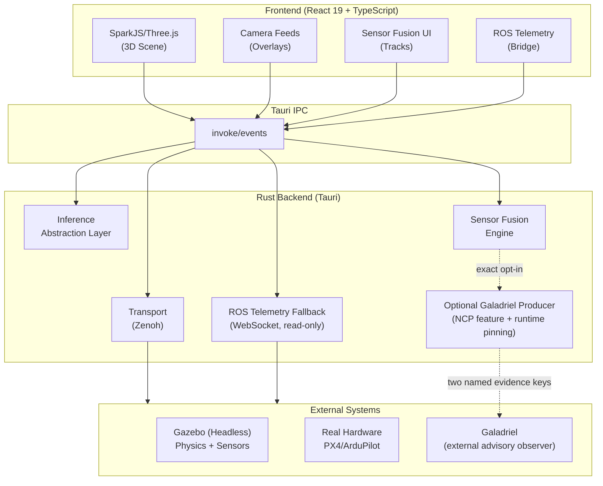

# CREBAIN

**Adaptive Response & Awareness System (ARAS)**
*DE: Adaptives Reaktions- und Aufklärungssystem*

[](https://github.com/sepahead/crebain/actions/workflows/ci.yml)
[](https://github.com/sepahead/crebain/actions/workflows/codeql.yml)
[](https://github.com/sepahead/crebain/actions/workflows/audit.yml)
[](#license)

<p align="center">
  <picture>
    <source media="(prefers-color-scheme: dark)" srcset="assets/logo-dark.svg">
    
  </picture>
</p>

CREBAIN is a research prototype for studying tactical visualization and
autonomy: a Tauri desktop app that renders Gaussian-splat 3D scenes, places
simulated surveillance cameras in them, runs ML object detection on the camera
feeds through platform-native backends, fuses multi-modal sensor measurements
into persistent 3D tracks in Rust, and talks to ROS/Gazebo for drone
simulation. An off-by-default native NCP feature can emit narrowly scoped,
Galadriel-compatible advisory evidence. Built with Tauri 2, React 19,
SparkJS/Three.js, and Rust.

> **Project status.** This is a research prototype, not a product. No model
> weights ship with the repository. Capability statuses below are tracked here
> and treated as unverified until measured on target hardware — performance
> claims require a recorded model, fixture, backend, invocation, and hardware
> context from your own deployment. Experimental backends are opt-in. See the
> [Disclaimer](#disclaimer).

| Capability | Description | Status |
| ---------- | ----------- | ------ |
| **3D Visualization** | Gaussian Splatting + self-contained GLB models via Three.js (WebGL) | Prototype |
| **Multi-Camera Surveillance** | Up to 64 placeable cameras (static / PTZ / patrol); live feed thumbnails for the first 4 | Prototype |
| **ML Detection** | Object detection pipeline with CoreML/ONNX paths and experimental backends | Prototype |
| **Sensor Fusion** | 5 filter algorithms (KF/EKF/UKF/PF/IMM) for multi-modal tracking | Prototype |
| **Drone Physics** | 120Hz quadcopter aerodynamics simulation | In Progress |
| **ROS Integration** | Read-only Zenoh product telemetry + development/native rosbridge telemetry fallback | In Progress |
| **Galadriel Evidence** | Feature-gated, exact-runtime-opt-in producer with immutable pinned registry/config/executable, two bounded NCP evidence routes, strict time/projection eligibility, upstream/capacity loss degradation, and heartbeat accounting; deployed receiver/security evidence remains pending | Component-tested |
| **Plant Authority** | Dependency-free headless lifecycle/channel/passive-expiry foundation, inactive draft command contract with no command ingress, profile-neutral same-frame-instance ENU/NED + FLU/FRD velocity-axis corpus, generic retained snapshots, a closed immutable context-bound health-snapshot candidate, and a profile-bound classifier for eight ages captured at one read against caller-proposed nonzero exclusive limits; self-check only—within-limit is not current freshness or health, frame/source identity is caller-supplied and unattested, and there is no authenticated collector, durable epoch ownership, approved profile/age policy, aggregate verdict, apply-time gate, active watchdog, or FCU adapter | L0 Foundation |
| **Cross-Platform** | macOS (Apple Silicon) + NixOS (CUDA) | In Progress |

---

## Quickstart

### macOS (Apple Silicon)

```bash
# Prerequisites (rustup honors the repo's pinned toolchain; a brew-installed
# rust does not)
xcode-select --install
brew install bun rustup

# Clone and setup
git clone https://github.com/sepahead/crebain.git

# From the repository root
bun install

# Build backend (CoreML is used automatically on macOS)
cargo build --locked --manifest-path src-tauri/Cargo.toml --release

# Run
bun run tauri:dev
```

### NixOS (NVIDIA CUDA)

```bash
# Clone
git clone https://github.com/sepahead/crebain.git

# Enter the CUDA dev environment
nix develop .#cuda
#
# Plain `nix develop` auto-detects CUDA only under impure evaluation
# (`nix develop --impure`); the .#cuda shell is the reliable path.
# The Nix shells set LD_LIBRARY_PATH for CUDA/TensorRT and driver libraries
# and pre-set ORT_DYLIB_PATH to the nixpkgs libonnxruntime.so.

# Install frontend deps and run
bun install
bun run tauri:dev
```

### Model setup

This repo does **not** ship model weights. Provide your own model files and
ensure you have the rights to redistribute them. Without a model the app still
runs — scenes, cameras, and simulation all work; the diagnostics UI reports
which detection backend, if any, is available.

| Platform | Model Path | Format |
| -------- | ---------- | ------ |
| macOS | `CREBAIN_MODEL_PATH=/path/to/model.mlmodelc` | CoreML (`.mlmodelc` directory) |
| Linux (NVIDIA) | `CREBAIN_ONNX_MODEL=/path/to/model.onnx` | ONNX (CUDA/TensorRT via ONNX Runtime) |

For local development you can also drop models into these paths (ignored by
git): `src-tauri/resources/yolov8s.mlmodelc/` (macOS) or
`src-tauri/resources/yolov8s.onnx` (Linux). The shared ONNX/TensorRT
postprocessor expects YOLOv8 COCO-80 output shaped `[1,84,N]` or `[1,N,84]`;
the CoreML path uses Vision and needs an NMS-wrapped `.mlmodelc`. See
[docs/MODEL_CONTRACTS.md](docs/MODEL_CONTRACTS.md) for what a model must
satisfy before its detections are trusted.

### First scene

Sample Gaussian-splat scenes (with download commands and licensing notes) are
listed in [public/splats/README.md](public/splats/README.md). Drag a scene
file onto the viewer or open it with `Ctrl/Cmd+O`.

---

## Using the app

1. **Launch the app**: `bun run tauri:dev`
2. **Load a scene**: Drag and drop a `.spz`/`.ply`/`.splat`/`.ksplat` file (or
   a `.glb` model / image floor texture), or use Ctrl+O (Cmd+O on macOS)
3. **Place cameras**: Press 1/2/3 to enter camera placement mode, click to place
4. **Enable detection**: Detection runs automatically on camera feeds in the
   native app (toggle with Y)
5. **View performance**: Press P to toggle the performance panel
6. **Sensor fusion**: Press U to expand/collapse the sensor fusion panel
7. **Connect ROS**: Press N to open the ROS connection panel
8. **Splat performance mode**: Press M to toggle a 1.5M splat cap (reloads the
   current splat; press again for full quality)

Essential keys — the full keymap lives in [docs/CONTROLS.md](docs/CONTROLS.md):

| Key | Action |
| --- | ------ |
| W/A/S/D + Q/E | Fly camera (Shift sprint, Ctrl/Cmd precision) |
| 1 / 2 / 3 | Place static / PTZ / patrol camera |
| Tab | Cycle cameras |
| V | Toggle camera feeds |
| T / Y | Toggle detection panel / detection on-off |
| U | Sensor fusion panel |
| N | ROS connection panel |
| Esc | Cancel placement / clear selection (also emergency-disarms all drones) |

Scene JSON is bounded to 10 MiB; splats to 256 MiB; GLB models must be
self-contained GLB 2.0 (embedded buffers and PNG/JPEG textures only —
standalone `.gltf` and external-resource references are rejected). The full
enforced limits are in
[docs/CONFIGURATION.md](docs/CONFIGURATION.md#scene-and-asset-limits).

The interface is German-first by design (camera types: SK = static camera,
PTZ = pan-tilt-zoom, PK = patrol camera) with a grayscale, tactical-signal
aesthetic and a project-specific 4-level threat scale (1=minimal, 2=guarded,
3=elevated, 4=severe).

---

## ML detection

- **Platform-native backends**: CoreML by default on macOS; TensorRT/CUDA on
  Linux (NVIDIA); ONNX Runtime as the universal fallback, preferring
  accelerated execution providers where available with CPU as last resort.
- **MLX is experimental, opt-in** (`CREBAIN_ENABLE_EXPERIMENTAL_MLX=1`,
  required even with `CREBAIN_BACKEND=mlx`): a Candle-on-Metal YOLOv8
  safetensors forward/postprocess path that still
  requires external model-contract validation before release claims.
- **Detection classes** (tactical mapping): `drone`, `bird`, `aircraft`,
  `helicopter`, `unknown`. These five labels are a downstream application
  taxonomy, not the native model tensor contract — a five-class exporter is
  not drop-in compatible. See
  [docs/MODEL_CONTRACTS.md](docs/MODEL_CONTRACTS.md).

## Sensor fusion

CREBAIN runs two fusion engines: a native Rust multi-modal tracker
(`src-tauri/src/sensor_fusion.rs`, the default — it is what the Sensor Fusion
panel displays) and a browser-only multi-camera triangulation engine.
Measurements from six modalities (visual, thermal, acoustic, radar, lidar,
radio-frequency) are associated to tracks with a Mahalanobis gate and fused
into persistent 3D tracks with a Tentative → Confirmed → Coasting → Lost
lifecycle (sliding-window M-of-N confirmation, default 3-of-5), using a
selectable filter: Kalman, Extended Kalman (default), Unscented Kalman,
Particle, or IMM (CV + Coordinated-Turn).

**Full design reference:** [docs/SENSOR_FUSION.md](docs/SENSOR_FUSION.md) —
the estimation math, the per-modality coordinate contract, data association,
tuning, validation, and a frank list of known limitations.

---

## Architecture



The frontend captures camera-feed frames from WebGL render targets, sends them
over Tauri IPC to the Rust backend for detection, and overlays the results;
sensor measurements flow into the Rust fusion engine the same way. Gazebo runs
headless — physics and sensor generation only — while all user-facing
rendering happens in Three.js. Design rationale, transport trade-offs, the
backend-selection logic, and the annotated directory map live in
[docs/ARCHITECTURE.md](docs/ARCHITECTURE.md).

```
crebain/
├── src/               # React frontend (components, hooks, ros, detection,
│                      #   physics, simulation, state, neuro, lib)
├── src-tauri/         # Rust backend (inference, transport, sensor fusion,
│                      #   native CoreML/ONNX, NCP bridge + Galadriel producer)
├── ros/               # ROS 1 reference package (crebain_msgs + launch files)
├── docs/              # Design docs, contracts, release gates
├── scripts/           # Version-coherence, bundle-size, perf-smoke checks
├── public/            # Static assets (models, splat samples)
└── flake.nix          # Nix dev shells and build configuration
```

---

## ROS / Gazebo simulation

```bash
# Terminal 1: Gazebo Classic + rosbridge via the packaged launch
# (see ros/README.md; gui:=false is the documented headless mode)
roslaunch crebain_msgs simulation.launch gui:=false

# ...or run your own world headless with a standalone rosbridge:
#   gzserver your_world.sdf
#   roslaunch rosbridge_server rosbridge_websocket.launch

# Terminal 2: CREBAIN development build — select the development-only
# rosbridge telemetry adapter and connect to ws://localhost:9090
bun run tauri:dev
```

Packaged builds expose only the native read-only telemetry path and default to
**Zenoh (Tauri)**. Vite development builds may additionally select a
TypeScript rosbridge WebSocket adapter for telemetry experiments; production
aliases that adapter to a network-free fail-closed stub and the packaged CSP
does not permit rosbridge sockets. The native Rust rosbridge fallback selected
with `CREBAIN_ZENOH=0` is also subscription-only. None of these ROS telemetry
paths can publish pose/twist/setpoints, call ROS/Gazebo services, spawn models,
or change MAVROS modes/missions. A separate binary compiled with `ncp` may,
only when `CREBAIN_GALADRIEL_ENABLE=1` and every deployment pin validates, put
strict evidence on `galadriel-pid` and `galadriel-monitor` named-perception
keys. It is not a generic ROS/action/FCU publisher. The remaining
guidance/interception calculation is a disabled-by-default, local
`NoAuthority` preview; disabling it,
disconnecting, or toggling simulation off aborts and discards the preview
generation.

Every packaged frontend build verifies the resolved Vite module graph, excludes
the development adapter, and content-hashes and scans every finalized JavaScript
chunk before it can succeed. Bounded renderer asset downloads remain confined
to the documented relative, HTTPS, and HTTP-loopback source policy; passive
image URLs do not receive a general HTTPS CSP allowance.

The native Zenoh transport speaks CREBAIN's own plain-key scheme; direct
interop with an `rmw_zenoh_cpp` ROS 2 graph requires an explicit re-keying
bridge. Topic templates, reference-only message/service definitions and launch
files, and the camera wire contract are documented in
[ros/README.md](ros/README.md).

An optional, off-by-default NCP (Engram) bridge exists behind the Rust `ncp`
feature; its Tauri commands are not registered in the product runtime and
there is no always-on CREBAIN↔Engram control loop. The same feature also contains
the separately gated Galadriel evidence producer; its component wiring does not
prove a deployed Galadriel receiver, TLS/mTLS identities, ACLs, or delivery. See
[docs/NCP_BRIDGE_HANDOFF.md](docs/NCP_BRIDGE_HANDOFF.md) and
[docs/GALADRIEL_PRODUCER.md](docs/GALADRIEL_PRODUCER.md).

---

## Configuration essentials

| Variable | Purpose |
| -------- | ------- |
| `CREBAIN_MODEL_PATH` | CoreML model path (macOS) |
| `CREBAIN_ONNX_MODEL` | ONNX model path (Linux) |
| `CREBAIN_BACKEND` | Force a backend: `coreml`, `mlx`, `tensorrt`, `cuda`, `onnx` |
| `CREBAIN_ENABLE_EXPERIMENTAL_MLX` | Required gate for any MLX use |
| `CREBAIN_GALADRIEL_ENABLE` | Exact runtime gate (`1`) for a Galadriel producer compiled with `ncp`; enabled startup also requires the documented registry/config/executable/NCP pins |

The full environment-variable reference, detection/guidance settings, scene
and asset limits, and the platform matrix are in
[docs/CONFIGURATION.md](docs/CONFIGURATION.md).

---

## Documentation

| Document | What it covers |
| -------- | -------------- |
| [docs/ARCHITECTURE.md](docs/ARCHITECTURE.md) | Design principles, transport trade-offs, backend selection, directory map |
| [docs/SENSOR_FUSION.md](docs/SENSOR_FUSION.md) | Fusion math, coordinate contracts, tuning, known limitations |
| [docs/MODEL_CONTRACTS.md](docs/MODEL_CONTRACTS.md) | What a model must prove before its detections are trusted |
| [docs/NATIVE_DETECTOR_BENCHMARK.md](docs/NATIVE_DETECTOR_BENCHMARK.md) | Release-command native detector latency artifact and evidence limits |
| [docs/CONFIGURATION.md](docs/CONFIGURATION.md) | Environment variables, settings, scene/asset limits |
| [docs/GALADRIEL_PRODUCER.md](docs/GALADRIEL_PRODUCER.md) | Optional live evidence routes, deployment pins, bounds, and claim limits |
| [docs/CONTROLS.md](docs/CONTROLS.md) | Full keyboard reference |
| [ros/README.md](ros/README.md) | ROS package, topics, launch files, camera wire contract |
| [docs/NCP_BRIDGE_HANDOFF.md](docs/NCP_BRIDGE_HANDOFF.md) | Optional NCP/Engram bridge status and boundaries |
| [docs/PLANT_CONTRACT_V1.md](docs/PLANT_CONTRACT_V1.md) | Inactive draft command contract, frame corpus, and limits |
| [docs/PLANT_HEALTH_V1.md](docs/PLANT_HEALTH_V1.md) | Inactive typed vehicle-health snapshot and evidence limits |
| [docs/PLANT_FRESHNESS_V1.md](docs/PLANT_FRESHNESS_V1.md) | Inactive profile-bound captured-read health-age classifier |
| [docs/RELEASE_ACCEPTANCE.md](docs/RELEASE_ACCEPTANCE.md) | Release-candidate evidence gates |
| [docs/MANUAL_SMOKE_TEST.md](docs/MANUAL_SMOKE_TEST.md) | Manual smoke checklist |
| [docs/RELEASE_EVIDENCE.md](docs/RELEASE_EVIDENCE.md) | Release evidence log |
| [docs/BACKLOG.md](docs/BACKLOG.md) | Current engineering backlog |
| [SECURITY.md](SECURITY.md) | Security policy and threat model |
| [CONTRIBUTING.md](CONTRIBUTING.md) | Contribution workflow, prerequisites, validation matrix |
| [SUPPORT.md](SUPPORT.md) | Where to ask questions |

---

## Development and validation

```bash
# Frontend typecheck + lint + format check + Vitest
bun run validate

# Frontend validation + inert plant boundary/frame-corpus/fmt/check/test/clippy/self-check +
# Rust fmt/check/test/clippy, plus bridge/producer clippy and tests with the off-by-default `ncp` feature
bun run validate:all

# Focused checks
bun run check:ncp-coherence
bun run check:phase0-baseline
bun run check:plant-boundary
bun run check:plant-frames
bun run test:plant
bun run self-check:plant
bun run check:rust
bun run test:rust
bun run clippy:rust

# Show the native detector benchmark contract; a real run needs an approved
# model, fixture, target profile, and private output path
bun run benchmark:native-detector -- --help
```

`bun run build` includes the production module-graph/chunk boundary proof, and
Tauri uses that same command before packaging. `bun run validate:all` does not
run the hosted bundle-size, coverage,
feature-gate (`cuda,tensorrt` and `--no-default-features`), CodeQL, or
supply-chain-audit jobs; release candidates require those hosted gates as
specified in [docs/RELEASE_ACCEPTANCE.md](docs/RELEASE_ACCEPTANCE.md). The
authoritative pass/fail status lives in the
[CI runs](https://github.com/sepahead/crebain/actions/workflows/ci.yml).

The benchmark command creates no repository-approved latency claim by itself.
Its artifact scope, trusted-baseline requirements, declaration limits, and
sharing precautions are defined in
[docs/NATIVE_DETECTOR_BENCHMARK.md](docs/NATIVE_DETECTOR_BENCHMARK.md).

Contributions follow [CONTRIBUTING.md](CONTRIBUTING.md) (workflow, branch
naming, per-change validation matrix) and
[CODE_OF_CONDUCT.md](CODE_OF_CONDUCT.md); agent-facing build/style notes live
in [AGENTS.md](AGENTS.md).

---

## Status and roadmap

Verified engineering baseline (enforced by CI doc-sync tests; full history in
[CHANGELOG.md](CHANGELOG.md)):

- [x] Local no-authority guidance-preview tests and reset/hold checks
- [x] End-to-end detection/fusion smoke tests with mocked model outputs
- [x] CI backend alignment to package scripts
- [x] Release acceptance matrix, model contracts, security threat model, and manual smoke checklist
- [x] Executable negative guard tests for native detection, model path, scene path, and transport topic boundaries, including TensorRT build inputs, fusion, Zenoh CDR, and transport payloads
- [x] Component-tested Galadriel producer mechanics: exact opt-in/default-off behavior, immutable registry and actual config/executable pins, readiness-only active initialization, frozen envelope routes/codecs, deterministic exact-time fusion ledger, bounded measurement/track domains, upstream/capacity loss degradation, sparse assignment, heartbeat generation, and finite owned-task shutdown

Planned capability work:

- [ ] Hardware-in-the-loop (HIL) testing
- [ ] Real PX4/ArduPilot integration
- [ ] Multi-drone coordination
- [ ] Deployed Zenoh TLS/mTLS identities, certificate policy, exact-route ACLs, and negative topology evidence (secure-mode config loading alone is insufficient)
- [ ] Live Galadriel receiver tap/assembler, registry agreement, payload-size limits, heartbeat-deadline enforcement, restart/loss/reorder/saturation/clock campaigns, wire-visible upstream-loss detail, and receiver-side correlation evidence
- [ ] PID JSONL regular-file enforcement, active archive saturation/drop health, and blocked-writer cleanup beyond the current two-second exit wait
- [ ] Edge deployment (Jetson, Apple Silicon Mac Mini)
- [ ] Recorded flight replay
- [ ] AI-assisted threat assessment and C2 integration

Near-term engineering tasks are tracked in [docs/BACKLOG.md](docs/BACKLOG.md).

---

## Troubleshooting

- **No detections appear** — detection needs the native Tauri app (not the
  browser-only dev server) plus a model you provide (see
  [Model setup](#model-setup)); check the diagnostics panel for backend
  availability, and confirm detection is toggled on (`Y`).
- **ONNX Runtime load/version error on Linux** — point `ORT_DYLIB_PATH` at a
  compatible `libonnxruntime.so` (the Nix shells pre-set it).
- **ROS panel has no WebSocket option** — packaged builds intentionally expose
  Zenoh telemetry only. In `bun run tauri:dev`, verify rosbridge is listening
  on `ws://localhost:9090` before selecting the development-only adapter.
- **Low FPS on large splats** — press `M` to toggle splat performance mode
  (1.5M splat cap).
- **Labels are in German** — intentional; see the design note in
  [Using the app](#using-the-app).

---

## Contributing

1. Fork the repository and create a feature branch from `main`.
2. Keep the change focused and document the risk.
3. Run the relevant validation command (`bun run validate` for frontend-only
   changes, `bun run validate:all` otherwise).
4. Open a pull request using the template.

See [CONTRIBUTING.md](CONTRIBUTING.md) for the full guide.

---

## Citing

If you use this software in your research, please cite it using the metadata
in [CITATION.cff](CITATION.cff).

---

## Disclaimer

This software is provided for **research and educational purposes only**.
CREBAIN is a technical demonstration and research platform for studying sensor
fusion, multi-modal tracking, and autonomous systems visualization. The
contributors do not endorse or encourage any specific application of this
technology and assume no liability for actions taken with it. Users are solely
responsible for compliance with all applicable laws and regulations in their
jurisdiction — including aviation regulations, privacy laws, export controls,
and restrictions on autonomous systems or surveillance technology. By using
this software, you accept full responsibility for your use of it.

---

## License

Licensed under either of

- Apache License, Version 2.0 ([LICENSE-APACHE](LICENSE-APACHE))
- MIT license ([LICENSE-MIT](LICENSE-MIT))

at your option.
