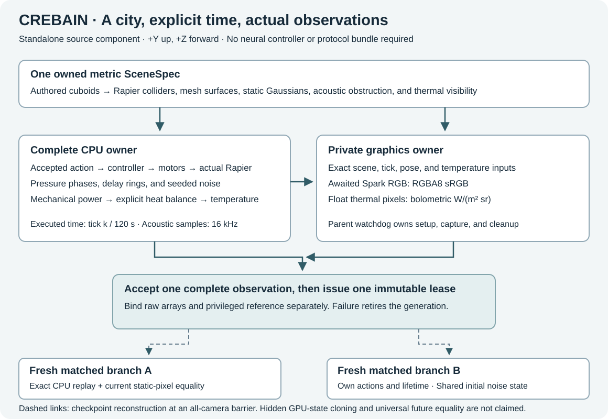
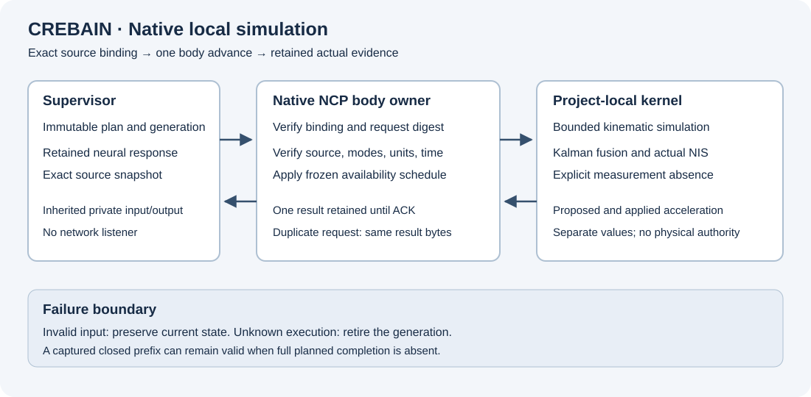

<p align="center">
  <picture>
    <source media="(prefers-color-scheme: dark)" srcset="assets/logo-dark.svg">
    
  </picture>
</p>

<p align="center"><a href="assets/archive/logos/README.md">Logo design archive</a></p>

# CREBAIN

**A 3D environment for drone simulation and sensor-fusion research.**

Run simulated drones through city geometry. Inspect camera pixels, microphone pressure, and thermal radiance.
Compare independent branches from the same recorded state.
CREBAIN owns its world, agents, and sensor models. It runs without another ecosystem project.

[](https://github.com/sepahead/crebain/actions/workflows/ci.yml)
[](https://github.com/sepahead/crebain/actions/workflows/codeql.yml)
[](https://github.com/sepahead/crebain/actions/workflows/audit.yml)

**Current package: `0.9.0`, research scope.** New native components have separate tested contracts.
Their source gates do not certify an installed desktop, physical fidelity, model accuracy, or a complete NCP v1 release.
The [0.9 release decision](docs/NARROWED_GO_0.9.0.md) and its remaining exclusions stay in force.

## Choose a workflow

| Workflow | What it supplies | Current boundary |
| --- | --- | --- |
| [Native city environment](docs/NATIVE_ENVIRONMENT.md) | Explicit Rapier ticks, city collision, Gaussian and mesh RGB, pressure samples, thermal radiance, reconstructed branches | Standalone source component; admits 1–256 drones within explicit resource limits |
| [Force-ground environment](docs/NATIVE_ENVIRONMENT.md#force-ground-profile) | Qualified force controller, absolute-heading targets, ground geometry, actual observation models, and privileged control records | One-drone source profile; zero city solids; [measured branch comparison](docs/NATIVE_ENVIRONMENT.md#measured-controlled-branches) |
| [Desktop application](docs/WORKFLOWS.md) | Tauri/React scene inspection, camera placement, native detection, Rust fusion, read-only telemetry | Separate UI scheduler and defaults; the native environment is not installed into this UI |
| [Local NCP body](docs/NATIVE_NCP_SIMULATION.md) | Private-process kinematics, Kalman observations, actual application and innovation evidence | Separate 1–3-entity scalar profile; does not transport city images, pressure, or thermal arrays |

The optional [typed sensor application](integrations/ncp-force-ground-sensors/README.md) is a separate construction candidate.
Its [sensor selection](integrations/ncp-force-ground-sensors/README.md#select-the-sensors-you-need) supports multiple cameras and microphones without requiring every modality.
Microphone-only selections use the same CPU environment without starting a graphics renderer.
Native [one- and two-microphone cases](integrations/ncp-force-ground-sensors/README.md#native-microphone-only-runs) produced identical pressure bytes through standalone CREBAIN, NCP, and optional Prisoma recording.
Four [native selection cases](integrations/ncp-force-ground-sensors/README.md#native-sensor-selection) passed, including two RGB cameras with different periods and a camera-only roster.
NCP carries typed observations; experiment software defines features, source variables, targets, and statistical assumptions.
Its first successful native run transferred all 44 RGB, thermal, and pressure payloads through NCP to an independent Python reader.
Its [one-step interface](integrations/ncp-force-ground-sensors/README.md#observation-driven-steps) also completed a native run with observation-dependent next actions.
An optional [Prisoma transcript](integrations/ncp-force-ground-sensors/README.md#optional-transcript-capture) captured every sensor payload before source-buffer release in one native run.
Renderer loss, parent loss, delayed preparation, and failed cleanup still need qualification.

The native environment requires no Engram, Prisoma, Galadriel, NCP, ROS, or Gazebo process.
The scalar NCP body reuses a different project-local kernel.
Its ENU acceleration interface must not be confused with the city's attitude and motor controls.

## Quickstart

The measured native environment uses Apple Silicon, Bun 1.3.14, Node 26.7.0, and the repository's Playwright Chromium distribution.
Other operating systems and graphics configurations need their own qualification.

Clone the repository and install its locked frontend dependencies:

```sh
git clone https://github.com/sepahead/crebain.git
cd crebain
bun install --frozen-lockfile
./node_modules/.bin/playwright install chromium
```

Use a new output directory and your explicitly selected absolute Node executable path:

```sh
bun examples/native-environment/run.ts examples/native-environment/city-run.json /tmp/crebain-city-example /opt/homebrew/bin/node
```

The supplied example runs one drone through 120 physics ticks, or one simulated second.
Two RGB cameras and one thermal camera each return ten frames.
Each of two microphones returns 16,000 pressure samples.
This observation/export example uses attitude commands and makes no tracking-quality claim.

`observations.jsonl` records complete accepted batches.
`result.json` appears only after the planned prefix, source check, and normal owner retirement succeed.
Failures distinguish the durable export prefix from accepted observations and actual CPU execution.
The [environment guide](docs/NATIVE_ENVIRONMENT.md#run-the-standalone-example) defines the exact input, files, launcher, and 128 MiB export bound.

For the desktop, run `bun run tauri:dev` after completing its [platform setup](docs/WORKFLOWS.md#quickstart).
For browser-only scene inspection, run `bun run dev`.
Model detection requires the native app and operator-supplied model files.
No model weights ship with CREBAIN.

## One world, explicit observations



Text alternative: One scene specifies city collision and visible surfaces.
The CPU owner advances dynamics, acoustic history, and temperature at integer ticks.
When cameras are selected, a private renderer returns actual RGB and thermal pixels.
The environment accepts an observation after every required output joins the executed tick.
Controlled branches reconstruct CPU state and use fresh renderers with checked current pixels.

[Open the original SVG](https://raw.githubusercontent.com/sepahead/crebain/main/assets/diagrams/native-environment.svg)
· [Read the illustrated math guide](output/pdf/native-environment-math.pdf)
· [Read the complete environment contract](docs/NATIVE_ENVIRONMENT.md)

One authored scene defines collision cuboids, mesh surfaces, static Gaussian placement, and acoustic obstruction.
The included city has sixteen building cuboids and 6,144 procedural Gaussians.
It contains no captured third-party city asset.

| Output | Meaning | Limit |
| --- | --- | --- |
| RGB | Awaited Spark/Three.js pixels, `rgba8-srgb`, bottom-left row origin | Static Gaussian geometry; no calibrated detector claim |
| Microphone pressure | A discrete acoustic forward model, sampled at 16 kHz in pascals | Declared delay, harmonics, range, obstruction, and noise; no calibrated real-drone acoustics |
| Thermal radiance | Floating-point bolometric gray-surface radiance in `W/(m² sr)` | All wavelengths; no calibrated thermal-camera or spectral-response claim |
| Reference state | Simulator dynamics, controls, temperatures, and checkpoint state | Privileged audit/label data; separate from ordinary predictor observations |

Physics time is `t = k / 120` seconds, where `k` is the completed integer tick.
Camera periods are integer tick counts. Display timing cannot advance the environment.
An observation is accepted only after all required outputs validate.
A graphics failure after CPU advancement preserves the executed tick and retires the owner.
It cannot become an apparent rollback or a successful empty observation.

The legacy city environment admits up to 256 drones.
The force-ground profile admits exactly one drone and zero scene solids.
Both profiles admit up to four RGB cameras, four thermal cameras, and four microphones.
These are admission limits, not a universal frame-rate or memory-performance guarantee.
The complete [limit table](docs/NATIVE_ENVIRONMENT.md#limits-and-remaining-work) includes leases, checkpoints, generations, and temporary reconstruction capacity.

## What exact branches establish

A checkpoint retains the complete admitted CPU state, including accepted future actions, controller memory, motor state, acoustic history, and temperatures.
Reconstruction replays the same transition before comparing the complete canonical state.
Direct Rapier snapshot restoration failed later full-state equality in inspected larger-body cases; those failures remain part of the record.

Graphics uses a fresh static renderer and checks the checkpoint's current camera pixels before child admission.
This does not clone hidden GPU state or prove unlimited future image equality.
Compare fresh matched siblings for intervention and no-intervention arms.
Checkpoint audit strings carry no executable restore authority.
See [deterministic dynamics](docs/DETERMINISTIC_DYNAMICS.md) and [reconstructed branches](docs/NATIVE_ENVIRONMENT.md#exact-cpu-state-and-reconstructed-static-branches).

**Known control limitation:** the unchanged default attitude controller failed frozen three-second tracking bounds with small attitude targets.
Late motor saturation and substantial altitude loss occurred despite exact trajectory repeats.
A separate twelve-tick free-rotation probe observed no Euler gyroscopic evolution in its inspected unequal-inertia configuration.
Reproducible simulation does not establish accurate flight dynamics or stable tracking.
The [bounded evidence summary](docs/DETERMINISTIC_DYNAMICS.md#observed-controller-and-angular-model-limits) records these observations.

An explicit [force-attitude profile](docs/DETERMINISTIC_DYNAMICS.md#bounded-force-attitude-profile) preserves requested steady moments before allocating remaining collective thrust.
Its private frozen one-drone campaign passed separate cold and settled tracking criteria.
It retains motor transients and has not replaced the desktop or city controller.

## Optional NCP composition



Text alternative: A supervisor installs one immutable local binding and plan.
The body validates each retained neural response against its own source snapshot.
It advances the kinematic and Kalman kernel once, then retains the exact result until acknowledgement.
A failure after execution retires the generation.
This process provides no physical command authority.

[Open the original SVG](https://raw.githubusercontent.com/sepahead/crebain/main/assets/diagrams/native-ncp-simulation.svg)
· [Build and use the native body](docs/NATIVE_NCP_SIMULATION.md)

The native package pins public `ncp-local` version `1.0.0` at immutable revision `de751d499b5e07d1c95a072e08255083d77cb38b`.
It uses inherited standard input/output and opens no network listener.
Its current application profile, `crebain.local-kinematic-kalman.v1`, requires the exact retained neural response at each step.
This application contract does not yet offer arbitrary body-only, body-plus-monitor, or body-plus-capture runs.

Engram can provide neural control, Galadriel can assess compatible diagnostics, and Prisoma can own capture or experiment analysis.
Each composition needs its own exact application and evidence contract.
The scalar profile emits one visual innovation modality.
Galadriel retains its two-modality minimum and reports insufficiency on that input; it does not demonstrate multimodal tampering detection.
No project is required for standalone CREBAIN.
The many-drone city environment still needs a separate observation transport and applied-action/predictor-access contract for a complete Prisoma experiment.
Raw simulated modalities do not establish independent statistical measurements or qualified fusion.
Haldir and real vehicle actuation are outside the current local environment profile.

The retained Host API 2.0 runtime and wire-0.8 NCP paths remain separately documented in the [workflow guide](docs/WORKFLOWS.md).
The host runtime has no NCP dependency. The wire-0.8 paths have no translator to the local SDK.
A source pin, local put, configuration check, or captured result is not installed interoperability or receiver-delivery proof.

## Desktop detection and fusion

The desktop renders Gaussian scenes and self-contained GLB models, places cameras, and displays native Rust fusion output.
The normative tracker in `src-tauri/src/sensor_fusion.rs` offers KF, EKF, UKF, particle, and IMM filters.
Its browser-only geometric estimator has a different contract and is not a parity oracle.

CoreML is the macOS default. Linux uses ONNX Runtime with its documented CPU fallback and optional accelerated providers.
MLX is experimental, opt-in. Its Candle-on-Metal path requires external model-contract validation before release claims.
Review exact tensors, preprocessing, classes, model rights, and measured backend behavior in [model contracts](docs/MODEL_CONTRACTS.md).

Product ROS telemetry is read-only. Guidance previews expose `NoAuthority`.
The dormant command adapter remains unregistered, and the plant foundation remains inert.
The separately gated Galadriel producer has two advisory routes; its local writes do not prove receiver delivery or deployed TLS/ACL enforcement.
Read [desktop workflows](docs/WORKFLOWS.md), [fusion math](docs/SENSOR_FUSION.md), and the [producer contract](docs/GALADRIEL_PRODUCER.md) before using those paths.

## Develop and verify

Use the pinned Rust toolchain through rustup. The repository currently selects Rust 1.91.1; the backend declares MSRV 1.89.
Bun 1.3.14 or later and Node 20.19 or later support repository tooling.
The native graphics launcher has the separately measured runtime described above.

```sh
bun run validate
bun run validate:all
```

The complete local gate covers frontend checks, contracts, managed simulation, the native local NCP package, inert plant, and applicable Rust targets.
Typed sensor changes also require the [explicit construction gate](integrations/ncp-force-ground-sensors/README.md#construction-and-qualification).
Its `validate:with-ncp-sensors` aggregate requires an explicitly selected NCP checkout; standalone `validate:all` does not require that optional dependency.
Focused backend commands are `bun run check:rust`, `bun run test:rust`, and `bun run clippy:rust`.
Documentation checks are `bun run check:docs-visuals` and `git diff --check`.

These commands do not replace hosted coverage, bundle, responsive-browser, feature, CodeQL, supply-chain, model, or installed-runtime gates.
[Release acceptance](docs/RELEASE_ACCEPTANCE.md), [manual smoke](docs/MANUAL_SMOKE_TEST.md), [release evidence](docs/RELEASE_EVIDENCE.md), and [security](SECURITY.md) define those obligations.
Source and component success cannot promote a failed scientific or operational requirement.

<details>
<summary>Recorded engineering baseline</summary>

These checks retain their original bounded meanings, including mocked detection inputs.
They do not establish model accuracy or physical deployment readiness.

- [x] Local no-authority guidance-preview tests and reset/hold checks
- [x] End-to-end detection/fusion smoke tests with mocked model outputs
- [x] CI backend alignment to package scripts
- [x] Release acceptance matrix, model contracts, security threat model, and manual smoke checklist
- [x] Executable negative guard tests for native detection, model path, scene path, and transport topic boundaries

</details>

## Read next

| Document | Purpose |
| --- | --- |
| [Environment and math](docs/NATIVE_ENVIRONMENT.md) · [PDF](output/pdf/native-environment-math.pdf) | Sensor equations, examples, ownership, forks, failures, and bounds |
| [Dynamics](docs/DETERMINISTIC_DYNAMICS.md) | Actual transition, actions, frames, replay, and controller limitations |
| [Desktop workflows](docs/WORKFLOWS.md) | Platform setup, models, controls, telemetry, and retained integrations |
| [Native NCP body](docs/NATIVE_NCP_SIMULATION.md) | Exact local application contract and component gates |
| [Documentation index](docs/README.md) | Architecture, fusion, model, security, historical evidence, and release records |
| [Contributing](CONTRIBUTING.md) · [Agent contract](AGENTS.md) | Development workflow and change-specific validation |
| [Changelog](CHANGELOG.md) · [Support](SUPPORT.md) | Recorded changes and support channels |

## License and citation

CREBAIN is authored and maintained by Sepehr Mahmoudian.
Cite the exact repository commit and [CITATION.cff](CITATION.cff); no DOI or Zenodo record is assigned to the 0.9.0 release.
The source uses [MIT](LICENSE-MIT) or [Apache-2.0](LICENSE-APACHE), at your option.
Models, datasets, and third-party assets retain their own terms.

Unless you explicitly state otherwise, any contribution intentionally submitted for inclusion in the work by you,
as defined in the Apache-2.0 license, shall be dual licensed as above, without any additional terms or conditions.

This software is for research and education.
Users remain responsible for applicable laws and asset rights.
The full [research-use disclaimer](docs/WORKFLOWS.md#disclaimer) retains the project terms.
