# crebain logo archive

This archive preserves earlier designs and captured design drafts.
The main repository README selects the active logo.
Archived artwork can contain superseded symbols or wording.
It does not establish current behavior, compatibility, authority, or release status.

[Manifest and exact source identities](manifest.json)

Each file retains its source bytes or an explicitly identified extraction from a historical portfolio SVG.
Extracted marks retain their source geometry, applicable styles, and referenced definitions.
No historical JavaScript was executed.
Dates identify the earliest captured source commit for those bytes, not necessarily the original design date.
Files use exact SHA-256 deduplication within this archive.

The archive excludes third-party marks, repeated platform icon sizes, and complete connection diagrams.
The manifest records any extraction gaps.

Select a preview to open the asset. Native SVG files retain scalable geometry.
Historical motion and accessibility behavior remain as originally stored.
The archive does not certify those older behaviors.

## CREBAIN

| Preview | Design | Source |
| --- | --- | --- |
| [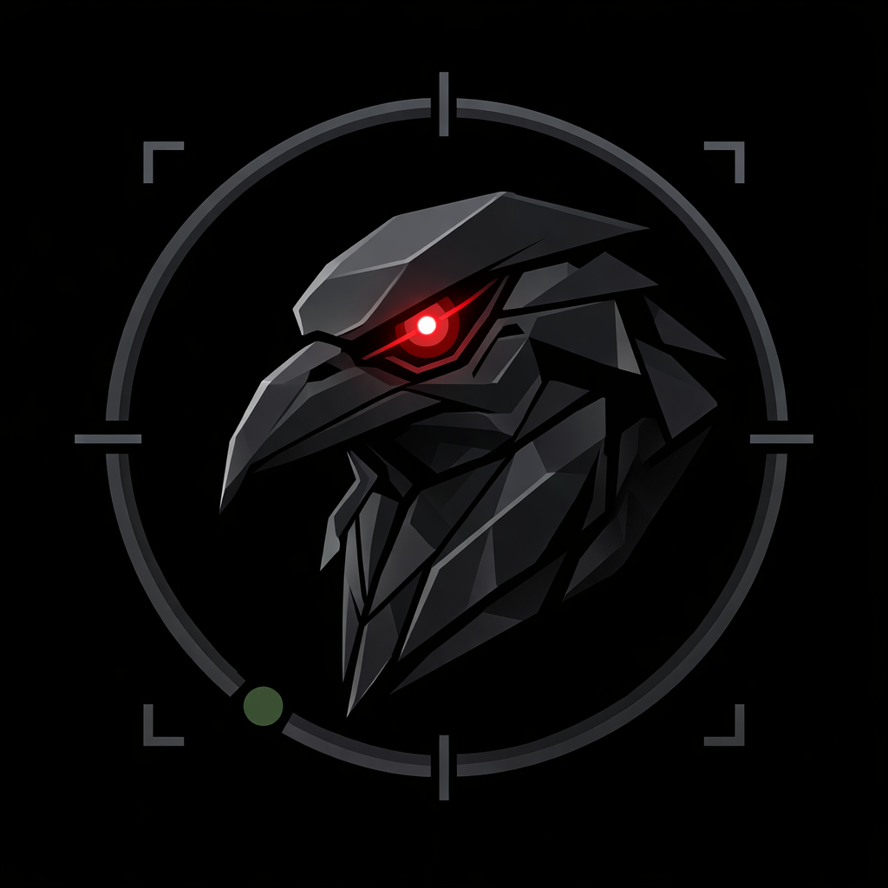](crebain/2026-03-23-001-crebain-logo-ff61865def.png) | [2026-03-23-001-crebain-logo-ff61865def](crebain/2026-03-23-001-crebain-logo-ff61865def.png) | [61a7411d5a](https://github.com/sepahead/crebain/blob/61a7411d5a1588173367bcc159dbc8be628dd4f5/public/crebain-logo.png) |
|  | [2026-07-04-002-profile-dark-d8413a6637](crebain/2026-07-04-002-profile-dark-d8413a6637.svg) | [e43d9f07dc](https://github.com/sepahead/sepahead/blob/e43d9f07dc6ef3246230a8b61cf6b5ddf5058a07/assets/work-graph-dark.svg) |
| [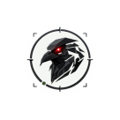](crebain/2026-07-04-003-profile-light-0aee680384.svg) | [2026-07-04-003-profile-light-0aee680384](crebain/2026-07-04-003-profile-light-0aee680384.svg) | [e43d9f07dc](https://github.com/sepahead/sepahead/blob/e43d9f07dc6ef3246230a8b61cf6b5ddf5058a07/assets/work-graph-light.svg) |
|  | [2026-07-12-004-profile-dark-9b4be6f69d](crebain/2026-07-12-004-profile-dark-9b4be6f69d.svg) | [6c173a05f1](https://github.com/sepahead/sepahead/blob/6c173a05f1655eac25d7b3bf7f551bb0cec2aeeb/assets/work-graph-dark.svg) |
| [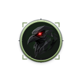](crebain/2026-07-12-005-profile-light-7ae9280eb7.svg) | [2026-07-12-005-profile-light-7ae9280eb7](crebain/2026-07-12-005-profile-light-7ae9280eb7.svg) | [6c173a05f1](https://github.com/sepahead/sepahead/blob/6c173a05f1655eac25d7b3bf7f551bb0cec2aeeb/assets/work-graph-light.svg) |
|  | [2026-07-12-006-profile-dark-2cf5d2c275](crebain/2026-07-12-006-profile-dark-2cf5d2c275.svg) | [8efeeab875](https://github.com/sepahead/sepahead/blob/8efeeab875d59d692ce3f7388e160bb3dd2d0aac/assets/work-graph-dark.svg) |
|  | [2026-07-12-007-profile-light-1489308861](crebain/2026-07-12-007-profile-light-1489308861.svg) | [8efeeab875](https://github.com/sepahead/sepahead/blob/8efeeab875d59d692ce3f7388e160bb3dd2d0aac/assets/work-graph-light.svg) |
| [](crebain/2026-07-12-008-logo-dark-fbe9607605.svg) | [2026-07-12-008-logo-dark-fbe9607605](crebain/2026-07-12-008-logo-dark-fbe9607605.svg) | [af4a2b9102](https://github.com/sepahead/crebain/blob/af4a2b91020d9748d8d347f125bd785eee1508aa/assets/logo-dark.svg) |
|  | [2026-07-12-009-logo-light-10ee30fed6](crebain/2026-07-12-009-logo-light-10ee30fed6.svg) | [af4a2b9102](https://github.com/sepahead/crebain/blob/af4a2b91020d9748d8d347f125bd785eee1508aa/assets/logo-light.svg) |
|  | [2026-07-12-010-profile-dark-d0051470b7](crebain/2026-07-12-010-profile-dark-d0051470b7.svg) | [ccd8062d1e](https://github.com/sepahead/sepahead/blob/ccd8062d1eacddbc4050d511ba24592d42e50501/assets/work-graph-dark.svg) |
|  | [2026-07-12-011-profile-light-73366a936f](crebain/2026-07-12-011-profile-light-73366a936f.svg) | [ccd8062d1e](https://github.com/sepahead/sepahead/blob/ccd8062d1eacddbc4050d511ba24592d42e50501/assets/work-graph-light.svg) |
|  | [2026-07-12-012-profile-dark-a0d7bce9c0](crebain/2026-07-12-012-profile-dark-a0d7bce9c0.svg) | [400ad33a73](https://github.com/sepahead/sepahead/blob/400ad33a73e68615703adce98a6529d8ce8d96dd/assets/work-graph-dark.svg) |
| [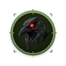](crebain/2026-07-12-013-profile-light-47386febc1.svg) | [2026-07-12-013-profile-light-47386febc1](crebain/2026-07-12-013-profile-light-47386febc1.svg) | [400ad33a73](https://github.com/sepahead/sepahead/blob/400ad33a73e68615703adce98a6529d8ce8d96dd/assets/work-graph-light.svg) |
|  | [2026-07-13-014-profile-dark-2675bbddef](crebain/2026-07-13-014-profile-dark-2675bbddef.svg) | [4675b232ed](https://github.com/sepahead/sepahead/blob/4675b232ed07bd2388c42a33b8696a3a374ce937/assets/work-graph-dark.svg) |
|  | [2026-07-13-015-profile-light-6f0f56bf61](crebain/2026-07-13-015-profile-light-6f0f56bf61.svg) | [4675b232ed](https://github.com/sepahead/sepahead/blob/4675b232ed07bd2388c42a33b8696a3a374ce937/assets/work-graph-light.svg) |
|  | [2026-07-26-016-profile-dark-367c973f4f](crebain/2026-07-26-016-profile-dark-367c973f4f.svg) | [a6833b5d27](https://github.com/sepahead/sepahead/blob/a6833b5d27b7444efb94072a73ed021912933ea0/assets/work-graph-dark.svg) |
|  | [2026-07-26-017-profile-light-9cf85b63b2](crebain/2026-07-26-017-profile-light-9cf85b63b2.svg) | [a6833b5d27](https://github.com/sepahead/sepahead/blob/a6833b5d27b7444efb94072a73ed021912933ea0/assets/work-graph-light.svg) |
|  | [2026-08-20-018-profile-dark-bfb81ad21f](crebain/2026-08-20-018-profile-dark-bfb81ad21f.svg) | [6f89d6c19d](https://github.com/sepahead/sepahead/blob/6f89d6c19d8b87556f66c91e73486163400ec8d2/assets/work-graph-dark.svg) |
|  | [2026-09-05-019-profile-dark-3f83737e52](crebain/2026-09-05-019-profile-dark-3f83737e52.svg) | [ed898bd827](https://github.com/sepahead/sepahead/blob/ed898bd827fd393b1a6262b48517a92c3b12d4b4/assets/work-graph-dark.svg) |
|  | [2026-09-05-020-profile-dark-64a8acd331](crebain/2026-09-05-020-profile-dark-64a8acd331.svg) | [8740c531cb](https://github.com/sepahead/sepahead/blob/8740c531cbb5cc9b74a74fe8e4d4018940700483/assets/work-graph-dark.svg) |
| [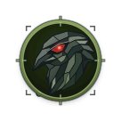](crebain/2026-09-05-021-profile-dark-91149526ed.svg) | [2026-09-05-021-profile-dark-91149526ed](crebain/2026-09-05-021-profile-dark-91149526ed.svg) | [4ef9ec9808](https://github.com/sepahead/sepahead/blob/4ef9ec980880f32aae27eac182448a7e70bdee3f/assets/work-graph-dark.svg) |
|  | [2026-09-05-022-logo-dark-c705ff7496](crebain/2026-09-05-022-logo-dark-c705ff7496.svg) | [2efa2ec1c4](https://github.com/sepahead/crebain/blob/2efa2ec1c4c40897124232908406575fad9821f0/assets/logo-dark.svg) |
| [](crebain/2026-09-05-023-logo-dark-8a2400c7c9.svg) | [2026-09-05-023-logo-dark-8a2400c7c9](crebain/2026-09-05-023-logo-dark-8a2400c7c9.svg) | [9defcca4d5](https://github.com/sepahead/crebain/blob/9defcca4d5f626c7ef648bd772e9cd27c6a7bf6c/assets/logo-dark.svg) |
| [](crebain/2026-09-05-024-profile-dark-a3db2b1769.svg) | [2026-09-05-024-profile-dark-a3db2b1769](crebain/2026-09-05-024-profile-dark-a3db2b1769.svg) | [8f4b49873e](https://github.com/sepahead/sepahead/blob/8f4b49873e90a87d7e1b37bbb0fa44dc1899ce61/assets/work-graph-dark.svg) |
| [](crebain/2026-09-06-025-logo-dark-617a0c3708.svg) | [2026-09-06-025-logo-dark-617a0c3708](crebain/2026-09-06-025-logo-dark-617a0c3708.svg) | [5acf61bcae](https://github.com/sepahead/crebain/blob/5acf61bcae78dba10d86ffe700227ed994a575d0/assets/logo-dark.svg) |
|  | [2026-09-06-026-profile-dark-b655ce960d](crebain/2026-09-06-026-profile-dark-b655ce960d.svg) | [8b0dc11c09](https://github.com/sepahead/sepahead/blob/8b0dc11c09db24a7d58d67ac37ac306a5cf79386/assets/work-graph-dark.svg) |
|  | [2026-09-06-027-profile-dark-eaddb090fd](crebain/2026-09-06-027-profile-dark-eaddb090fd.svg) | [a3bcd355a9](https://github.com/sepahead/sepahead/blob/a3bcd355a9a1089ffd503836893f0f8a9f3f1e7d/assets/work-graph-dark.svg) |
|  | [2026-09-06-028-logo-dark-de60a96957](crebain/2026-09-06-028-logo-dark-de60a96957.svg) | [48a803cbe6](https://github.com/sepahead/crebain/blob/48a803cbe68656860ef50568f75f324f61ca2773/assets/logo-dark.svg) |
|  | [2026-09-06-029-profile-dark-30902aa5c9](crebain/2026-09-06-029-profile-dark-30902aa5c9.svg) | [a1bc81fd70](https://github.com/sepahead/sepahead/blob/a1bc81fd7026c8aa6d1c58039542d6ca4dd85445/assets/work-graph-dark.svg) |
|  | [2026-09-06-030-logo-dark-2129d32888](crebain/2026-09-06-030-logo-dark-2129d32888.svg) | [421ee30b1c](https://github.com/sepahead/crebain/blob/421ee30b1cae96220967ab9bfa0743e3ca87f0cb/assets/logo-dark.svg) |
|  | [2026-09-06-031-profile-dark-e55871e12e](crebain/2026-09-06-031-profile-dark-e55871e12e.svg) | [9db7aa36f1](https://github.com/sepahead/sepahead/blob/9db7aa36f11f2f92ffa52f1b7c416392836a4f6a/assets/work-graph-dark.svg) |
|  | [2026-09-06-032-logo-dark-40d3ca7e4e](crebain/2026-09-06-032-logo-dark-40d3ca7e4e.svg) | [365f0eff11](https://github.com/sepahead/crebain/blob/365f0eff11461f0e394c28cef14e80cede0931f6/assets/logo-dark.svg) |
| [](crebain/2026-09-07-033-profile-dark-2e6c51b4c8.svg) | [2026-09-07-033-profile-dark-2e6c51b4c8](crebain/2026-09-07-033-profile-dark-2e6c51b4c8.svg) | [a9038ea0ee](https://github.com/sepahead/sepahead/blob/a9038ea0ee5a0735837e9958f1301507cb7c0864/assets/work-graph-dark.svg) |
|  | [2026-09-07-034-logo-dark-2565e5d6d3](crebain/2026-09-07-034-logo-dark-2565e5d6d3.svg) | [0b782069ea](https://github.com/sepahead/crebain/blob/0b782069eacdd279bdbeaf08fef6cba6c87d8236/assets/logo-dark.svg) |
|  | [2026-09-07-035-profile-dark-e9c6e51e99](crebain/2026-09-07-035-profile-dark-e9c6e51e99.svg) | [4bcb7457ab](https://github.com/sepahead/sepahead/blob/4bcb7457ab2f55d856a9f52665ff18c0f186e063/assets/work-graph-dark.svg) |
| [](crebain/2026-09-07-036-logo-dark-d070baa2be.svg) | [2026-09-07-036-logo-dark-d070baa2be](crebain/2026-09-07-036-logo-dark-d070baa2be.svg) | [a4ace53c39](https://github.com/sepahead/crebain/blob/a4ace53c39b26de886b14437d76368b513f33a51/assets/logo-dark.svg) |
