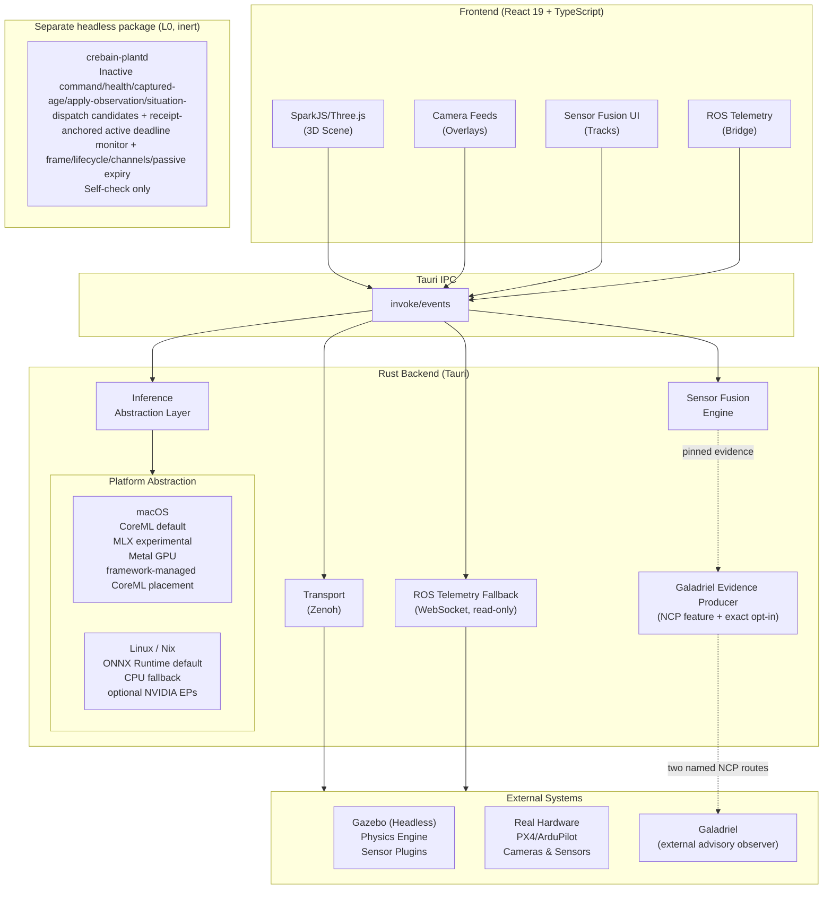
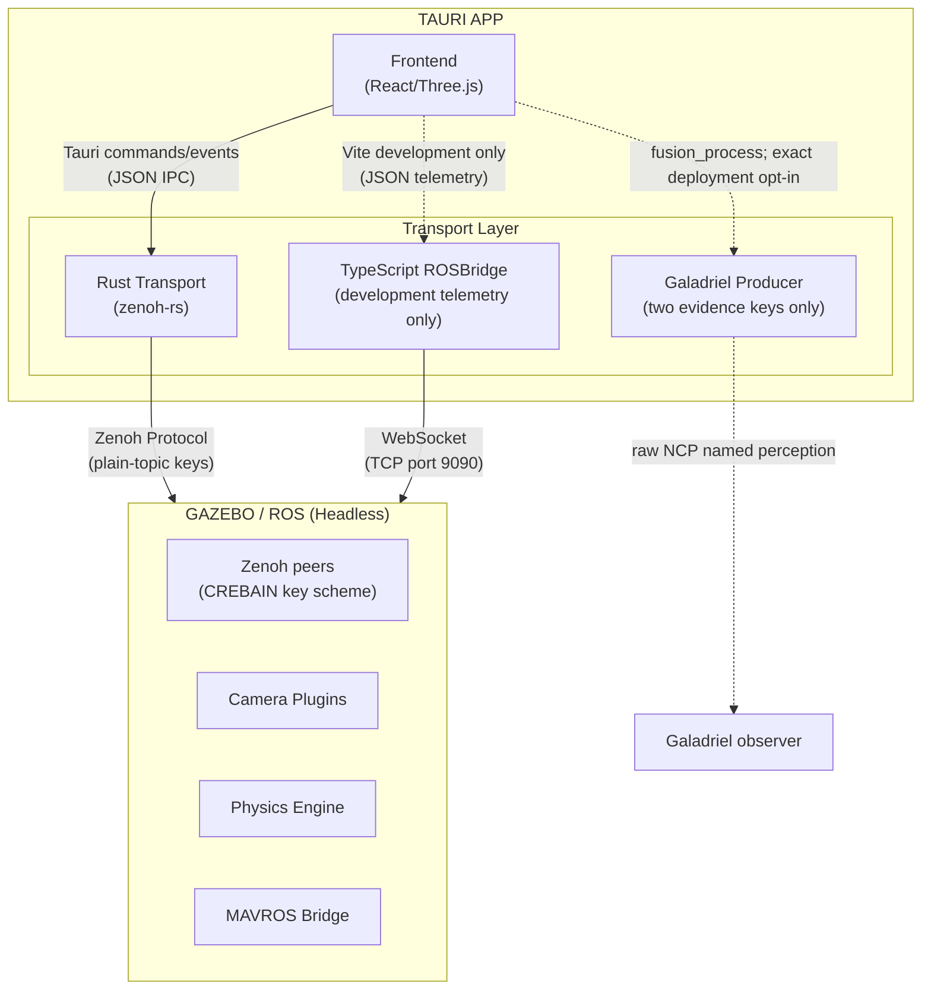
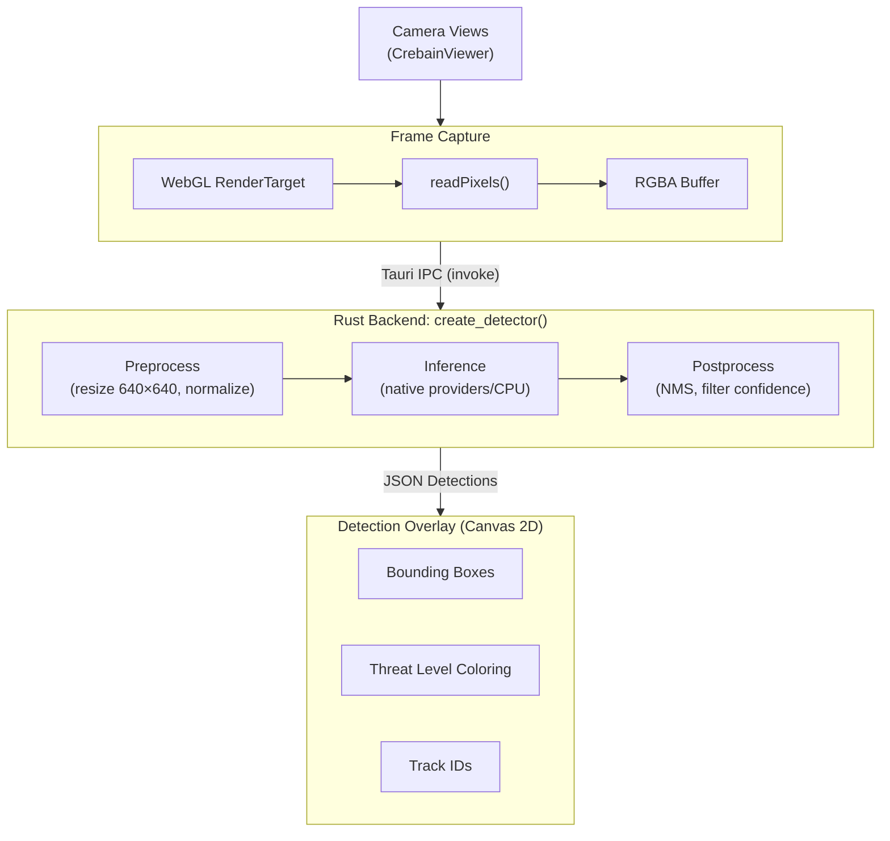

# CREBAIN Architecture

Design rationale and system structure for CREBAIN. For the sensor-fusion
deep-dive see [SENSOR_FUSION.md](SENSOR_FUSION.md); for model requirements see
[MODEL_CONTRACTS.md](MODEL_CONTRACTS.md); for runtime settings and limits see
[CONFIGURATION.md](CONFIGURATION.md); for the optional advisory producer see
[GALADRIEL_PRODUCER.md](GALADRIEL_PRODUCER.md).

## System overview



### Inert headless plant foundation

`src-tauri/crates/plant-authority` is a separate dependency-free workspace
package with the `crebain-plantd` binary. It does not link `crebain_lib`, Tauri,
the renderer, inference, fusion, simulation, the NCP action module, the
Galadriel producer, or the generic telemetry transports. Its only executable
mode is `--self-check`.

The package establishes inactive command-contract, vehicle-health,
profile-bound captured-read age-classifier, post-health-load single-reference-
instant apply-check observation,
and exact-profile safe-action situation-dispatch candidates, plus an unwired
receipt-anchored active command deadline-monitor candidate,
the nine explicit lifecycle states, generation-guarded events, capacity-one
latest-value paths, a non-consuming retained whole-snapshot register, bounded
reject-new lifecycle ingress, bounded drop-oldest evidence
with loss accounting, a separate sticky first-cause safety latch, and a passive
generation-bound monotonic expiry guard. The current adapter is deliberately
inert and exposes no action operation. Generic snapshot storage remains
disconnected mechanics. The canonical kernel health path instead seals a
concrete, deeply immutable report and binds its declared profile, vehicle,
source, stream epoch, runtime generation, local-frame instance, strictly
increasing per-channel source sequence, frame, SI units, values, and plant-local
observation times into one retained commit. Checked loads compute all ages from
one instant. The separate classifier consumes one such coherent observation,
rejects zero limits and exact-profile mismatch, and compares receipt plus all
seven observation ages against caller-proposed exclusive limits. Only an age
strictly below its limit is within it; equality is outside. The assessment owns
the observed commit and exposes no boolean or aggregate fresh, healthy, safe,
eligible, or authorized result. The command contract candidate gives velocity proposals
closed action/frame/unit semantics, distinct producer and plant-local time, and
draft instantaneous-speed/TTL validation, but defines no wire format or command ingress and
its profile/frame/limits are unapproved. A separate finite m/s component and
digest-bound JavaScript/Rust corpus cover exact ENU↔NED and FLU↔FRD
velocity-axis conventions only for the same local origin/datum or rigid-body
reference point, while rejecting local↔body conversion without attitude. The
frame-convention component carries no frame-instance identity, is not called by command admission, and
does not select a profile or cover attitude, yaw/quaternions, points,
covariance, Three.js, time, or live FCU semantics. The separate health candidate
carries a declared local-frame-instance identity but does not authenticate its
source, prove real FCU sampling or multi-message coherence, interpret profile
mode/estimator flags, or apply state policy. The captured-read classifier does
not read a clock, approve its profile/limits, implement the draft ODD's inclusive
`<=200 ms` position/velocity condition, interpret unknown/unavailable state, or
establish current or apply-time freshness.

The apply-check observation candidate performs a narrower composition without
granting authority. After exact-profile and command/lifecycle-generation
prechecks it first loads one generation-checked coherent health snapshot, then
privately mints one plant-monotonic reference instant. It computes health ages
and then command receipt age relative to that same instant. Equality is outside
the requested lifetime. The retained evidence includes the command
profile/session/sequence/generation, lifecycle state/generation observed at the
check, the command-age relation, and all eight health-age relations. Exact
profile or command/lifecycle generation mismatch precedes the health load;
missing/poisoned/wrong-generation health and health clock regression precede
command clock regression, followed by health-policy mismatch. Lifecycle state
is deliberately neutral: a successful observation can
contain `Emergency`, `Shutdown`, or any other `PlantState`, just as it can
contain an expired command, stale ages, or unknown/unavailable health. It has no
direct boolean accessor or `From` conversion to `bool` and supplies no aggregate
or authorizing verdict, permit, authorization token, command content, velocity,
action, output revocation, safe action, adapter conversion, I/O, or runtime call,
although callers can compare its facts. The command carries no
`VehicleIdentity` or `LocalFrameInstanceIdentity`, so exact profile/generation
equality can compose with health from another declared vehicle/frame instance;
this adds no HAZ-005/HAZ-013 evidence. The observation is remintable and not
command-content-bound: matching retained IDs/TTL can describe copyable
candidates with different velocity and must never pair it to a command as a
checked token. The evidence can stale immediately after capture and is not a
write-adjacent atomic transaction, so it is not the CTL-003 immediately-before-
write check.

The safe-action candidate keeps five plant intent labels separate from
untrusted ingress actions. It pairs a nonzero opaque situation code with the
full profile identity, copies borrowed rows into an owned fixed 255-slot table,
and rejects empty/oversized/duplicate proposals, exact-profile mismatch, and
missing rows without a default. Its non-cloneable selection owns the asserted
situation and intent while borrowing the immutable policy object. It does not
derive a situation from health, lifecycle, expiry, or an authenticated trigger;
resolve overlapping trigger priority; content-bind the caller-supplied rows to
the profile digest; or convert an intent into velocity, adapter, or FCU work.

The active deadline-monitor candidate accepts only a non-cloneable ticket
derived from a structurally validated command's opaque plant receipt time. The
copyable candidate can mint another ticket, so ownership constrains one monitor
only and is not global admission. A caller-proposed local TTL must be nonzero
and no greater than the command's requested TTL; the absolute deadline is never
recomputed from monitor start. One long-lived named worker owns one active slot
and no queue. Replacement requires the same exact profile, session, and
generation plus a strictly higher sequence; it installs a separately validated
immutable ticket rather than refreshing the existing interval. Current clock
regression or `now >= deadline` terminalizes before replacement, shutdown, or
caller-reported generation mismatch. A newer sequence whose receipt precedes
the active receipt also terminalizes. The worker rechecks after every `Condvar`
wake and records one
sticky terminal outcome, including detection age and lateness for deadlines.
Poison, worker unwind, shutdown, and a reported generation mismatch also
terminate fail closed. Poisoned synchronization intentionally exposes no exact
active key; worker-start failure retains the initial key and any terminal reason
computed before spawn. This is detection evidence only: the monitor does not observe
lifecycle rotation autonomously, revoke output, classify state, select/apply a
safe action, call the inert adapter, reserve scheduler capacity, or prove
suspend, wake-latency, or deadline-to-effect behavior. Multiple monitor
instances are not globally prevented.

This is a component foundation, not an authority chain. It has no approved or
authenticated ingress/UAV profile or FCU health collector, approved age/state
policy, authoritative situation classifier and content-bound ODD safe-action
table, integrated command admission and apply-time output invalidation,
operational watchdog timing, authorizing immediately-before-write governor,
PX4/FCU adapter, or staged live evidence. CREBAIN therefore remains L0.

## Design principles

### 1. Measurement-driven communication

**Problem**: Robotics UIs often mix control, perception, telemetry, and
diagnostics data with very different latency, throughput, and debuggability
needs.

**Solution**: Keep the renderer-facing ROS product transport surface read-only,
use the native Zenoh-oriented path for packaged telemetry, reserve rosbridge for
explicit development/native telemetry fallback, and inventory the separate
feature-gated Galadriel evidence writer as two exact routes. Measure end-to-end
latency in the target deployment before making performance claims.

The three paths and when to use them:

- **rosbridge (JSON over WebSocket)** — a telemetry-only fallback. The
  TypeScript client is selectable only in Vite development; production builds
  substitute a network-free stub and remove rosbridge WebSocket origins from
  the CSP. Every build records the resolved project-module graph and hashes and
  scans the finalized JavaScript chunks, so `build --mode test` cannot select
  the development adapter. The native Rust fallback (`CREBAIN_ZENOH=0`) is also
  subscription-only. JSON parsing overhead applies on every message.
- **Zenoh-oriented transport (native Rust)** — the packaged-build default, with
  a fixed typed read surface (raw/compressed camera, CameraInfo, IMU,
  PoseStamped, ModelStates). It has no generic publish, setpoint, service, or
  Gazebo mutation method. It speaks CREBAIN's own plain-key topic scheme — direct interop
  with an `rmw_zenoh_cpp` ROS 2 graph (which keys topics as
  `<domain>/<topic>/<type>/<hash>`) requires an explicit re-keying bridge.
- **Native camera-work admission** — both native backends share one process-wide
  384 MiB weighted, nonblocking envelope. Rosbridge reserves before JSON
  expansion for retained wire/JSON, decoded bytes, base64 IPC output, and
  callback bookkeeping; Zenoh reserves before CDR materialization for retained
  wire/CDR, embedded image bytes, frame/IPC base64, and callback bookkeeping.
  A frame is dropped when its weight would exceed the envelope. One worst-case
  64 MiB frame is admitted, while another worst-case frame from a different
  topic is backpressured. The topic event carries only a small delivery ID,
  lifecycle generation, and exact subscription ID, each encoded as a canonical
  positive-u64 decimal string across Tauri IPC; the renderer pulls the
  large frame exactly once, and the native reservation and per-topic slot
  remain owned until an identity-matched acknowledgement after every listener
  settles or its eight-second deadline quarantines that listener. Event-listener
  registration and native declaration share one twelve-second setup deadline;
  a late listener handle is immediately released. Pull and acknowledgement
  have separate ten- and four-second renderer deadlines. A 30-second native
  monotonic lease covers a lost readiness event, renderer loss, and a rejected,
  lost, or late acknowledgement; expiry atomically releases the exact slot and
  permit and quarantines only the matching live declaration. Expiry then
  performs a bounded exact undeclaration; cleanup failure retains quarantine
  for explicit retry, while lifecycle rotation or a newer exact identity fences
  stale cleanup. Lifecycle rotation discards an untaken stale-generation frame,
  while a pulled frame remains reserved until exact acknowledgement or lease
  expiry. A proven exact unsubscribe or reopen likewise retires only an untaken
  matching frame; an in-flight frame keeps its immutable reservation. Each
  camera subscription also carries a renderer-issued exact identity, so late
  callbacks and cleanup from a closed subscription cannot enter or remove a
  reopened topic, and an explicit reopen removes a quarantined declaration
  before installing its new identity. The renderer admits only descriptors for
  the current canonical nonzero-u64 lifecycle, delivery, and subscription IDs,
  serializes one full
  pull/listener/acknowledgement cycle per topic, and holds at most one prevalidated small descriptor pending; it
  never pulls that pending delivery before the active acknowledgement settles.
  Duplicate pulls or acknowledgements, malformed readiness events, deadline
  failures, and overlapping topic deliveries fail closed; callback failures are
  isolated and still reach bounded acknowledgement.
- **Galadriel evidence producer (native NCP, optional)** — absent from default
  binaries and disabled unless an `ncp` build also receives exact runtime opt-in
  plus valid registry/config/executable pins. It can put frozen evidence only to
  `galadriel-pid` and `galadriel-monitor` named-perception keys. Startup owns an
  immutable effective fusion engine; active initialization is readiness-only and
  a config update cannot replace it. Its secure-mode request, local queue/input
  accounting, and codec tests are not deployed TLS/ACL/receiver proof.
- **Tauri commands/events** — small frontend/backend notifications only.
  Tauri's own documentation notes that events are JSON and are not intended for
  low-latency or high-throughput streaming.

Latency and throughput for either transport depend on topology, payload path,
and hardware; benchmark in your deployment before relying on numbers.

Renderer network access is deny-by-default in the source inventory: WebSocket
code is confined to the explicitly development-only adapter, while ordinary
asset downloads are confined to the bounded fetch module and the documented
same-origin/HTTPS/HTTP-loopback source classes. Passive remote image URLs are
not allowed by the packaged CSP.

`GuidanceController` and `InterceptionSystem` remain only as local visualization
and proposal machinery. Preview generation is disabled by default, exposes
`NoAuthority`/`Hold`, and accepts no transport object. Disabling preview,
disconnecting telemetry, changing transport, or toggling simulation off aborts
the active singleton missions and clears trajectories, proposals, and
controller snapshots so reconnection cannot resume an earlier generation.



### 2. Platform-native inference

**Problem**: Different deployment targets expose different inference
accelerators, model formats, and runtime constraints.

**Solution**: Prefer the supported default backend for the host platform, report
backend availability in diagnostics, and keep experimental backends opt-in until
their behavior is measured and complete. Backend support does not establish model
accuracy, target-hardware performance, or deployment validation.

```rust
// Automatic backend selection (simplified from src-tauri/src/inference/mod.rs)
pub fn create_detector() -> Result<Box<dyn Detector>> {
    // Explicit override first: CREBAIN_BACKEND=coreml|mlx|onnx|cuda|tensorrt
    // (mlx additionally requires CREBAIN_ENABLE_EXPERIMENTAL_MLX=1 — the
    // explicit override cannot bypass the experimental gate)
    if let Ok(backend) = std::env::var("CREBAIN_BACKEND") {
        return create_detector_with_backend(backend.parse()?);
    }
    #[cfg(target_os = "macos")]
    {
        // Apple Silicon: CoreML > experimental MLX (opt-in) > ONNX
        if coreml::is_available() { /* CoreML detector */ }
        if experimental_mlx_enabled() && mlx::is_available() { /* MLX detector */ }
    }
    #[cfg(target_os = "linux")]
    {
        // NVIDIA: TensorRT > CUDA > ONNX
        if tensorrt::is_available() { /* TensorRT detector */ }
        if cuda::is_available() { /* CUDA detector */ }
    }
    // Universal fallback: ONNX Runtime — prefers accelerated execution
    // providers where available (TensorRT/CUDA on Linux, CoreML on macOS),
    // with CPU as the last resort.
}
```

Notes:

- CoreML is Apple's supported framework for integrating machine-learning models
  into Apple-platform apps.
- The "MLX" backend is implemented with Candle (Metal GPU backend) providing
  MLX-style tensor operations over a YOLOv8 safetensors path. It stays
  experimental and opt-in until an approved model contract, fixture detections,
  and target-hardware benchmarks are recorded.
- TensorRT is NVIDIA's SDK for optimizing inference engines on NVIDIA GPUs.
- ONNX Runtime provides the cross-platform fallback and registers accelerated
  execution providers when present.

### Detection flow



Performance depends on hardware, model format, model size, runtime provider,
image size, and batching. Treat any latency target as invalid until reproduced
through the native Tauri path on deployment hardware with the exact model
digest, thresholds, fixture frames, and invocation recorded.

### 3. Headless simulation, rich visualization

**Problem**: Gazebo's GUI competes for GPU resources and does not integrate
with custom UIs.

**Solution**: Run Gazebo headless — physics, sensor data generation, and camera
image rendering only — and render everything user-facing (tactical map, drone
icons, trajectories, detection overlays, threat indicators) in SparkJS/Three.js,
where the app has full control over the interactive UI.

### 4. Sim2Real awareness

**Problem**: Simulated sensor data does not transfer perfectly to real
hardware.

**Solution**: Use simulation for logic testing, not perception training.

| Use Gazebo For             | Do Not Use Gazebo For          |
| -------------------------- | ------------------------------ |
| UI/UX development          | Final detection model training |
| Integration testing        | Control loop tuning            |
| Mission state machines     | Aerodynamic performance        |
| Multi-drone coordination   | Real sensor noise modeling     |
| Safe failure mode testing  | Production deployment          |

### 5. Lock-pinned clean builds

**Problem**: "Works on my machine" — different CUDA versions, missing
dependencies.

**Solution**: A Nix flake provides pinned development shells:

```bash
nix develop            # default dev shell
nix develop .#cuda     # explicit CUDA shell (x86_64 NixOS + NVIDIA)
nix develop .#cpu-only # Linux shell without CUDA
```

Plain `nix develop` is intentionally the CPU/default-feature shell; the explicit
`x86_64-linux` `.#cuda` shell never infers hardware availability and does not
attest that a GPU or driver is present. The default package uses the checked-in
`bun.nix` cache expression to install frontend dependencies offline, the exact
Rust channel in `rust-toolchain.toml`, the Tauri-configured bounded production
frontend build, and the clean flake source. The Nix workflow evaluates all
systems and builds that default-feature package on Linux and macOS; a passing
evaluation alone is not package evidence. The Linux shells and package set
`ORT_DYLIB_PATH` (and `ORT_SKIP_DOWNLOAD=1`) to the nixpkgs
`libonnxruntime.so`; override it only with a separately reviewed compatible
runtime. Cargo's optional NCP packages remain fixed to the exact Git commit in
`Cargo.lock`; the standard 0.9 package does not compile their feature.

## Directory map

Key files, not an exhaustive listing.

### Frontend (`src/`)

```
src/
├── components/
│   ├── CrebainViewer.tsx      # Main 3D viewer (scene, cameras, feeds, splats)
│   ├── DetectionOverlay.tsx   # Bounding box rendering
│   └── *Panel.tsx             # Draggable UI panels
│
├── hooks/
│   ├── useGazeboDrones.ts     # Drone state from ROS (CircularBuffer, memoized)
│   ├── useGazeboSimulation.ts # Telemetry + disabled-by-default local preview
│   ├── useDroneController.ts  # Local drone spawning, physics loop, keyboard flight
│   └── useDraggable.ts        # Shared panel drag logic
│
├── ros/
│   ├── ROSBridge.ts           # Development-only read-only WebSocket client
│   ├── ROSBridgeDisabled.ts   # Network-free packaged-build replacement
│   ├── TelemetryBridge.ts     # Narrow read-only frontend interface
│   ├── ZenohBridge.ts         # Native read-only Zenoh transport adapter
│   ├── ROSCameraStream.ts     # Camera frame decoding
│   ├── GuidanceController.ts  # Local NoAuthority proposal preview
│   ├── TransformManager.ts    # TF tree with caching
│   └── useROSSensors.ts       # Multi-modal sensor fusion integration
│
├── detection/                 # Shared detection types + browser fusion engine
├── physics/                   # Drone physics simulation (120 Hz)
├── simulation/                # Interception system
├── state/                     # Scene serialization/persistence
├── neuro/                     # Dormant NCP TypeScript glue (version guard)
└── lib/                       # Utilities (CircularBuffer, mathUtils, shortcuts, logger)
```

### Backend (`src-tauri/src/`)

```
src-tauri/src/
├── lib.rs                # Tauri commands (IPC entry points)
├── main.rs               # Native app entry
│
├── coreml.rs             # macOS CoreML/Vision FFI (native detect path)
├── onnx_detector.rs      # Global ONNX Runtime detector singleton
├── sensor_fusion.rs      # KF/EKF/UKF/PF/IMM filters
├── pid_observation.rs    # Frozen sidecar observation/envelope + local JSONL shape
├── galadriel_registry.rs # Strict canonical deployment registry and policy
├── galadriel_producer.rs # Feature/runtime-gated bounded NCP evidence runtime
├── producer_monitor.rs   # Frozen outcome/miss/summary/heartbeat envelope
│
├── common/               # Shared detection, NMS, YOLO, error, path utils
│
├── inference/            # ML abstraction layer (Detector trait + backends)
│   ├── mod.rs            # Detector trait + factory
│   ├── coreml.rs         # CoreML Detector adapter (delegates to ../coreml.rs)
│   ├── mlx.rs            # Experimental Candle-on-Metal backend ("MLX")
│   ├── cuda.rs           # Linux CUDA backend
│   ├── tensorrt.rs       # Linux TensorRT backend
│   └── onnx.rs           # Cross-platform fallback
│
├── transport/            # Communication layer
│   ├── mod.rs            # Telemetry-only Transport trait + types
│   ├── zenoh.rs          # Read-only Zenoh implementation
│   ├── rosbridge.rs      # Read-only rosbridge WebSocket fallback
│   └── commands.rs       # Lifecycle + typed subscription Tauri commands
│
└── ncp/                  # Dormant NCP (Engram) action/control adapter
```

The producer does not execute registry transform chains. It attaches a common
projection only when the incoming `source_frame_id` already names the selected
canonical ENU frame and the modality's transform chain is empty; otherwise the
evidence is explicitly incomparable. Frame-name equality is not authenticated
sensor provenance. V1 also requires an advancing fusion/frame timestamp and a
strictly newer equal timestamp for that track/modality channel. All measurements
in a nonempty native frame must equal the advancing frame timestamp; mixed-old,
future, replayed/nonadvancing, and out-of-order input rejects before prediction or evidence
mutation. The renderer keeps one sensor-clock high-water, reuses it for empty
frames, and commits it only after native success.

Within an assigned co-located cluster, native fusion admits one effective update
per `(sensor_id, modality, timestamp_ms, source_frame_id)` correlation identity,
using the deterministic lowest-Cartesian-noise representative. Independent
sensors remain separate updates. This avoids treating repeated derivations from
one capture as independent covariance or IMM evidence.

Renderer/native input admission keeps the newest bounded measurements and turns
malformed, buffer-overflow, registry-trim, or track-capacity loss into sticky
degraded/truncated frame state. Native work is capped at 512 measurements and
1,024 live tracks with explicit numeric/string/metadata envelopes. Track-capacity
overflow drops whole birth clusters before the final ledger; numeric upstream
loss is not present on the frozen wire summary. Sparse finite-component
assignment and an all-infinite short circuit are component-tested, not deployed
combined-load/deadline evidence. Queue lanes are bounded and report drops/degradation, but
single-worker monitor ordering can delay heartbeats behind older events. Those
limits are part of the architectural boundary, not end-to-end liveness proof.
The optional JSONL archive is another boundary: active admission uses a separate
capacity-16 drop-new channel; configured `ncp` sinks are startup-preflighted and
each batch is validated/serialized before writing; writer I/O failure degrades
the epoch and terminates that worker. Its blocking standard writer is not
forcibly abortable after the two-second exit wait, and no-producer fusion awaits
synchronous append/flush outside the fusion lock.

The native macOS CoreML/Vision bridge is implemented directly in
`src-tauri/src/coreml.rs`; there is no separately built Swift package or
bundled inference sidecar. AGENTS.md carries the contributor-facing
architecture notes and performance guidelines for the trees above.
