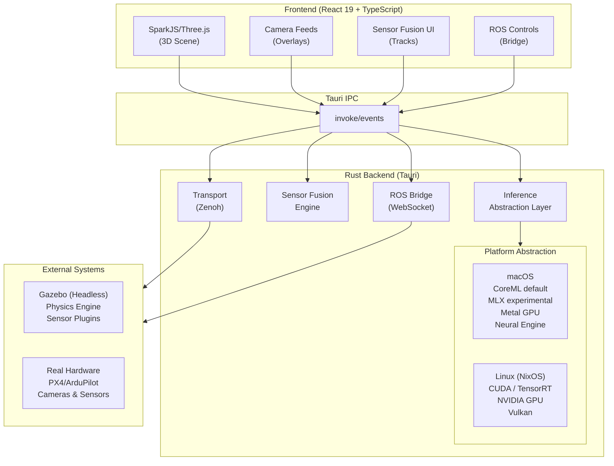
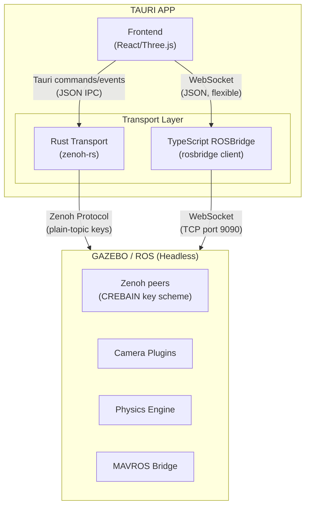
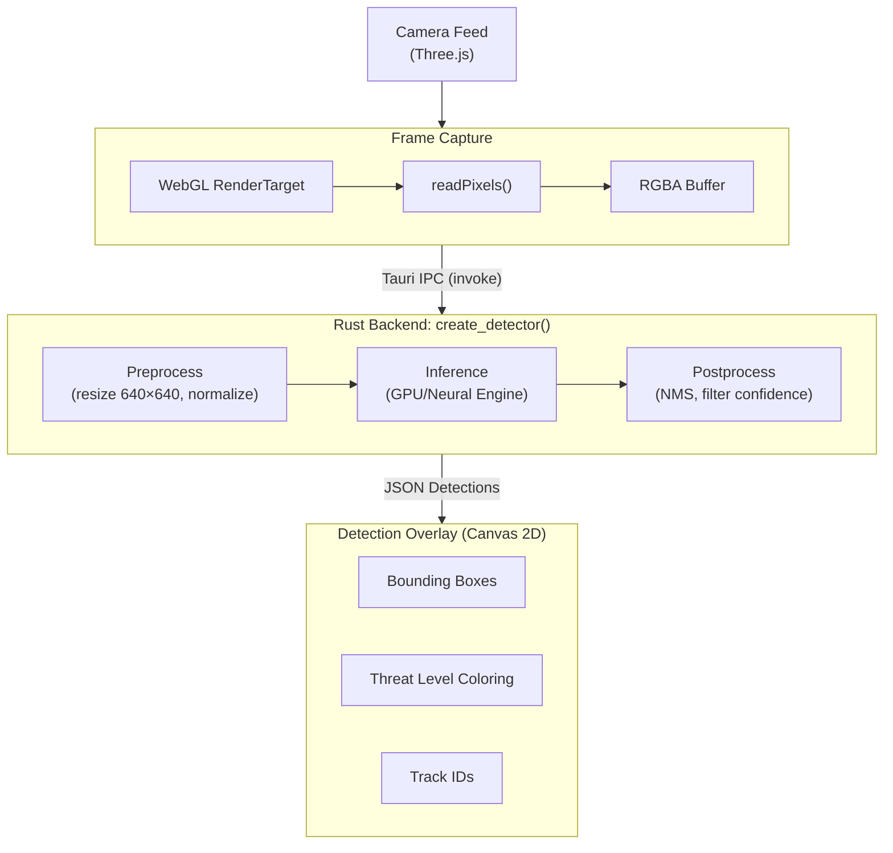

# CREBAIN Architecture

Design rationale and system structure for CREBAIN. For the sensor-fusion
deep-dive see [SENSOR_FUSION.md](SENSOR_FUSION.md); for model requirements see
[MODEL_CONTRACTS.md](MODEL_CONTRACTS.md); for runtime settings and limits see
[CONFIGURATION.md](CONFIGURATION.md).

## System overview



## Design principles

### 1. Measurement-driven communication

**Problem**: Robotics UIs often mix control, perception, telemetry, and
diagnostics data with very different latency, throughput, and debuggability
needs.

**Solution**: Use rosbridge where dynamic JSON/WebSocket integration is useful,
use Zenoh-oriented transport paths for typed robotics data where available, and
measure end-to-end latency in the target deployment before making performance
claims.

The three paths and when to use them:

- **rosbridge (JSON over WebSocket)** — the shipped UI default. Flexible ROS
  integration: dynamic message types, ROS 1 support, Gazebo Classic service
  calls, the custom fusion detection arrays, and browser-DevTools debugging.
  JSON parsing overhead applies on every message.
- **Zenoh-oriented transport (native Rust)** — a typed pub/sub path with a fixed
  message surface (raw/compressed camera, CameraInfo, IMU, PoseStamped,
  ModelStates, pose/twist publishing). No ROS service calls, MAVROS state
  helpers, or custom fusion arrays; the UI surfaces those operations as
  unsupported. It speaks CREBAIN's own plain-key topic scheme — direct interop
  with an `rmw_zenoh_cpp` ROS 2 graph (which keys topics as
  `<domain>/<topic>/<type>/<hash>`) requires an explicit re-keying bridge.
- **Tauri commands/events** — small frontend/backend notifications only.
  Tauri's own documentation notes that events are JSON and are not intended for
  low-latency or high-throughput streaming.

Latency and throughput for either transport depend on topology, payload path,
and hardware; benchmark in your deployment before relying on numbers.



### 2. Platform-native inference

**Problem**: Different deployment targets expose different inference
accelerators, model formats, and runtime constraints.

**Solution**: Prefer the validated backend for the host platform, report
backend availability in diagnostics, and keep experimental backends opt-in
until their behavior is measured and complete.

```rust
// Automatic backend selection (simplified from src-tauri/src/inference/mod.rs)
pub fn create_detector() -> Result<Box<dyn Detector>> {
    // Explicit override first: CREBAIN_BACKEND=coreml|mlx|onnx|cuda|tensorrt
    // (mlx additionally requires CREBAIN_ENABLE_EXPERIMENTAL_MLX=1 — the
    // explicit override cannot bypass the experimental gate)
    if let Ok(backend) = std::env::var("CREBAIN_BACKEND") {
        return create_detector_with_backend(backend.parse()?);
    }
    #[cfg(target_os = "macos")]
    {
        // Apple Silicon: CoreML > experimental MLX (opt-in) > ONNX
        if coreml::is_available() { /* CoreML detector */ }
        if experimental_mlx_enabled() && mlx::is_available() { /* MLX detector */ }
    }
    #[cfg(target_os = "linux")]
    {
        // NVIDIA: TensorRT > CUDA > ONNX
        if tensorrt::is_available() { /* TensorRT detector */ }
        if cuda::is_available() { /* CUDA detector */ }
    }
    // Universal fallback: ONNX Runtime — prefers accelerated execution
    // providers where available (TensorRT/CUDA on Linux, CoreML on macOS),
    // with CPU as the last resort.
}
```

Notes:

- CoreML is Apple's supported framework for integrating machine-learning models
  into Apple-platform apps.
- The "MLX" backend is implemented with Candle (Metal GPU backend) providing
  MLX-style tensor operations over a YOLOv8 safetensors path. It stays
  experimental and opt-in until an approved model contract, fixture detections,
  and target-hardware benchmarks are recorded.
- TensorRT is NVIDIA's SDK for optimizing inference engines on NVIDIA GPUs.
- ONNX Runtime provides the cross-platform fallback and registers accelerated
  execution providers when present.

### Detection flow



Performance depends on hardware, model format, model size, runtime provider,
image size, batching, and whether the native Tauri app or browser-only path is
used. Treat any latency target as invalid until reproduced with
`bun run test:benchmark` on the deployment hardware (the suite runs whenever
`RUN_BENCHMARKS` is set to any non-empty value; the documented convention is
`RUN_BENCHMARKS=1`).

### 3. Headless simulation, rich visualization

**Problem**: Gazebo's GUI competes for GPU resources and does not integrate
with custom UIs.

**Solution**: Run Gazebo headless — physics, sensor data generation, and camera
image rendering only — and render everything user-facing (tactical map, drone
icons, trajectories, detection overlays, threat indicators) in SparkJS/Three.js,
where the app has full control over the interactive UI.

### 4. Sim2Real awareness

**Problem**: Simulated sensor data does not transfer perfectly to real
hardware.

**Solution**: Use simulation for logic testing, not perception training.

| Use Gazebo For             | Do Not Use Gazebo For          |
| -------------------------- | ------------------------------ |
| UI/UX development          | Final detection model training |
| Integration testing        | Control loop tuning            |
| Mission state machines     | Aerodynamic performance        |
| Multi-drone coordination   | Real sensor noise modeling     |
| Safe failure mode testing  | Production deployment          |

### 5. Reproducible builds

**Problem**: "Works on my machine" — different CUDA versions, missing
dependencies.

**Solution**: A Nix flake provides pinned development shells:

```bash
nix develop            # default dev shell
nix develop .#cuda     # force the CUDA/TensorRT shell (NixOS + NVIDIA)
nix develop .#cpu-only # Linux shell without CUDA
```

Honest caveats: the flake's CUDA auto-detection probes host paths
(`/dev/nvidia0`, …) that pure flake evaluation cannot see, so plain
`nix develop` only auto-detects CUDA under `--impure` — NixOS CUDA users should
use `nix develop .#cuda` directly. `nix build` currently builds only the Rust
backend crate (no frontend build, no Tauri bundle) and is not exercised in CI
(the Nix workflow runs `nix flake check --no-build`). The Linux shells pre-set
`ORT_DYLIB_PATH` (and `ORT_SKIP_DOWNLOAD=1`) to the nixpkgs
`libonnxruntime.so`; override `ORT_DYLIB_PATH` if that version mismatches.

## Directory map

Key files, not an exhaustive listing.

### Frontend (`src/`)

```
src/
├── components/
│   ├── CrebainViewer.tsx      # Main 3D viewer (scene, cameras, feeds, splats)
│   ├── DetectionOverlay.tsx   # Bounding box rendering
│   └── *Panel.tsx             # Draggable UI panels
│
├── hooks/
│   ├── useGazeboDrones.ts     # Drone state from ROS (CircularBuffer, memoized)
│   ├── useGazeboSimulation.ts # Continuous guidance controller
│   ├── useDroneController.ts  # Local drone spawning, physics loop, keyboard flight
│   └── useDraggable.ts        # Shared panel drag logic
│
├── ros/
│   ├── ROSBridge.ts           # WebSocket client (rosbridge)
│   ├── ZenohBridge.ts         # Native Zenoh transport adapter
│   ├── GazeboController.ts    # Gazebo Classic service calls (spawn/state/reset)
│   ├── ROSCameraStream.ts     # Camera frame decoding
│   ├── GuidanceController.ts  # 20Hz PD control loop
│   ├── TransformManager.ts    # TF tree with caching
│   ├── WaypointManager.ts     # MAVROS mission support
│   └── useROSSensors.ts       # Multi-modal sensor fusion integration
│
├── detection/                 # Detection pipeline + browser fusion engine
├── physics/                   # Drone physics simulation (120 Hz)
├── simulation/                # Interception system
├── state/                     # Scene serialization/persistence
├── neuro/                     # Dormant NCP TypeScript glue (version guard)
└── lib/                       # Utilities (CircularBuffer, mathUtils, shortcuts, logger)
```

### Backend (`src-tauri/src/`)

```
src-tauri/src/
├── lib.rs                # Tauri commands (IPC entry points)
├── main.rs               # Native app entry
│
├── coreml.rs             # macOS CoreML/Vision FFI (native detect path)
├── onnx_detector.rs      # Global ONNX Runtime detector singleton
├── sensor_fusion.rs      # KF/EKF/UKF/PF/IMM filters
├── pid_observation.rs    # Innovation-record (JSONL) observation support
│
├── common/               # Shared detection, NMS, YOLO, error, path utils
│
├── inference/            # ML abstraction layer (Detector trait + backends)
│   ├── mod.rs            # Detector trait + factory
│   ├── coreml.rs         # CoreML Detector adapter (delegates to ../coreml.rs)
│   ├── mlx.rs            # Experimental Candle-on-Metal backend ("MLX")
│   ├── cuda.rs           # Linux CUDA backend
│   ├── tensorrt.rs       # Linux TensorRT backend
│   └── onnx.rs           # Cross-platform fallback
│
├── transport/            # Communication layer
│   ├── mod.rs            # Transport trait + types
│   ├── zenoh.rs          # Zenoh implementation
│   ├── rosbridge.rs      # rosbridge WebSocket fallback
│   └── commands.rs       # Tauri transport commands
│
└── ncp/                  # NCP (Engram) client — off-by-default `ncp` feature
```

`src-tauri/native/coreml-ffi/` holds the Swift CoreML bridge and
`src-tauri/sidecar/` the Swift sidecar package. AGENTS.md carries the
contributor-facing architecture notes and performance guidelines for the
`src/` and `src-tauri/src/` trees above.
