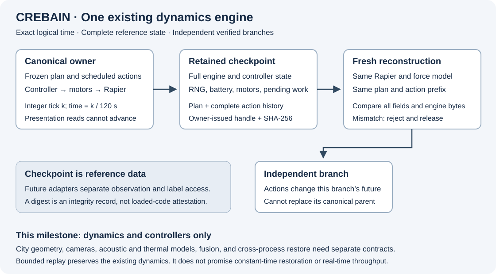
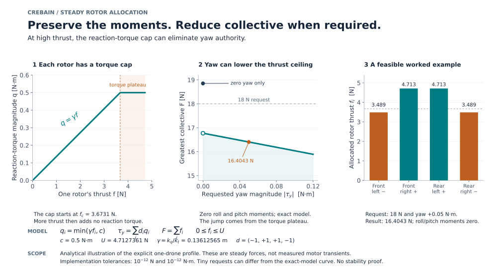

# Deterministic drone dynamics

`DeterministicDroneWorld` owns an explicit-clock use of CREBAIN's existing Rapier dynamics.
It reuses `DronePhysicsWorld` and the quadcopter force model.
The legacy profiles use `FlightController`; a separate force profile uses `ForceAttitudeController`.
The desktop retains its existing wall-clock scheduler and defaults.
This component has no network, NCP, sensor, fusion, or external vehicle authority.



Text alternative: One owner admits a frozen plan and scheduled actions.
It advances the existing dynamics by integer ticks.
A checkpoint retains complete reference state and action history.
A fresh owner reconstructs that history before a full-state comparison permits an independent fork.
Presentation reads cannot advance the simulation.

## Admitted scope

The legacy ground profile is `crebain.rapier-dynamics.v1`.
The [force profile](#bounded-force-attitude-profile) has a separate controller, action contract, and one-drone admission limit.
The legacy ground plan admits only `dynamics` and `attitude_controller` capabilities.
It uses existing ground and drone cuboids, with the default quadcopter and controller parameters.
Unknown fields, alternative geometry, sensors, fusion, and unsupported capabilities fail before preparation.
Admission copies plain data descriptors once, freezes that owned value, then validates it.
Accessors, symbol keys, hidden record fields, sparse arrays, array extras, cycles, and non-data values reject without evaluating getters.
Validation, retained action history, and pending execution use the same accepted action value.
The copy bounds depth to eight, nodes to 8,192, record fields to sixteen, and strings to 256 characters.
Each admitted array has at most 256 entries.
These checks do not isolate proxy traps or arbitrary code in the same JavaScript realm.
Descriptor enumeration allocates its property map before the later key-count checks.
The copy limits bound traversal and output, not memory allocation for arbitrary caller objects.
Future process ingress needs its own bounded primitive JSON contract.

Both source-policy checkers permit only the copier's exact reviewed descriptor-call node.
The import-free helper is byte-bound, and changed guards or added reflection fail the policy gate.
This explicit policy extension leaves global capability recovery and all other descriptor references forbidden.

This checkpoint is complete for the admitted dynamics domain.
It is not a checkpoint of the full desktop scene or a future multimodal environment.
City collision, camera capture, acoustic and thermal models, and fusion attachment need separate state contracts.
No physical accuracy, cross-platform numerical parity, or real-time throughput follows from this component gate.

## Public interface

The implementation is `src/physics/DeterministicDroneWorld.ts`.

| Method | Contract |
| --- | --- |
| `prepare(plan)` | Validate and copy the exact plan, initialize actual Rapier, and construct the sorted drone roster. Reject fallback physics. |
| `schedule(action)` | Copy one supported future action. Reject unknown drones, duplicates, stale ticks, non-finite values, and exhausted budgets. |
| `advance(ticks)` | Apply due actions and execute existing fixed dynamics steps for a legacy profile. Return detached simulator truth. |
| `advanceControlled()` | Execute one owned force-profile tick after reserving its complete encoded return. Retain requested, allocated, and actual effects separately. |
| `observe()` | Return detached current truth and rational simulation time. It cannot change simulation state. |
| `checkpoint()` | Retain canonical reference state and return an immutable, owner-issued handle with its SHA-256. |
| `checkpointState(handle)` | Return the retained canonical reference-state string. This is privileged reference data, not sensor input. |
| `restore(handle)` | Reconstruct the exact prefix in a fresh owner. Compare all state before replacing the current world. |
| `fork(handle)` | Perform the same verified reconstruction in an independent speculative owner. Preserve the canonical owner. |
| `releaseCheckpoint(handle)` | Revoke that handle and release its retained capacity. |
| `retire()` | Release physics resources, commands, controllers, and retained checkpoints. Later operations reject. |

A handle is an in-process capability.
Copied, forged, foreign, modified, released, and retired handles cannot authorize restoration.
The serializable reference string supplies no restore authority.
A branch's checkpoint cannot replace its parent's canonical world.
No arbitrary serialized bytes enter Rapier deserialization on this interface.

The caller's `sourceIdentity` is a declared digest, not loaded-code attestation.
The checkpoint also binds the exact plan, geometry name, parameters, controller configuration, and actual Rapier version.
Installed source and artifact qualification remain separate gates.
A future process adapter must separate observation access from privileged checkpoint and reference-label access.
In-process TypeScript ownership is not an operating-system sandbox.

## Time and action meaning

Let `k` be the nonnegative integer physics tick.
Simulation time is `t = k / 120` seconds.
Each advance uses `Δt = 1 / 120` seconds, without wall-clock clipping or display-frame accumulation.
For example, three ticks span exactly 25 milliseconds at the interface.
The internal integrator uses the existing floating-point representation of `1 / 120`.

An action for tick `k` applies before that tick's controller and physics update.
An attitude action contains roll and pitch in radians, yaw rate in radians per second, and altitude in meters.
The controller retains its existing angle clamp, integral clamp, motor mixer, and saturation behavior.
A motor action contains four normalized commands in `[0, 1]`, in named rotor order.
Selecting direct motors clears inactive controller memory.
Disarming retains the existing rotor and battery semantics.
The record distinguishes the selected control, actual motor target, rotor response, and resulting motion.

Coordinates use the existing Three.js world: positive Y is up.
Local positive Z is forward and positive X is right.
These coordinates are not silently relabeled ENU.
An external adapter must declare and test its frame conversion.

The existing motor response updates rotor speed toward its target on each tick.
Thrust follows `T = k_t ω²`, with angular speed `ω` in radians per second.
`k_t` is the configured thrust coefficient, and `T` is thrust in newtons.
The existing Rapier path applies rotor thrust and torque, gravity, and its configured damping.
This extraction does not add a new aerodynamic model or change the fallback's distinct force model.

### Observed controller and angular-model limits

A frozen campaign used seven actual-Rapier configurations, two repeats each, and 360 ticks per repeat.
Each repeat covered three simulated seconds.
Exact repeats and direct-world comparisons passed, but the default attitude controller failed the frozen tracking bounds.
With ±0.03-radian targets, 82.5–92.5% of motor commands reached zero or one during ticks 241–360.
Maximum altitude loss was approximately 10.9–12.2 meters in those cases.
These observations do not qualify stable tracking or delivery of commanded acceleration.
The public city example retains attitude commands and tests one second of observations and export, without tracking-quality credit.

A separate pinned-runtime free-rotation probe used eight configurations, two repeats, and twelve ticks per repeat.
With damping zero, the inspected mixed-axis angular velocity stayed exactly constant despite unequal principal inertias.
With damping 0.5, its components decayed proportionally in the inspected configurations.
The measured configuration omitted Euler gyroscopic evolution.
This bounded observation does not characterize every Rapier mode or establish physical fidelity.
These observations concern the unchanged legacy controller and source physics.
The separate force profile below changes control and allocation, while retaining that physics.
Private raw traces and source-bound analyses are retained; this summary is not a public replay or installed-runtime receipt.

## Bounded force-attitude profile

Select `crebain.rapier-force-attitude.v1` explicitly.
It admits one default quadcopter, ground geometry, and the `force_attitude_height` capability.
It requires engine model `rapier-0.19.3-observed-no-gyro-v1` and owned altitude/heading reference values.
The desktop, native city environment, and scalar NCP body keep their separate controls.
This profile does not automatically replace any existing controller.

Schedule an explicit target or direct motor action before calling `advanceControlled()`.
Targets contain roll, pitch, absolute heading, and altitude; heading is not a yaw-rate command.
The controller uses no integral state and never seeds a spinning rotor at startup.
Source arming, disarming, motor lag, force caps, damping, collision, and battery behavior remain intact.

| Quantity | Force-profile bound or unit |
| --- | --- |
| Roll and pitch target | Each within ±0.1 rad |
| Heading target | Within ±0.2 rad of its owned reference, with wrapped angle difference |
| Altitude target | Within ±0.5 m of its owned reference |
| Actual tilt and relative attitude angle | Each at most 0.35 rad |
| Angular speed | At most 1 rad/s |
| Linear speed | At most 5 m/s |
| Height above the ground origin | Greater than 0.05 m |
| Quaternion norm error | At most `1e-6`; computation normalizes the admitted copy |
| One controlled return | 32,768 encoded bytes reserved before mutation; not a JavaScript heap bound |

The original raw quaternion remains visible with its normalized computational representation.
Envelope failure before a controlled effect retires invalid owned state without applying a new action.
A failure after execution reports the executed tick or explicit uncertainty and retires the owner.
The record keeps the last accepted tick separate from completed-but-unaccepted execution.
An output-capacity rejection occurs before mutation and leaves a valid owner available.

### Feedback and units

Let `R` map body coordinates to world coordinates, and let `R_d` denote the target rotation.
Both are dimensionless rotation matrices.
The target follows Three.js Euler order `YXZ`, using `(pitch, heading, −roll)` in radians.
Define the attitude error as `e_R = vee((R_dᵀR − RᵀR_d)/2)`.
The `vee` operator extracts the three independent entries of a skew-symmetric matrix.
Let `ω_b = Rᵀω_world` be measured angular velocity in body coordinates, in rad/s.

For angular acceleration `α_b`, the feedback is:

`α_b = −K_R e_R − K_ω ω_b`.

The controller requests body moments `τ = diag(I_x, I_y, I_z) α_b`, in N·m.
The fixed principal inertias are `(0.01, 0.02, 0.01) kg·m²`.
It adds no Euler gyroscopic compensation to the inspected engine model that omits that evolution.
This model choice is not a claim about real quadcopters.

Let `Δt = 1/120 s` and `p = 11/12` be the source motor-speed retention factor per tick.
Define `τ_m = −Δt/ln(p)`, in seconds.
The gains are `K_R = (0.2/τ_m)²`, `K_ω = 2(0.2/τ_m)`, `K_h = (0.1/τ_m)²`, and `K_v = 2(0.1/τ_m)`.
Position/attitude gains have units `s⁻²`; rate gains have units `s⁻¹`.
Angles use the usual dimensionless-radian convention in these equations.

Let `h`, `h_d`, and `v_y` be actual height, target height, and world vertical velocity, in m, m, and m/s.
Let `e_y = (0, 1, 0)` denote the body thrust-axis unit vector.
Then `u_y = (R e_y)_y` is its dimensionless upward component in world coordinates.
For mass `m = 1.5 kg` and gravity `g = 9.81 m/s²`, request:

`a_y = clamp(K_h(h_d − h) − K_v v_y, −a_max, a_max)`.

`F_request = m(g + a_y)/u_y`.

Here `a_y` is requested vertical acceleration in m/s², and `F_request` is collective thrust in newtons.
The limit is `a_max = 0.75(4U cos(0.35)/m − g) = 1.4965313932375626 m/s²`.
The rotor force ceiling `U` is defined below.
This reserves 25% of the steady acceleration margin above gravity at maximum admitted tilt.
It does not reserve 25% of total rotor thrust or remove motor transients.

### Full moments before collective



Text alternative: Rotor reaction torque reaches a fixed cap as thrust rises.
Nonzero yaw then requires unequal thrust and a lower collective ceiling.
The worked example retains 0.05 N·m yaw by reducing an 18 N request to approximately 16.4043 N.

[Open the original SVG](../assets/diagrams/force-attitude-allocation.svg)
· [Read the vector PDF](../output/pdf/force-attitude-allocation.pdf)


The owned allocation policy is `full-moments-before-collective-v1`.
It preserves all three requested steady moments within `1e-12 N·m`, then maximizes collective up to the request.
It fails closed if the reconstructed allocation cannot meet that postcondition.
Generic `allocate()` retains its older collective-first contract; the force controller calls `allocateAttitudeFirst()`.

Use rotor order front-left, front-right, rear-left, rear-right, with yaw signs `d = (−1, +1, +1, −1)`.
Let `f_i` be rotor thrust in newtons, and let `l = 0.25 m` be the arm coordinate magnitude.
The source constants are `k_t = 1.91e-6 N·s²/rad²` and `k_q = 2.6e-7 N·m·s²/rad²`.
The maximum speed is `Ω = 15000 × 2π/60 rad/s`.
Thus `U = min(15 N, k_t Ω²) = 4.712736101520169 N`.
Each rotor reaction torque has cap `c = 0.5 N·m`.
Define `γ = k_q/k_t`, in meters, and `f_c = c/γ = 3.673076923076923 N`.

For requested moments `(τ_x, τ_y, τ_z)`, define the force offsets:

`r = (−τ_x−τ_z, −τ_x+τ_z, τ_x−τ_z, τ_x+τ_z)/(4l)`.

Every force vector with those roll/pitch moments has form `f_i = F/4 + r_i + d_i s`.
Here `F = Σ f_i` is collective thrust and `s` is the remaining yaw coordinate, both in newtons.
The exact steady yaw equation is `τ_y = Σ d_i min(γ f_i, c)`, subject to `0 ≤ f_i ≤ U`.

The solver examines sixteen choices of capped and uncapped rotors.
Let `J` be the uncapped set, `n = |J|`, and `D = Σ_{i∈J} d_i`.
For `n > 0`, define dimensionless `a = D/(4n)` and force offset:

`b = [τ_y − γ Σ_{i∈J} d_i r_i − c Σ_{i∉J} d_i]/(γ n)`.

The yaw equation becomes `s = b − aF`.
Each rotor then gives a linear interval constraint on `F`.
An uncapped rotor uses `[0, f_c]`; a capped rotor uses `[f_c, U]`.
Intersect these intervals with `0 ≤ F ≤ F_request` and select the largest feasible upper endpoint.
A zero coefficient requires a consistent constant inequality; it cannot be divided away.
When every rotor is capped, yaw is zero and the solver instead intersects all lower/upper bounds on `s`.

For example, at zero roll/pitch and `|τ_y| = 0.05 N·m`, the greatest feasible collective is:

`F_max = 2(U + f_c) − |τ_y|/γ = 16.404318356886492 N`.

An 18 N request must reduce collective to retain that yaw moment.
At exactly zero yaw, four equal maximum forces can instead deliver `4U = 18.850944406080675 N`.
This discontinuity follows the source torque cap.

The implementation first accepts an existing allocation that already meets all moment postconditions.
Otherwise, it solves the ceiling and reconstructs through the existing bounded allocator.
It permits at most eight downward binary64 steps to move inside a rounded boundary.
Force and moment residual limits are `1e-12 N` and `1e-12 N·m`, respectively.
These tolerances define numerical acceptance; they do not imply exact real-number optimization for arbitrarily small requests.
At maximum collective, a `1e-12 N·m` yaw request can accept zero achieved yaw within tolerance.
A `2e-12 N·m` request takes the lower-ceiling path.

### Feasibility, evidence, and limits

Let `θ_bound = 0.35 rad` and `ω_bound = 1 rad/s` denote the admitted relative-angle and body-rate bounds.
Each angular-acceleration component is bounded by `B = K_R sin(θ_bound) + K_ω ω_bound = 5.6718837680704475 rad/s²`.
Thus `|τ_x|` and `|τ_z|` are at most `0.05671883768070447 N·m`; `|τ_y|` is at most `0.11343767536140895 N·m`.
Every collective request is at least `F_min = m(g − a_max) = 12.470202910143657 N`.
At `F_min`, choose the uncapped solution `s = τ_y/(4γ)`.
The bounds give `2.795780398385764 N ≤ f_i ≤ 3.4393210566860644 N`, below the reaction-torque plateau.
This supplies a feasible full-moment solution for every admitted request under the fixed analytical model.
The derivation is not a theorem-prover result or a stability proof.

Private frozen campaign 003 completed all 36 runs, including four raw-motor comparisons.
Its 26 force-controlled cold runs and six settled branches passed their unchanged tracking criteria.
Its model, repeat integrity, original tracking, expanded tracking, and settled-arm results each passed separately.
It recorded 41,760 tracking advances and 72 model-discriminator advances.
Its input freeze SHA-256 is `a0043a762b6be1df91761b4a8bfb5a4757b8437675e286a64cfbd58d4ada274d`.
Independent arithmetic reconstruction checked all 19,440 controlled trace rows at the `1e-12 N·m` moment bound.
The earlier cold-altitude and heading failures remain retained comparison evidence.
These private results are not a public replay package or installed-runtime receipt.

Requested moments, allocated steady moments, and actual transient rotor moments remain distinct fields.
The source motor law applies `ω_next = p ω_current + (1 − p) Ωu` before calculating actual thrust and capped torque.
Here `u` is the normalized motor target, and each `ω` has units rad/s.
Motor lag and torque capping do not commute.
Observed transient yaw differed from steady demand by up to `0.08567300077471042 N·m` in that campaign.
The passing late-window criteria do not establish exact transient moment tracking, general stability, calibrated physics, or larger-scene qualification.

The checkpoint binds the exact allocation policy, gains, physical parameters, limits, and held-action ticks.
Changing that policy changes canonical state identity.
Returned controller diagnostics are detached audit values and supply no restoration or external command authority.

## Complete state and replay

The canonical checkpoint includes:

- the complete Rapier snapshot bytes, body and collider handles;
- body parameters, poses, velocities, acceleration field, orientations, and angular velocities;
- every rotor's geometry, direction, speed, thrust, and torque;
- battery, armed state, motor targets, and active control selection;
- all controller gains, integral values, and previous errors;
- logical time, pending actions, and the complete accepted action history;
- the declared plan, ground geometry, runtime version, and deterministic placement generator state.

Negative zero uses `{"float64":"negative-zero"}` in canonical JSON.
Other finite numbers retain JavaScript's round-trippable JSON representation.
Non-finite checkpoint values reject.
Initial random placement uses a named 32-bit linear congruential generator.
Its state update is `s_next = (1664525 s + 1013904223) mod 2^32`.
Dividing that state by `2^32` supplies a value in `[0, 1)` for a declared spawn box.
This generator serves placement only. It does not claim physical sensor-noise fidelity.

Direct Rapier snapshot restoration matched immediate bytes but failed later full-byte equality in inspected larger-body cases.
Visible bodies initially remained equal, which did not satisfy the required complete fork contract.
The selected implementation therefore replays the frozen plan and accepted actions through a fresh instance of the same dynamics.
It compares the entire reconstructed reference state, including engine bytes, before accepting restore or fork.
A mismatch destroys the candidate and preserves the current owner.
Reconstruction cost grows with the recorded prefix.
This is not a constant-time checkpoint restoration claim.

Let `S_0` be the complete initial state from the bound plan.
Let `u_k` contain the controls selected for tick `k`, including explicit absence of a new action.
The existing transition computes `S_k = F(S_(k-1), u_k)`.
Reconstruction repeats the same initialization, object insertion order, ticks, and accepted actions under the same runtime.
The complete accepted history includes future actions already queued when the checkpoint was created.
Replaying this history also reconstructs transient engine state that direct snapshot loading failed to preserve.
Exact reference-state comparison is an additional acceptance guard, not a proof of cross-platform determinism.
The collision and future-action controls test this principle within their recorded bounds.

## Operating bounds

| Quantity | Bound |
| --- | --- |
| Drones | 1 through 256, sorted unique identifiers |
| Plan horizon | 7,200 ticks, or 60 simulated seconds |
| One advance | 1 through 2,400 ticks |
| Accepted actions | 4,096 per complete owner history, including pending actions |
| Retained checkpoints | Eight across a fork family |
| Live owners | Eight across a fork family, including its canonical owner |
| Serialized physics checkpoint | 4 MiB |
| Complete canonical checkpoint | 5 MiB |
| Position or altitude magnitude | 100,000 meters at admission |

Each active reconstruction can temporarily allocate one additional candidate world and checkpoint.
At most eight owners can reconstruct concurrently within one family.
Checkpoint creation and reconstruction block mutations on their requesting owner.
A physics failure after mutation retires that owner.
Hash or reconstruction failure preserves the current owner and releases the failed reservation.
These are admission bounds, not measured application throughput or memory-performance claims.

## Component gate

Run the complete repository gate before publication:

```bash
bun run validate:all
```

The focused actual-Rapier controls are:

```bash
bun run test:run src/physics/__tests__/DeterministicDroneWorld.test.ts src/physics/__tests__/DronePhysics.test.ts src/physics/__tests__/ForceAttitudeController.test.ts src/physics/__tests__/ForceDynamics.test.ts
```

They compare direct existing dynamics, controller memory, motor and battery state, pending actions, random placement, and complete checkpoint bytes.
They also exercise collisions, branch ordering, changed actions, presentation schedules, forged handles, capacity limits, and post-mutation failures.
The force controls independently reconstruct rotor moments and challenge false policy or overstated achieved-moment diagnostics.
They check analytical ceilings, cap boundaries, infeasible requests, tolerance behavior, and checkpoint policy binding.
These mutation checks validate the test oracle; they add no external diagnostic-admission API.
The gate qualifies the tested same-runtime dynamics scope only.
It does not complete the standalone many-drone city product, installed Prisoma integration, or scientific sensor validation.

The current desktop bundle excludes the audited copier.
The production module gate rejects its inclusion until finalized-call provenance receives separate qualification.
This source allowance grants no future bundle exception.
