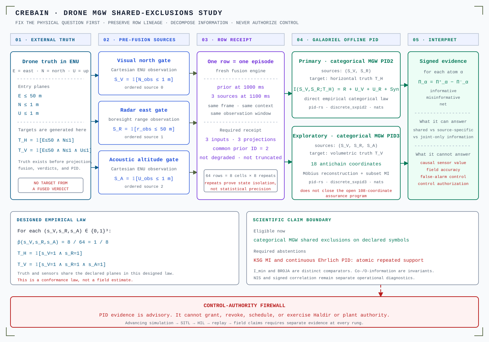
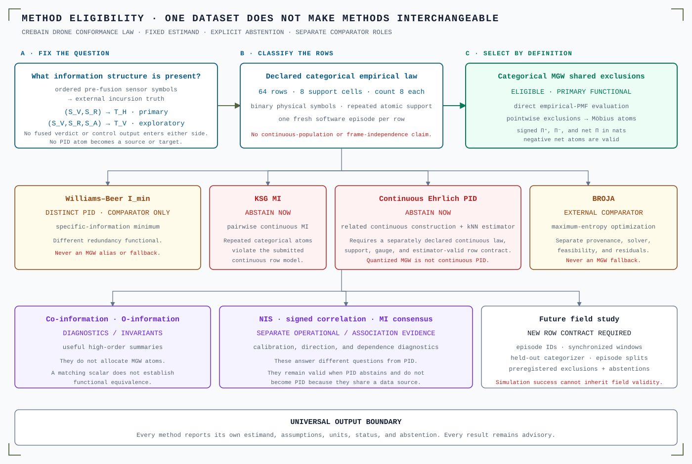

# Drone shared-exclusions PID study

> Status: deterministic, source-derived conformance fixture. This is not a
> flight study, a calibrated detector evaluation, or a control path.

CREBAIN now supplies a bounded drone fixture for an offline Galadriel study.
The study asks a narrow question:

> How is information about a declared incursion truth distributed across
> ordered, pre-fusion visual, radar, and acoustic symbols?

That question makes partial information decomposition (PID) useful. PID is not
required for detection, calibration, or control. The study uses categorical
Makkeh–Gutknecht–Wibral (MGW) shared exclusions because the submitted variables
are declared binary symbols. It does not substitute another PID when MGW is
unavailable.

The checked producer artifact is
[`src-tauri/tests/fixtures/crebain_drone_mgw_v1.json`](../src-tauri/tests/fixtures/crebain_drone_mgw_v1.json).
Its SHA-256 is
`82a837415b56c3646386a5c3e6fe28a492906c164edc461249bab7844aa4ebda`.
The embedded analysis-manifest digest is
`4b0381beee855e7d624066ab04cfdc07920c6182951315b65ba48d99c1e86f90`.

## System and evidence boundary

  

Text alternative: External drone truth is fixed in a canonical east-north-up
(ENU) frame. Visual, radar, and acoustic measurements become three ordered
binary sources. Each row uses one newly initialized fusion engine. Its receipt
must contain three inputs, three common-prior projections, and no degradation.
Galadriel evaluates a primary two-source horizontal-incursion PID. It also
evaluates a separately labeled exploratory three-source volumetric-incursion
PID. The outputs retain informative, misinformative, and net atoms. A
control-authority firewall prevents those research outputs from authorizing
Haldir or the plant.

## 1. Freeze the estimand before selecting a method

Let a drone's externally generated truth position be
\((E,N,U)\) in meters in the registered ENU frame. Define three entry planes:

\[
E_0=50,\qquad N_0=1,\qquad U_0=1.
\]

The fixture creates the targets from truth before sensor projection:

\[
T_H=\mathbf 1[E\leq E_0\land N\leq N_0],
\]

\[
T_V=\mathbf 1[E\leq E_0\land N\leq N_0\land U\leq U_0].
\]

`T_H` is the primary horizontal-incursion target. `T_V` is the exploratory
volumetric-incursion target. Neither target comes from a Galadriel verdict,
CREBAIN track decision, PID atom, or control output.

The ordered sources are measurement-derived symbols:

\[
S_V=\mathbf 1[N_{\mathrm{visual}}\leq N_0],
\quad
S_R=\mathbf 1[r_{\mathrm{radar}}\leq E_0],
\quad
S_A=\mathbf 1[U_{\mathrm{acoustic}}\leq U_0].
\]

Radar is on the registered east boresight. Its range is therefore the designated
east coordinate in this fixture. This construction is deliberate. It is not a
claim about arbitrary radar geometry.

The source order is:

1. `visual_north_plane_crossed`;
2. `radar_east_plane_crossed`;
3. `acoustic_up_plane_crossed`.

Order is part of the estimand. A source-order change changes the manifest
digest.

## 2. Define one scientific row

One row contains:

1. one unique episode identifier;
2. one freshly initialized `MultiSensorFusion` engine;
3. one visual prior at `1000 ms`;
4. three synchronized observations at `1100 ms`;
5. ordered pre-fusion source symbols;
6. externally generated truth targets;
7. a bounded fusion receipt.

The receipt must show:

| Receipt coordinate | Required value |
|---|---:|
| Input count | 3 |
| Expected modality count | 3 |
| Common projection count | 3 |
| Common frozen-prior identifier | 2 |
| Degraded | `false` |
| Truncated | `false` |

The fixture has eight factorial source cells. It generates eight fresh software
episodes for each cell:

\[
8\ \text{cells}\times 8\ \text{episodes per cell}=64\ \text{rows}.
\]

Thus,

\[
\widehat p(S_V=s_V,S_R=s_R,S_A=s_A)=\frac 8{64}=\frac18
\]

for every \((s_V,s_R,s_A)\in\{0,1\}^3\).

The repeated rows prove state isolation and deterministic regeneration. They do
not create 64 independent physical observations. The study reports no
confidence interval, p-value, or resampling result.

## 3. Why PID helps here

Mutual information answers how strongly a source set and target depend. It does
not, by itself, allocate the joint information among shared, source-specific,
and joint-only contributions.

For two sources, a PID represents:

\[
I(S_V,S_R;T_H)=R+U_V+U_R+\mathrm{Syn}.
\]

This allocation can answer engineering questions that a single association
score cannot:

- Is target information repeated across modalities?
- Does one modality contribute target information unavailable from the other?
- Does the pair carry information that neither modality carries alone?
- Is an atom informative or misinformative for this functional?

These are sensor-portfolio questions. They are not causal effect estimates.
They also do not measure detection accuracy, calibration, or operational risk.

MGW shared exclusions is especially useful because it exposes a pointwise
construction and retains signed atom components. For each lattice coordinate
\(\alpha\), pid-rs reports:

\[
\Pi_\alpha^{\mathrm{net}}
=
\Pi_\alpha^{+}-\Pi_\alpha^{-}.
\]

The informative and misinformative components are nonnegative in exact
arithmetic. The net atom can be negative. A negative net atom is a valid
measure-relative result. It is not evidence that a sensor is harmful.

The primary question uses the two-source decomposition. It has four named
coordinates. The exploratory question uses the three-source, 18-antichain
lattice. A successful three-source fixture does not close pid-rs's separate
108-coordinate assurance program.

## 4. Why PID is not forced

Use PID only when atom allocation is the scientific question. Use another
method when another question is primary:

- Use calibration curves or normalized innovation squared (NIS) for estimator
  calibration.
- Use signed correlation for linear direction and association.
- Use mutual information for dependence without atom allocation.
- Use receiver-operating-characteristic analysis for discrimination.
- Use causal designs for interventions and causal effects.
- Use safety analysis for control authority.

If the source, target, support, or row contract cannot be defended, PID must
abstain. It must not fall back to a different functional and keep the same
label.

## 5. Method eligibility

  

Text alternative: The fixed question maps ordered pre-fusion sensor symbols to
external incursion truth. The rows form a repeated categorical empirical law.
That topology makes categorical MGW shared exclusions eligible. Williams–Beer
`I_min` and BROJA are different comparator PIDs. They are not fallback routes.
Pairwise KSG mutual information and continuous Ehrlich PID abstain because this
fixture has repeated atomic support. Co-information and O-information are
diagnostics. NIS, signed correlation, and Galadriel's optional MI consensus
remain separate operational or association evidence. Future field work needs a
new row contract.

| Object | Scientific question | Current status | Output and boundary |
|---|---|---|---|
| Categorical MGW shared exclusions | How does the declared categorical target information occupy the redundancy lattice? | **Eligible.** Primary PID2 and exploratory PID3. | Signed informative, misinformative, and net atoms in nats. |
| Williams–Beer `I_min` | What PID follows from minimum specific information? | Comparator only. Not requested in this fixture. | A different PID functional. Never an MGW alias or fallback. |
| Pairwise KSG mutual information | How much continuous dependence exists for a declared regular continuous law? | **Abstain.** The fixture has repeated atomic support. | Pairwise MI, not PID. |
| Continuous Ehrlich PID | What continuous shared-exclusions PID follows from a declared continuous law and gauge? | **Abstain.** No eligible continuous law is submitted. | A related but distinct continuous construction and estimator. |
| BROJA | What bivariate decomposition follows from the BROJA optimization constraints? | External comparator only. Not requested here. | Separate solver provenance, feasibility checks, and residuals. |
| Co-information and O-information | What invariant or high-order balance does the joint law have? | Optional diagnostics. | They do not allocate MGW atoms. |
| NIS and signed correlation | Are innovations calibrated, and what signed linear association exists? | Separate operational evidence. | They remain useful when PID abstains. |
| Galadriel pairwise MI consensus | Which modalities separate in an uncalibrated pairwise dependence graph? | Separate opt-in research companion. | It is not PID and does not fuse into the accepted verdict. |
| Infomorphic objective | How should named information atoms be composed into a learning objective? | Downstream research only. | An objective composition is not another PID functional. |

The rows in this table are different estimands. Agreement is a scientific
comparison. Disagreement is not automatically a defect.

## 6. Producer and consumer responsibilities

CREBAIN owns the physical row:

- canonical frame and units;
- truth and target generation;
- sensor ordering;
- timestamps and episode identity;
- frozen-prior projection receipt;
- exact fixture regeneration.

Galadriel owns the offline scientific question:

- fixture-byte and manifest verification;
- source and target extraction;
- the exact pid-rs software identity;
- primary PID2 evaluation;
- exploratory PID3 evaluation;
- atom and mutual-information reconstruction;
- typed produced, unavailable, and error outcomes;
- a versioned advisory evidence artifact.

pid-rs owns the functional implementation and report semantics. This integration
uses the already pinned, reviewed revision
`1cd2424f7967e1752dcc8e53859e8fdad3566f51` read-only. A newer pid-rs commit is
not automatically a better dependency. Dependency changes need a separate
reviewed, remote-reachable API commit.

Haldir owns neither the estimand nor the PID. Haldir may display or archive a
qualified advisory result. It must not convert PID into control authority.

## 7. Required hostile controls

The study must fail closed under these mutations:

1. Swap two source identities without changing the manifest digest.
2. Replace external truth with a fused verdict.
3. Reuse a fusion engine across supposedly independent episodes.
4. Change a timestamp or window without changing row identity.
5. Remove one expected modality while retaining a complete receipt.
6. Mark a degraded or truncated row as eligible.
7. Change a threshold or category map after viewing PID output.
8. Clamp a negative atom to zero.
9. Mix nats and bits.
10. Break PID2 or PID3 reconstruction.
11. Present KSG or continuous Ehrlich output for the repeated atomic fixture.
12. Convert an advisory result into Haldir or plant authority.

Each hostile control must preserve unrelated predicates. A test that creates an
impossible composite state does not establish a causal guard.

## 8. Evidence ladder

| Rung | Required evidence | Current status |
|---|---|---|
| Deterministic conformance | Exact fixture regeneration, complete cells, fresh engines, receipts, manifest digest | Implemented in CREBAIN |
| Offline functional integration | Exact-byte import, pid-rs identity, PID2/PID3 reconstruction, signed atom artifact | Galadriel integration required |
| Stochastic simulation | Calibrated sensor error models, independent simulated episodes, preregistered analysis | Not established |
| Software-in-the-loop (SITL) | Time-synchronized simulator runs with episode-level splits | Not established |
| Hardware-in-the-loop (HIL) | Hardware clocks, calibration, loss, restart, and resource evidence | Not established |
| Recorded flight replay | Immutable raw inputs, truth provenance, episode grouping, blind analysis | Not established |
| Field claim | Independent flights, operating-domain definition, human review, uncertainty and failure analysis | Not established |
| Control use | Safety case and separate authority protocol | Out of scope and prohibited |

Success at one rung does not validate a later rung.

For future stochastic work, freeze a preregistration artifact before viewing
PID output. It must bind:

- episode identifier and independence unit;
- source order;
- target definition;
- synchronized time-window rule;
- calibration and category map;
- exclusions and missingness handling;
- episode-level train, validation, and test splits;
- resampling unit and stopping rule;
- method routes and software identities;
- accepted outputs and abstention rules.

Frames within one episode are dependent. Frame count is not the independent
sample size. Split, permute, and bootstrap at the episode level.

If a categorizer is fitted, fit it on separate calibration episodes. Record its
edges and occupancy. The result is a categorical or quantized estimand. Do not
call it continuous PID.

## 9. Twenty-lens review

| Lens | Question | Current disposition | Gate before a stronger claim |
|---:|---|---|---|
| 1 | Is the estimand explicit? | Yes. Sources, targets, order, units, and functionals are named. | Rebind any changed coordinate before execution. |
| 2 | Is target provenance independent of the analysis? | Yes. Truth creates targets before fusion. | Reject fused-verdict or PID-derived targets. |
| 3 | Are source variables pre-fusion? | Yes. Three measurement predicates are fixed. | Retain raw measurement and category lineage. |
| 4 | Are rows synchronized? | Yes. All sources share one `1100 ms` window. | Field work needs verified clock alignment. |
| 5 | Is the independence unit honest? | Yes. One fresh software episode per row. No inferential claim. | Use independent physical episodes for uncertainty. |
| 6 | Are geometry and units explicit? | Yes. ENU meters and a radar-boresight range are fixed. | Validate calibration and transforms in later rungs. |
| 7 | Is categorization declared? | Yes. Three physical threshold predicates are fixed. | Fit any learned categorizer outside evaluation episodes. |
| 8 | Is the PID functional identified? | Yes. Categorical MGW shared exclusions is named. | Keep complete defining-paper provenance. |
| 9 | Are Wibral-related works separated? | Yes. Categorical MGW and continuous Ehrlich are distinct. | Do not use “Wibral PID” as a method identifier. |
| 10 | Are signs and units preserved? | Required. Informative, misinformative, and net atoms use nats. | Reject clamping and unit ambiguity. |
| 11 | Is lattice algebra checked? | Producer law is complete. Consumer reconstruction is required. | Verify PID2 identities and all PID3 subset sums. |
| 12 | Are comparators kept distinct? | Yes. `I_min`, BROJA, invariants, MI, NIS, and correlation have separate roles. | Never implement fallback substitution. |
| 13 | Are method assumptions enforced? | Yes for the fixture classification. KSG and continuous Ehrlich abstain. | Reassess every new row law. |
| 14 | Is uncertainty honest? | Yes. No p-value, interval, or resampling is reported. | Use episode-level designs for stochastic claims. |
| 15 | Is the simulation grounded? | Partly. The safety volume and sensors are realistic abstractions. | Add calibrated noise, occlusion, clutter, and failures. |
| 16 | Are causal claims excluded? | Yes. PID is an associative decomposition. | Use interventions for causal attribution. |
| 17 | Is safety authority separated? | Yes. PID is advisory only. | Preserve the Haldir and plant firewall. |
| 18 | Is software provenance durable? | Yes for the fixture and pid-rs revision. | Bind exact producer and consumer commits in the final artifact. |
| 19 | Are resources and determinism bounded? | Yes. The law has 64 rows and eight support cells. | Retain checked budgets for expanded studies. |
| 20 | Can a human defend the result? | The contract is reviewable and the limitations are explicit. | The candidate must reproduce key derivations, disclose AI assistance, and obtain qualified human review. |

The twenty lenses do not vote. One failed load-bearing lens blocks the
corresponding claim.

## 10. Implementation and publication checklist

- [x] Define the physical truth frame and entry planes.
- [x] Define ordered pre-fusion visual, radar, and acoustic sources.
- [x] Define external horizontal and volumetric targets.
- [x] Use one fresh fusion-engine episode per row.
- [x] Generate all eight source cells with equal counts.
- [x] Retain exact timestamps and the frozen-prior receipt.
- [x] Embed and hash the preregistered analysis manifest.
- [x] Check exact fixture regeneration in the normal test suite.
- [x] Check source-order and target-origin digest sensitivity.
- [x] State that repeats do not create inferential precision.
- [x] Select categorical MGW without fallback.
- [x] Require KSG and continuous Ehrlich abstention on this law.
- [ ] Import the exact fixture into Galadriel.
- [ ] Verify the CREBAIN fixture SHA-256 and manifest digest in Galadriel.
- [ ] Evaluate primary `discrete_sxpid2`.
- [ ] Evaluate exploratory `discrete_sxpid3`.
- [ ] Retain informative, misinformative, and net atoms.
- [ ] Verify PID2 reconstruction and PID3 subset identities.
- [ ] Add hostile source-order, target-leakage, row-loss, sign, and unit controls.
- [ ] Serialize a versioned Galadriel advisory evidence artifact.
- [ ] Add Galadriel publication figures and prose alternatives.
- [ ] Update Haldir's advisory-only Galadriel mirror.
- [ ] Prove that no PID path can grant or exercise Haldir authority.
- [ ] Run CREBAIN, Galadriel, and Haldir repository gates.
- [ ] Bind final clean remote-reachable commits in the defense memo.
- [ ] Obtain candidate-owned reproduction and qualified human review.
- [ ] Define a new preregistration before SITL, HIL, replay, or field work.

Do not delete a review branch, prototype, or handoff artifact until useful bytes
are durable and retrievable from remote history.

## References

These sources define different objects. Their proximity in this study does not
make them interchangeable.

- Abdullah Makkeh, Aaron J. Gutknecht, and Michael Wibral,
  “[Introducing a differentiable measure of pointwise shared information](https://doi.org/10.1103/PhysRevE.103.032149),”
  *Physical Review E* 103, 032149 (2021). This is the categorical pointwise MGW
  shared-exclusions functional used here.
- Aaron J. Gutknecht, Michael Wibral, and Abdullah Makkeh,
  “[Bits and pieces: Understanding information decomposition from part-whole relationships and formal logic](https://doi.org/10.1098/rspa.2021.0110),”
  *Proceedings of the Royal Society A* 477, 20210110 (2021). This supplies the
  role-distinct part–whole and logical derivation.
- Paul L. Williams and Randall D. Beer,
  “[Nonnegative Decomposition of Multivariate Information](https://arxiv.org/abs/1004.2515)”
  (2010). This introduces the antichain lattice and `I_min`. The study uses the
  lattice lineage, not the `I_min` functional.
- Kyle Schick-Poland, Abdullah Makkeh, Aaron J. Gutknecht, Patricia Wollstadt,
  Anja Sturm, and Michael Wibral,
  “[A partial information decomposition for discrete and continuous variables](https://arxiv.org/abs/2106.12393)”
  (2021). This is the role-distinct general measure-theoretic construction. It
  is not an alias for categorical MGW or continuous Ehrlich PID.
- David A. Ehrlich, Kyle Schick-Poland, Abdullah Makkeh, Felix Lanfermann,
  Patricia Wollstadt, and Michael Wibral,
  “[Partial information decomposition for continuous variables based on shared exclusions: Analytical formulation and estimation](https://doi.org/10.1103/PhysRevE.110.014115),”
  *Physical Review E* 110, 014115 (2024). This defines the related, distinct
  continuous construction and nearest-neighbor estimator.
- Alexander Kraskov, Harald Stögbauer, and Peter Grassberger,
  “[Estimating mutual information](https://doi.org/10.1103/PhysRevE.69.066138),”
  *Physical Review E* 69, 066138 (2004). KSG is a mutual-information estimator,
  not a PID.
- Nils Bertschinger, Johannes Rauh, Eckehard Olbrich, Jürgen Jost, and Nihat
  Ay, “[Quantifying Unique Information](https://doi.org/10.3390/e16042161),”
  *Entropy* 16, 2161–2183 (2014). BROJA-style bivariate optimization remains a
  separate comparator.
- Fernando E. Rosas, Pedro A. M. Mediano, Michael Gastpar, and Henrik J.
  Jensen,
  “[Quantifying high-order interdependencies via multivariate extensions of the mutual information](https://doi.org/10.1103/PhysRevE.100.032305),”
  *Physical Review E* 100, 032305 (2019). O-information is a high-order
  diagnostic, not a PID atom.
- Abdullah Makkeh, Marcel Graetz, Andreas C. Schneider, David A. Ehrlich, Viola
  Priesemann, and Michael Wibral,
  “[A general framework for interpretable neural learning based on local information-theoretic goal functions](https://doi.org/10.1073/pnas.2408125122),”
  *Proceedings of the National Academy of Sciences* 122, e2408125122 (2025).
  This bivariate infomorphic-network work composes named PID atoms into local
  objectives. It does not define a fallback PID. The later three-input ICLR
  work is a separate publication.
- Andreas C. Schneider, Valentin Neuhaus, David A. Ehrlich, Abdullah Makkeh,
  Alexander S. Ecker, Viola Priesemann, and Michael Wibral,
  “[What should a neuron aim for? Designing local objective functions based on information theory](https://openreview.net/forum?id=CLE09ESvul),”
  *International Conference on Learning Representations* (2025). This
  role-distinct work extends local objective design to three input classes.
