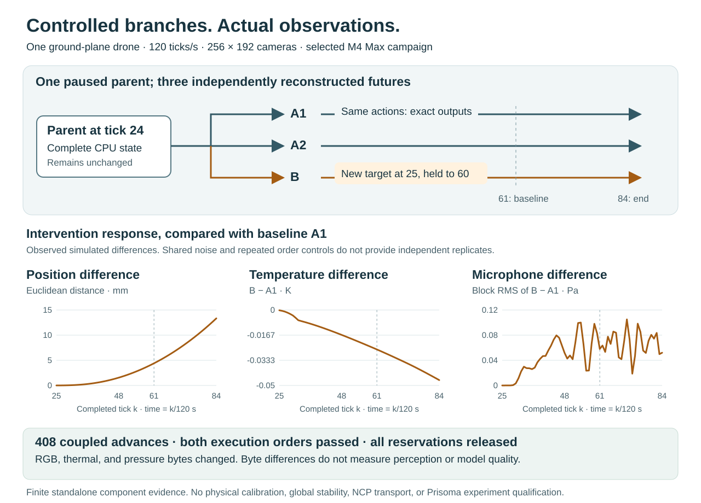

# Native city environment

This source component combines CREBAIN's actual Rapier dynamics with a project-authored city and three explicit observation models.
It runs without Engram, Prisoma, Galadriel, NCP, ROS, or the desktop application.
The existing desktop keeps its scheduler and defaults.
This component is not an installed desktop or NCP environment profile.


Text alternative: One scene specifies city colliders, meshes, and static Gaussian surfaces.
The CPU owner advances dynamics, acoustic history, and temperature at explicit ticks.
Selected cameras use a private renderer for actual RGB and thermal pixels.
Camera-free rosters require no graphics process.
The environment accepts a complete observation only after every required output joins the executed tick.
Branches reconstruct exact CPU state and use fresh static renderers with verified current pixels.

Read the [illustrated math guide](../output/pdf/native-environment-math.pdf) for worked examples and the checkpoint limits.

## Run the standalone example

The example requires the repository's frontend dependencies and its pinned Playwright Chromium distribution.
The measured platform uses Bun 1.3.14, Node 26.7.0, Chromium 151.0.7922.34, and an Apple M4 Max Metal renderer.
These observations do not qualify every supported operating system or installation.

From the repository root, run:

```sh
bun examples/native-environment/run.ts examples/native-environment/city-run.json /tmp/crebain-city-example /opt/homebrew/bin/node
```

Use a new output directory.
If the plan includes cameras, provide your explicitly selected absolute Node executable path.
For a camera-free plan, omit that final argument.
The launcher does not search PATH for a fallback.
The example advances 120 physics ticks, or one simulated second.
Two RGB cameras and one thermal camera each capture ten frames.
Each of two microphones returns 16,000 pressure samples.

The input file contains a closed plan, scheduled actions, and a step count.
Edit those values to define another bounded run.
The example replaces the declared source digest with its local source inventory digest.
It preserves original input bytes and the exact effective specification, including negative zero.
Neither inventory nor version strings attest loaded code on a hostile host.

`observations.jsonl` contains complete accepted observation batches.
`result.json` exists only after the planned prefix, source check, and normal owner retirement succeed.
A failed write reports the durable prefix separately from the owner's accepted and executed status.
The export has a 128 MiB admission bound and exclusive private files.
It is an engineering export, not Prisoma's durable experiment protocol.

## Force-ground profile

`crebain.cpu-force-ground-environment.v1` selects one drone above the existing ground, with an empty `scene.solids` array.
It reuses the qualified [force-attitude dynamics](DETERMINISTIC_DYNAMICS.md#bounded-force-attitude-profile), acoustic model, thermal model, and existing graphics owner.
The city profile and its default controller remain separate.
This profile does not admit force-controlled city geometry or multiple drones.

The closed plan adds `controller.engineModel`, `controller.referenceAltitudeM`, and `controller.referenceHeadingRad`.
The engine model must be `rapier-0.19.3-observed-no-gyro-v1`.
Reference altitude uses meters; reference heading uses radians.
Scene, camera, microphone, thermal, and acoustic admission rules still apply.
The scene format retains its existing identifier, even with no city solids or Gaussians.
RGB and thermal rendering still include the ground and drone mesh.

Run the separate explicit example with:

```sh
bun examples/native-environment/run.ts examples/native-environment/force-ground-run.json /tmp/crebain-force-ground-example /opt/homebrew/bin/node
```

The supplied plan requests 24 ticks, or 0.2 simulated seconds.
It schedules a level target at tick one and a 0.03-radian pitch target at tick thirteen.
This short export example does not establish tracking quality or a completed Prisoma experiment.

A force action uses `kind=force_attitude_height`, `roll_rad`, `pitch_rad`, `heading_rad`, and `altitude_m`.
Roll and pitch must each lie within ±0.1 radians.
Heading is absolute, within a wrapped ±0.2 radians of the owned reference.
Altitude must lie within ±0.5 meters of the owned reference.
Legacy yaw-rate keys, implicit angle conversions, and out-of-bound targets are rejected.
Direct motor controls remain explicit comparisons and produce no force-controller diagnostics.

An action applies before its named tick and persists until the next accepted action.
The first controlled tick requires an explicitly scheduled applicable action.
Missing control, insufficient capacity, and the wrong CPU advance method reject before mutation.
`EnvironmentState.advanceControlled()` awaits one actual dynamics transition, then advances thermal state and pressure once.
The existing synchronous `EnvironmentState.advance()` remains the city API.
Coupled callers continue using the asynchronous `EnvironmentOwner.advance()` method.

Force observations use `crebain.force-ground-observation.v1`.
They bind the environment profile, exact owned plan digest, actual control transition, source, scene, tick, and preceding accepted batch.
The privileged control record retains the held-action tick, applied motor targets, actual rotor state, and complete before/after dynamics digests.
This CREBAIN record is not Prisoma's selected-execution receipt or a durable experiment commitment.
Its `crebain.controlled-transition-json.v1` encoding preserves negative zero as `{"float64":"negative-zero"}`.
The record hashes its exact encoded bytes; its insertion order differs from the sorted dynamics checkpoint encoding.
This private owned-output encoder does not widen the shared caller-input admission contract.
Caller input retains accessor rejection; replacement internal returns are outside that accessor-isolation claim.
The allocator's steady moment guarantee does not remove motor lag or guarantee transient tracking.
Ordinary predictors must not receive this privileged record or the complete CPU reference.

The raw sensor reservation and the 32,768-byte controlled return cover different data.
The encoded envelope adds 66,560 bytes for the quoted control record and its metadata.
`observationEnvelopeBytes()` supplies the same bound to preparation, tick admission, joined output checks, and standalone export projection.
The optional fourth preparation argument can restrict the encoded observation capacity.
An insufficient bound rejects before CPU allocation or graphics launch.
The export retains its 128 MiB cap and distinguishes executed, accepted, and durable prefixes.

A typed controlled CPU failure retains the actual executed tick, or explicit uncertainty, and separate thermal and acoustic completion facts.
A later sensor failure cannot erase a successfully returned control transition.
Retirement during an awaited CPU operation waits for that operation before releasing CPU resources.
An already admitted operation can finish during retirement, but it cannot publish a late observation or start a late graphics request.
Unresolved cleanup retains its resource reservation.

Controlled checkpoint reconstruction awaits the same force transition for every replayed tick, including accepted future actions.
The existing all-camera barrier and fresh-renderer pixel checks still apply.
The private 256 × 192 campaign described below supplies a separate bounded real-render comparison.
It does not qualify the force profile across every admitted camera configuration.

### Measured controlled branches



Text alternative: A parent stops at tick 24.
Two fresh siblings receive baseline actions. A third receives a different target at tick 25.
All children advance through tick 84. The parent remains unchanged.
Plots show position distance, temperature difference, and microphone pressure difference between the intervention and one baseline sibling.

[Open the original SVG](../assets/diagrams/force-ground-coupled.svg?raw=true)
· [Read the derived numeric series](data/force-ground-coupled-20260908.json)
· [Read the illustrated math guide](../output/pdf/native-environment-math.pdf)

Private campaign 002 completed 408 coupled advances in two fresh families with reversed creation and advancement orders.
Each family used one paused parent and three children, with one drone and zero scene solids.
Two RGB cameras and one thermal camera used 256 × 192 pixels, a 60-degree field of view, and 12-tick periods.
Two microphones sampled at 16 kHz.
Each child produced five frames per camera and 8,000 pressure samples per microphone.

The intervention requested roll 0.02 rad, pitch 0.03 rad, heading 0.04 rad, and altitude eight meters at tick 25.
The inherited level target at tick 61 remained binding.
Matched siblings agreed on every future payload and complete final CPU state.
Corresponding branches also agreed across the reversed-order families.
Separate direct implementation instances matched each returned control, reference, and pressure block.
Fresh parent checkpoints confirmed unchanged parent state after child operations.
Every owner retired with zero observation leases and family reservations.

Compared with a baseline child, the intervention changed 791 RGB bytes, 844 thermal bytes, and 115,171 pressure bytes per family.
Camera differences first appeared at tick 36; pressure differences first appeared at tick 25.
Byte inequality establishes an observed difference, not perception accuracy, tampering detection, or world-model quality.
The plotted position distance reaches 13.337742 mm over this selected half-second continuation.
Shared noise and repeated order controls do not supply independent statistical replicates.
The public numeric series is a derived private-campaign summary, not a public replay package or installed-runtime receipt.

The original 64 × 48 campaign failed its spatial-variation criterion at tick 36.
The thin drone mesh missed every pixel center; fresh original-resolution thermal frames reproduced the retained failure bytes exactly.
A higher-resolution diagnostic recovered the drone but failed exact CPU/GPU coordinate equality at two triangle-edge pixels.
Those centers lay approximately 0.000795 pixels outside the CPU-projected edges.
Separate interior, exterior, and ambient-temperature controls passed; the earlier exact-coordinate diagnostic remains failed.
Campaign 002 changed camera dimensions only. It preserved the original actions, horizon, order controls, and acceptance criteria.

A uniform ambient image can be valid sensor output while failing an experiment's visibility requirement.
Specify dimensions, projection, sampling, pose, and source tick when defining a camera experiment.
This campaign establishes no general visibility guarantee, physical calibration, force-controlled city, many-drone force control, or nonzero Gaussian contribution.
NCP transport and a complete Prisoma experiment remain separate open contracts.

## Ownership and public interfaces

| Owner | Interface and meaning |
| --- | --- |
| `SceneSpec.ts` | Own closed metric city geometry, materials, cameras, and microphones. Reject external resource and executable fields. |
| `EnvironmentState.ts` | Own actual dynamics, acoustic history, temperatures, accepted actions, and exact CPU checkpoints. |
| `GraphicsOwner.ts` | Render actual Three.js and Spark pixels for an exact scene, tick, pose, and temperature input. |
| `owned-graphics-process.mjs` | Own a private Node worker and Chromium process group, with parent setup, capture, and cleanup deadlines. |
| `EnvironmentOwner.ts` | Join CPU execution and all required outputs, retain one immutable observation lease, and own reconstructed branches. |

`EnvironmentOwner.prepare(plan, launcher)` admits the complete raw output capacity before CPU preparation.
The launcher is required only when RGB or thermal cameras are configured.
With both camera lists empty, preparation starts no renderer and ignores any supplied graphics launcher.
Camera-free observations contain `graphics=null`; pressure, CPU state, and lease rules remain unchanged.
The standalone example records `diagnostics=null` for that path.
Configured cameras retain their graphics checks on every tick, including ticks without a due frame.
`schedule(action)` accepts one future action through the existing dynamics contract.
`advance()` executes one tick and returns an owner-issued observation handle after complete output validation.
`readObservation(handle)` returns an immutable JSON string.
`releaseObservation(handle)` releases that lease before another advance.
Copied, foreign, altered, and released handles reject.

`checkpointEligibility()` explains the required all-camera barrier.
Static-render checkpoints require at least one camera.
The separate CPU checkpoint interface remains available for camera-free state.
`checkpoint()` returns a live owner-issued checkpoint handle at that barrier.
`checkpointAudit(handle)` returns metadata and complete CPU checkpoint strings for privileged audit.
`fork(handle)` reconstructs an independent child with explicit parent ancestry.
`releaseCheckpoint(handle)` releases retained checkpoint capacity.
`resourceStatus()` reports reserved family capacity, including unresolved generations.
`retire()` ends authority and releases owned resources.

Checkpoint audit strings do not carry executable fork authority.
This interface has no loader for arbitrary serialized checkpoints.
It does not restore a retired environment or replace a canonical parent with an experimental child.

## Geometry, time, and actions

The metric frame uses positive Y upward, positive Z forward, and positive X right.
It is not ENU or the PushT action frame.
The city fixture contains sixteen authored building cuboids and the existing ground.
The same cuboids define Rapier collision, mesh surfaces, acoustic obstruction, and Gaussian placement.
Gaussians sit 20 millimeters outside building faces as an explicit visual representation.
The fixture has 6,144 procedural Gaussians.
No captured third-party city asset is included.

The drone drawing is a visual proxy, not a calibrated physical surface reconstruction.
Its rotor-center positions follow the existing physics offsets.
Thermal area and capacity are explicit effective model parameters, not values inferred from that drawing.

Let `k` be the completed nonnegative physics tick.
Time is exactly `t = k / 120` seconds at the interface.
The existing numerical integrator uses floating-point `Δt = 1 / 120` seconds.
Display reads and wall-clock delays cannot advance this clock.

An action for tick `k` applies before that tick's controller and dynamics update.
The selected control persists until a later accepted action replaces it.
A legacy city attitude control contains roll and pitch in radians, yaw rate in radians per second, and altitude in meters.
A motor control contains `commands.front_left`, `front_right`, `rear_left`, and `rear_right`, each in `[0, 1]`.
The legacy city controller retains its angle clamps, integral state, mixer, and motor saturation.
Commanded control, actual rotor response, and resulting motion are different quantities.
The legacy city batch does not expose a separate applied-action record.
The complete CPU audit retains the relevant controller, motor, and accepted-action state.

A separate 360-tick actual-Rapier controller campaign found tracking failures with small attitude targets.
Its repeated and direct-world trajectories matched, but late motor saturation and altitude loss violated the frozen tracking bounds.
The legacy city profile preserves that controller behavior.
Its deterministic forks do not qualify stable attitude tracking or neural acceleration delivery.
The 120-tick public city example retains attitude commands and tests one second of observations and export, without tracking-quality credit.

A separate pinned-runtime free-rotation probe observed no Euler gyroscopic evolution in its inspected unequal-inertia, zero-damping configuration.
This twelve-tick observation does not characterize every Rapier mode or establish physical fidelity.
The [dynamics evidence summary](DETERMINISTIC_DYNAMICS.md#observed-controller-and-angular-model-limits) records the bounded campaign sizes and limitations.

## Actual RGB and thermal pixels

RGB output contains awaited Spark and Three.js rasterization, with `rgba8-srgb` channels and a bottom-left row origin.
Each camera has independent dimensions and an integer capture period.
A camera emits only when its period divides the completed tick.
The initial tick-zero image is not acquired automatically.

The admitted Gaussian scene is static.
The renderer prepares its fixed-origin Gaussian collection once, then sorts and renders each requested view.
Drone meshes and temperatures change with explicit inputs.
Dynamic Gaussian geometry is unsupported by this profile.
Opacity-zero versus opacity-one controls must change actual rendered pixels before the Gaussian contribution is credited.

Thermal output uses an actual floating-point render target and visibility tests against the same scene surfaces.
Each pixel contains bolometric gray-surface radiance in watts per square meter per steradian, abbreviated `W/(m² sr)`.
This integrates all wavelengths.
It is not an 8–14 micrometer camera, calibrated detector, temperature image, or false-color RGB conversion.
The renderer copies GPU readback bytes before publishing them or starting another capture.

## Heat model with units

For rotor `r`, let torque `τ_r` have units of newton-meters and speed `ω_r` have units of radians per second.
The actual rotor state supplies mechanical power:

```math
P_m = sum_r |τ_r ω_r|.
```

Let motor efficiency be `η`, with `0 < η ≤ 1`.
The model defines electrical input as `P_e = P_m / η` watts and heat input as `P_h = P_m (1/η - 1)` watts.
For example, `P_m = 70 W` and `η = 0.7` give `P_e = 100 W` and `P_h = 30 W`.
This is a declared constant-efficiency model.
It does not infer electrical energy from the simulator's normalized battery variable.

Let `T_k` be body temperature in kelvin, `T_a` ambient temperature, and `C` heat capacity in joules per kelvin.
Let `A` be effective area in square meters and `h` convection coefficient in watts per square meter per kelvin.
Let emissivity `ε` be dimensionless, and let `σ = 5.670374419 × 10^-8 W/(m² K⁴)`.
The next temperature solves the backward-Euler heat balance:

```math
C (T_(k+1) - T_k) / Δt
  = P_h - h A (T_(k+1) - T_a)
        - ε σ A (T_(k+1)^4 - T_a^4).
```

With zero heat loss, `P_h = 30 W`, `C = 100 J/K`, and one tick, the temperature increases by `0.0025 K`.
The implemented loss terms reduce that increase when the body is warmer than ambient.
The residual increases strictly with temperature because its derivative is `C/Δt + hA + 4εσAT³`, which is positive.
A bounded bracket and 64 bisection iterations select the next temperature.
A solution outside the admitted temperature range fails the transition.

Ideal diffuse surface radiance is:

```math
L(T, ε, T_a) = (σ / π) [ε T^4 + (1 - ε) T_a^4].
```

The second term represents reflected uniform ambient radiation.
At `T = T_a = 293.15 K`, radiance is about `133.2973 W/(m² sr)`, regardless of emissivity.
At `T = 400 K`, `ε = 0.9`, and that ambient temperature, radiance is about `429.1870 W/(m² sr)`.
Independent arithmetic controls check these rendered values and opaque-surface occlusion.
The model does not claim measured drone fidelity, spectral response, or a globally closed scene energy balance.

## Microphone pressure model

Microphones emit actual samples from a declared discrete acoustic forward model.
They do not receive truth-position vectors with an acoustic label.
Sample rate is `f_s = 16,000 Hz`.
For completed tick `k ≥ 1`, the sample interval is:

```math
[floor((k - 1) f_s / 120), floor(k f_s / 120)).
```

The first three intervals contain 133, 133, and 134 samples.
CPU advancement occurs first.
The completed pose and rotor speed remain constant within that tick's audio block.
This is an explicit piecewise-constant approximation, not continuous moving-source acoustics.

For a two-bladed rotor at `n` revolutions per minute, blade-passage frequency is `f_b = 2n / 60` hertz.
At `n = 6,000 RPM`, the fundamental is `200 Hz`.
The source waveform combines sine harmonics with weights `1`, `0.3`, and `0.1`.
Amplitude scales with `(n/15,000)^2` and the declared reference pressure in pascals.
Each rotor contributes one quarter of that pressure scale.
The four phases and their histories are explicit simulator state.

For source distance `d`, reference distance `d_0`, and sound speed `c`, delay is `max(d,d_0) / c` seconds.
Gain includes `d_0 / max(d,d_0)` and the configured obstruction factor.
The sampler uses linear interpolation between retained delayed source samples.
For example, `d = 34.3 m` and `c = 343 m/s` give a 0.1-second delay, or 1,600 samples.
That example requires a configured maximum range of at least 34.3 meters.
The default 32-meter range would omit that source.

Each microphone adds a seeded Box-Muller normal-noise sample with the declared standard deviation in pascals.
Noise state, phases, delay rings, tick, and sample index all enter the exact CPU checkpoint.
The model omits echoes, diffraction, calibrated directivity, and moving-source retarded geometry.
Cloned noise streams are common random numbers, not independent experimental replicates.

## Failure and acceptance

The owner reserves complete raw output capacity before advancing CPU state.
It accepts a batch only after source, scene, tick, camera roster, dimensions, units, and actual sample bytes validate.
The accepted batch binds privileged CPU reference data separately from pressure, RGB, and thermal arrays.
These raw modalities share simulator causes.
Their presence does not prove statistical independence or a qualified fused measurement.

If rendering fails after CPU advancement, the known executed tick remains distinct from the last accepted observation tick.
If CPU execution throws without a completed return, `executedTick` becomes unknown.
`lastObservedCompletedCpuTick` identifies the previous observed completed return.
A recoverable complete CPU audit remains explicitly incomplete sensor evidence.
The owner retires and rejects later actions or advances.
There is no apparent rollback or continuation after uncertain required output.

The parent can terminate only independently joined owned browser processes.
HTTP routing limits browser requests to the private development origin.
That routing rule is not operating-system network isolation.
Parent-death cleanup depends on the measured private pipe and schedulable processes.
Stopped or unschedulable process families receive no unconditional orphan-cleanup guarantee.
Unconfirmed disappearance remains unresolved.
Failed preparation attempts CPU and returned graphics cleanup independently.
`EnvironmentPreparationError` retains the primary failure and each cleanup disposition.
A launcher that returns no graphics authority does not prove that no graphics resources existed.

## Exact CPU state and reconstructed static branches

A checkpoint requires a released observation lease and a completed tick where every configured camera was due.
The first possible barrier is the least common multiple of camera periods.
If that period exceeds 7,200 ticks, no such barrier exists within this profile's horizon.
The owner reports ineligibility before CPU checkpoint or graphics work.

The CPU checkpoint is complete for the admitted dynamics, controller, acoustic, and thermal state.
It includes accepted future actions, not only already executed actions.
Reconstruction replays the same actual transition and compares the complete canonical CPU state.
See [deterministic dynamics](DETERMINISTIC_DYNAMICS.md) for the retained direct-Rapier restore failures and the selected replay contract.

A branch launches a fresh private static renderer and re-renders the checkpoint's exact last input.
Ordered raw camera digests must match before child admission.
Parent checkpoint, accepted prefix, action-history position, and new child identities remain explicit.
Owner-dependent batch hashes therefore differ between siblings even when raw observations match.
Candidates can use only free future action slots.
They cannot overwrite an already accepted future action through this interface.

Equal current pixels do not prove equal hidden GPU states or universal future equality.
Controlled comparisons must use fresh matched siblings for both intervention and no-intervention arms.
A continuing warm parent is an additional diagnostic, not the sole causal control.
Frozen same-action future controls qualify only their recorded finite scope.
Intentionally different action effects are not renderer failures.

Failed reconstruction retires only the candidate child.
Primary reconstruction failure and cleanup failure remain separate.
Unresolved graphics generations continue consuming family capacity.
The parent checkpoint, state, and observation lease survive a rejected child.

## Limits and remaining work

| Quantity | Admitted bound |
| --- | --- |
| Sorted drones, legacy city | 1 through 256 |
| Sorted drones, force-ground | Exactly one |
| Static scene cuboids, legacy city | At most 64 |
| Static scene cuboids, force-ground | Zero; existing ground only |
| RGB cameras | 4, each 8 through 1,280 pixels per dimension |
| Thermal cameras | 4, each 8 through 320 pixels per dimension |
| Microphones | 4 at 16 kHz |
| Camera periods | 1 through 120 physics ticks |
| Horizon | 7,200 ticks, or 60 simulated seconds |
| Complete maximum raw batch | 27,857,088 bytes |
| Observation lease | One per owner; release before another advance |
| Retained or unresolved family generations | Four |
| Generation attempts | 256 per family |
| CPU checkpoints | Eight per family; 64 MiB each; 128 MiB retained total |
| Checkpoint metadata | 1 MiB each; 8 MiB retained total |
| Current render reference | At most 512 KiB per owner, with pixel digests instead of duplicate image arrays |
| Reconstruction staging | One per family; at most one reserved 32 MiB raw camera batch |
| Temporary CPU reconstruction checkpoint | One additional 64 MiB reservation, separate from the 128 MiB retained-family budget |

A CPU restore temporarily reserves one additional owner beyond the four retained owners.
Unresolved cleanup keeps the temporary owner and 64 MiB checkpoint reservations.
Both CPU fork and restore then reject further reconstruction.
A later unrelated cleanup observation cannot release these reservations.

These are logical data and ownership bounds, not a total process-memory guarantee.
JSON, base64, temporary CPU replay, GPU resources, and runtime allocations need separate operational measurements.
The audited plain-data copier bounds traversal and output but does not isolate proxy traps or descriptor allocation.
The graphics executable path is trusted launcher configuration, not a scene capability.

The component does not supply calibrated camera detection, qualified fusion, tampering accuracy, or a learned drone controller.
The current scalar NCP adapter still has its separate one-to-three-entity profile.
Many-drone observation transport and segmented checkpoint export need separately installed contracts.
Prisoma still needs its selected-action receipt, predictor-access contract, durable commitments, and complete experiment integration.
Ordinary predictors must not read privileged checkpoint or future-reference data.
No real-world vehicle or weapon control is provided by this environment.

## Rebuild the math guide

The guide builder is `scripts/build-native-environment-guide.py`.
The rendered control used ReportLab 4.5.1, pypdf 6.15.0, and rsvg-convert 2.62.3.
It embeds Arial fonts from the selected local installation.
Use `CREBAIN_PDF_FONT_DIR` to select an explicit folder containing `Arial.ttf` and `Arial Bold.ttf`.
The script writes the eight-page guide to `output/pdf/native-environment-math.pdf`.
Review every rendered page after changing mathematical prose or diagram content.
The source Markdown remains the owning implementation contract.
