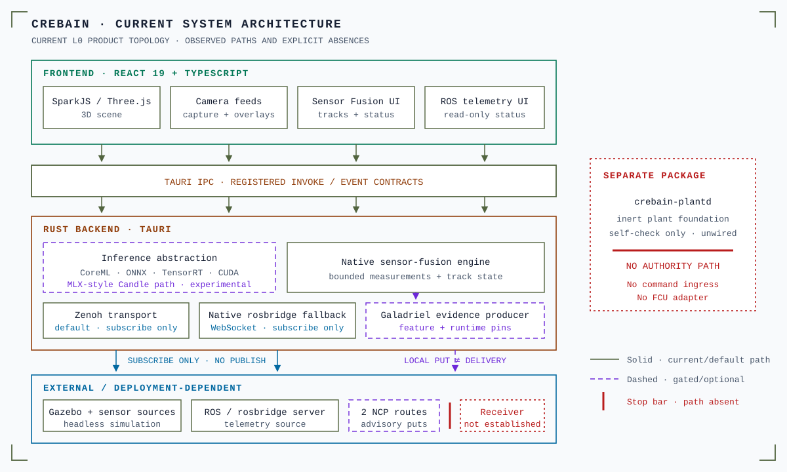

# CREBAIN documentation index

This index groups the top-level documents in `docs/` by audience.

  

Text alternative: The React frontend uses Tauri inter-process communication
(IPC) to reach Rust inference, sensor fusion, and read-only telemetry transports.
A feature-gated producer can make local puts to two advisory NCP routes. Those
puts do not prove receiver delivery. The separate plant foundation is inert and
has no vehicle-authority path.

## User guides

- [CONTROLS.md](CONTROLS.md) — Full keyboard reference
- [CONFIGURATION.md](CONFIGURATION.md) — Environment variables, settings, scene/asset limits
- [MANUAL_SMOKE_TEST.md](MANUAL_SMOKE_TEST.md) — Manual smoke checklist

## Architecture and design

- [Native city environment](NATIVE_ENVIRONMENT.md) — Standalone city, actual RGB, pressure, thermal radiance, and reconstructed branches
- [DETERMINISTIC_DYNAMICS.md](DETERMINISTIC_DYNAMICS.md) — Explicit Rapier ticks, complete reference state, and verified action-prefix forks

- [ARCHITECTURE.md](ARCHITECTURE.md) — Design principles, transport trade-offs, backend selection, directory map
- [SYSTEM_CONTEXT.md](SYSTEM_CONTEXT.md) — System context, trust boundaries, and claim limits
- [SENSOR_FUSION.md](SENSOR_FUSION.md) — Fusion math, coordinate contracts, tuning, known limitations
- [FUSION_VALIDATION_PROTOCOL.md](FUSION_VALIDATION_PROTOCOL.md) — Preregistered, not-yet-run fusion metrics and experiment protocol
- [MODEL_CONTRACTS.md](MODEL_CONTRACTS.md) — What a model must prove before its detections are trusted
- [NATIVE_DETECTOR_BENCHMARK.md](NATIVE_DETECTOR_BENCHMARK.md) — Release-command native detector latency artifact and evidence limits

## Integrations

- [GALADRIEL_PRODUCER.md](GALADRIEL_PRODUCER.md) — Optional live evidence routes, deployment pins, bounds, and claim limits
- [NCP_BRIDGE_HANDOFF.md](NCP_BRIDGE_HANDOFF.md) — Dormant action adapter, dependency-isolated headless perception runner, advisory producer, and Engram compatibility boundaries
- [CREBAIN managed simulation](../integrations/engram/managed-simulation/README.md) — Host API 2.0 schemas, tick order, receipts, packaging, and simulator-only boundaries
- [Native NCP simulation](NATIVE_NCP_SIMULATION.md) — Bounded local body process, source binding, actual application, and failure limits
- [Native simulation kernel](NATIVE_SIMULATION_KERNEL.md) — Project-local kernel reuse, actual innovation recording, and numerical parity limits

## Plant foundation (inactive/unwired candidates)

- [PLANT_CONTRACT_V1.md](PLANT_CONTRACT_V1.md) — Inactive draft command contract, frame corpus, and limits
- [PLANT_HEALTH_V1.md](PLANT_HEALTH_V1.md) — Inactive typed vehicle-health snapshot and evidence limits
- [PLANT_FRESHNESS_V1.md](PLANT_FRESHNESS_V1.md) — Inactive profile-bound captured-read health-age classifier
- [PLANT_SAFE_ACTION_V1.md](PLANT_SAFE_ACTION_V1.md) — Inactive exact-profile safe-action situation-dispatch candidate
- [PLANT_WATCHDOG_V1.md](PLANT_WATCHDOG_V1.md) — Unwired receipt-anchored active command deadline-monitor candidate
- [PLANT_APPLY_OBSERVATION_V1.md](PLANT_APPLY_OBSERVATION_V1.md) — Unwired post-health-load single-reference-instant apply-check observation and association limits

## Safety and claims

- [HAZARD_LOG.md](HAZARD_LOG.md) — Phase 0 Systems-Theoretic Process Analysis (STPA) hazard log. The normative structured log is in `baselines/`
- [L1_ODD.md](L1_ODD.md) — Draft, unapproved L1 operational design domain limits
- [COMPLETION_LEVELS.md](COMPLETION_LEVELS.md) — Current L0 claim, the L1 target, and claims that CREBAIN does not make
- [CROSS_REPOSITORY_REQUIREMENTS_0.9.0.md](CROSS_REPOSITORY_REQUIREMENTS_0.9.0.md) — Explicit 0.9.0 cross-repository requirements handoff

## Release

- Gates (pre-release): [RELEASE_ACCEPTANCE.md](RELEASE_ACCEPTANCE.md) — Release-candidate evidence gates
- Evidence log (post-release): [RELEASE_EVIDENCE.md](RELEASE_EVIDENCE.md) — Release evidence log
- History (retired identifiers): [RELEASE_HISTORY.md](RELEASE_HISTORY.md) — Version history and retired release identifiers
- Decision (0.9.0): [NARROWED_GO_0.9.0.md](NARROWED_GO_0.9.0.md) — Exact 0.9 release scope, exclusions, and blockers
- Baseline (Phase 0): [PHASE0_BASELINE.md](PHASE0_BASELINE.md) — Frozen Phase 0 vocabulary, scope, and command-surface baseline
- Planning (ongoing): [BACKLOG.md](BACKLOG.md) — Current engineering backlog

## Notes

- [`markdown-visual-coverage.json`](markdown-visual-coverage.json) accounts for
  every tracked Markdown file as visually covered or specifically exempt. The
  verifier also requires concise alt text and an adjacent prose alternative.
- `archive/` is historical. Do not use it as an implementation plan.
- `baselines/` holds machine-readable frozen artifacts.
