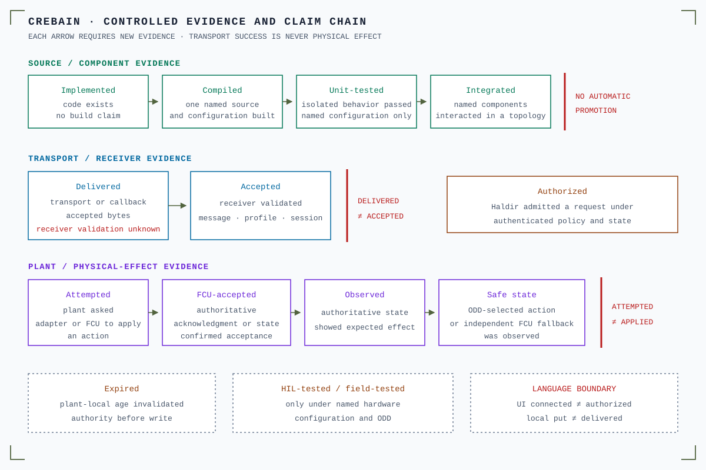

# CREBAIN release acceptance criteria

Use these criteria to decide if a stabilization batch, demo build, or release
candidate is ready. Numeric performance, accuracy, transport, scientific, and
safety claims require measurements from the candidate in its target
environment.

The strict manual and target-environment gates in these criteria apply to demo,
operational-readiness, deployment, and 1.0 claims. The research-only 0.9.0
prerelease is a deliberately narrower exception governed by
[`NARROWED_GO_0.9.0.md`](NARROWED_GO_0.9.0.md): it may be tagged only after its
pre-tag automated source conditions pass. The annotated tag then starts the
exact-tag package gate. The release stays draft/unpublished unless it passes,
while manual/deployment entries remain visibly pending and the published artifact
retains the documented NO_GO boundaries.

  

Text alternative: Eleven named stages separate weak claims from strong claims.
They cover source existence, builds, tests, integration, transport, receiver
validation, authorization, and attempted application. Later stages cover flight
control unit acceptance, observed effect, and safe-state evidence. Each stronger
claim needs new evidence. No stage advances automatically. Expiry and hardware
or field tests provide separate facts.

## Required evidence

### Local cross-language gate

- **Acceptance evidence:** `bun run validate:all` passes: Phase 0 baseline plus fail-closed self-test; NCP manifest/lock/doc coherence; frontend typecheck/lint/format/tests; inert plant dependency boundary, digest-bound JavaScript/Rust frame corpus, scoped-rustfmt/check/test/strict-clippy/headless self-check; isolated headless NCP boundary/check/test/strict-clippy/network-free self-check; Rust fmt/default check/all-target tests/clippy; NCP bridge/producer feature clippy/all-target tests; every default/NCP Cargo package command uses `--locked`

- **Blocking conditions:** Any error, inventory/config/pin drift, stale normative NCP version, unlocked package acceptance command, plant-boundary/frame-corpus drift, benchmark-logic test failure, other test failure, or clippy warning

### Hosted frontend gates

- **Acceptance evidence:** CI `bun run validate`, `bun run check:bundle`, `bun run test:responsive`, and `bun run test:coverage` pass; the browser smoke covers the 1,600×1,200 free layout, the 1,600×1,000 docked layout, the 1,024×720 minimum, and the minimum at 200% UI scale; it rejects hidden document overflow, panel collisions, clipped chrome, and inaccessible rail overflow; `validate` includes `check:production-vendors`, which binds the exact Spark/Rapier/Three transforms and local-byte/texture runtimes; every build emits schema-v2 module provenance, excludes the development rosbridge module, hashes/scans every finalized JavaScript chunk, runs split/aliased/reflective artifact rejection fixtures, and `check:bundle` then applies the size budget

- **Blocking conditions:** Vendor package/module/payload/AST drift, transformed runtime or mutation failure, module graph/provenance drift, chunk hash/capability scan, artifact self-test, responsive layout smoke, bundle budget, or coverage threshold fails, even if another local gate passed

### Hosted Rust feature gates

- **Acceptance evidence:** Linux checks pass for `--features cuda,tensorrt` and `--no-default-features`; default and NCP jobs pass on Linux/macOS

- **Blocking conditions:** Feature-gated code does not compile or NCP tests are skipped

### Managed simulation bootstrap and operational gates

- **Acceptance evidence:** CI uses exact Rust 1.91.1.
  The managed gate uses an Apple Silicon macOS 15 runner.
  It runs the boundary, input, release-contract, format, check, test, Clippy, and rustdoc gates.
  Push-main CI also creates one clean-main observed build and stage receipt.
  Contract provenance v2 binds each copied Engram schema to one Git blob from clean `origin/main`.
  The build receipt binds the CREBAIN Git identity, source blobs, Cargo inputs, tools, target, and Mach-O arm64 bytes.
  Fresh Cargo dep-info must match the compile-input roster.
  The stage receipt joins those bytes to the exact package inventory.
  The pack receipt binds clean Engram `origin/main` and the exact extension-tool Git blob.
  Installed proof v3 joins build, stage, pack, store, bundle, seal, executable, configuration, and schemas.
  Bootstrap CI does not open historical or operational captures.
  Its provider-free test accepts synthetic v2 evidence and rejects an exact v1 root.
  The cross-repository oracle validates three plans and six receipt roots against immutable Engram models.
  It also validates each terminal run against its complete NEST evidence bundle.

- **Blocking conditions:** A copied contract lacks Git provenance.
  A build input, Cargo dep-info row, or receipt join drifts.
  A source include escapes scanning.
  A source executable lacks owner-execute mode.
  A source executable lacks valid thin Mach-O arm64 load commands.
  The pack tool, Engram commit, bundle generation, or receipt lineage drifts.
  A nested roster is unsafe, unsorted, duplicated, stale, or open.
  Exact arithmetic, numeric kinds, recorder state, controller encoding, or decoded proposals drift.
  The runtime gains NCP, MUSIC, network, Tauri, artifact, plant, physical, scientific, or restart authority.

The observed-build receipt is not a signature or reproducibility proof.
It does not attest external dependency bytes or the complete build environment.

The target-environment gate runs one reviewed runtime and one NEST session for each suite member.
Each run must prove the exact 6N population topology.
Each run must bind the exact eight-file receipt-store closure.
The capture must embed all five retained JSON sidecars as canonical objects.
It must close and rehash every mirrored neural request and result.
The verifier must derive every store path, size, and hash from those objects.
The verifier must rejoin the reservation, dispatches, WAL, anchor, authority, and catalog record.
The run summary must contain exactly 17 fields.
It must deny execution, NCP, physical, and scientific authority.
The suite must publish distinct receipt and evidence identities from one immutable Engram commit.
Capture v2 and INDEX v2 bind the exact one-, two-, and three-drone suite.
Current evidence uses `operational-evidence/real-nest-3.9-v2/`.
Commit only the four evidence JSON files as direct child C1 of clean source revision C0.
Push C1 before operational verification.
Pass both exact revisions to `bun run check:managed-simulation-operational-v2 --`.
The operational verifier requires the tracked input context.
It rejects every INDEX v1 root.
It preserves Host API 2 number lexemes before digest verification.
It rejects alternate float spellings and cross-language type collapse.
It keeps managed-runtime and ledger digest profiles separate.
The retained bytes are local observations, not signatures or external attestations.

### Supply chain and static analysis

- **Acceptance evidence:** cargo-deny, `bun audit`, pinned-action policy, and CodeQL workflows pass for the candidate/dependency change; the fresh local Cargo audit reports no vulnerability advisories and documents the unpatched transitive `glib` 0.18 and `rand` 0.7.3 unsoundness warnings plus legacy unmaintained warnings; build and sealing jobs retain read-only repository access, package provenance attestation is isolated, and only the final artifact-only publisher receives `contents: write`

- **Blocking conditions:** In-policy vulnerability/advisory failure, an undocumented advisory warning, unresolved in-policy static-analysis finding, or repository write access in a checkout/build/sealing job

### Published release evidence

- **Acceptance evidence:** The byte-verified draft is promoted only after every predecessor succeeds; the publication request keeps it non-latest, while the PATCH response and an exact-ID refetch both prove the public prerelease is natively immutable, non-draft, prerelease, and contains exactly one `.dmg`, one `.AppImage`, one `.deb`, one metadata-normalized hierarchy-preserving evidence archive, and its checksum; exact-workflow/tag/ref/commit provenance attestations bind the packages and archive; the archive's manifest binds every internal byte and exact source commit; a clean verification follows `RELEASE_EVIDENCE.md`, proves annotated-tag/version coherence and exact asset inventory, and confirms standalone packages equal their archived copies

- **Blocking conditions:** Unsupported or duplicate package type, mutable or stale release state, flat-path ambiguity, stale draft input, premature publication, tag-target drift, missing archive/checksum/attestation, manifest/inventory mismatch, source mismatch, untrusted attestation signer/ref/commit, or uploaded-byte mismatch

### Documentation drift

- **Acceptance evidence:** README, AGENTS, CONTRIBUTING, SECURITY, ROS/model/NCP/Galadriel/config docs, baselines, and workflows agree on commands, status, limits, and boundaries

- **Blocking conditions:** Stale command, unsupported capability, invented count/run, or mismatched protocol/model/deployment claim

### Native launch

- **Acceptance evidence:** Tauri app launches on each release platform and diagnostics render actual backend availability

- **Blocking conditions:** Crash, missing diagnostics, or misleading mode label

### Models

- **Acceptance evidence:** Exact artifact digest, model path, input/output tensors, preprocessing, postprocessing, class map, fixtures, and rights are recorded; MLX safetensors inputs receive the same review

- **Blocking conditions:** Assuming a five-class `[1,9,N]` exporter fits the native COCO-80 `[1,84,N]`/`[1,N,84]` parser; unverified model

### Scene JSON

- **Acceptance evidence:** Browser paths and serialized production-handler native IPC tests reject a non-JSON, traversing, outside-root, missing, malformed, invalid-UTF-8, or >10 MiB scene file; migration precedes strict validation; bounds/references are enforced

- **Blocking conditions:** Unbounded parse/read, schema bypass, path escape, or non-atomic native save

### Scene asset restore

- **Acceptance evidence:** Only reloadable relative/HTTPS/loopback sources persist; GLB is self-contained and rejects loader-expanded primitive/texture paths; source plus aggregate loaded/pending decoded-accessor, resident-texture, render-work, expanded-metadata, and time limits hold; remote GLB worst-case bytes are reserved before acquisition; splat URL/File acquisition is supersession-abortable; callback-only parse reservations survive reset until settlement; ordinary loader/spawn/aggregate/timeout failure rolls back the partial scene and leaves physics paused; superseded generations cannot clear or commit newer work

- **Blocking conditions:** External GLB fetch, hidden or retained partial failure, stale load mutation, early in-flight reservation release, requested-physics resume after failure, or any source/decoded-resource budget bypass

### ROS 1 / Gazebo Classic

- **Acceptance evidence:** Packaged UI's ROS surface is Zenoh/read-only; development and native rosbridge fallbacks are telemetry-only and tested against the documented ROS 1 message packages; the separate Galadriel writer is inventoried as two non-ROS evidence routes

- **Blocking conditions:** Any generic renderer/ROS publish, setpoint, service, MAVROS mode/mission, or Gazebo mutation capability; claiming the narrow evidence exception or reference definitions are product commands

### Camera transport

- **Acceptance evidence:** Raw and compressed fixtures pass on rosbridge and native Zenoh; malformed base64/CDR, sizes, formats, timestamps, matrices, and distortion arrays fail

- **Blocking conditions:** Suffix-inferred schema, JSON byte-array ingress, dimension/allocation bypass, or divergent transport behavior

### Transport authority boundary

- **Acceptance evidence:** Present executable Vite/Cargo/Tauri inputs and the release workflow are pinned; root Cargo config, Vite environment/config alternatives, and Tauri platform merge configs are explicitly locked absent; tracked build/release invocations reject `--config` and `TAURI_CONFIG`; comment-stripped Rust must contain exactly one real Tauri handler list; AST/token checks cover literal, split, template, array-joined, aliased, reflective, descriptor/global destructuring, dynamic-constructor, and conservative macro routes/capabilities; schema-v2 chunk provenance permits canonical bare `new Function` only at exact counts two and one in the exact one-module Spark and Rapier chunks under CSP without `unsafe-eval`; Three and all other chunks have no allowance; development network modules and the single bounded production fetch adapter are explicit; registered IPC/native methods and the two exact Galadriel evidence keys are compared; the generic-publish prohibition remains intact

- **Blocking conditions:** New public/build/conditional input or explicit config override, handler comment shadow or second list, unresolved route macro, global capability recovery, any noncanonical/differently scoped dynamic constructor, vendor provenance/count drift, undeclared renderer network module, generic publish/service method, uninventoried NCP write, direct actuator route, packaged rosbridge client, or inventory drift

### Inert plant foundation

- **Acceptance evidence:** `crebain-plant-authority` remains a separate zero-dependency workspace package and the Tauri application does not link it; command/frame/health/captured-age/safe-action tests pass; apply-observation tests prove that one generation-checked coherent health snapshot is loaded before one private reference instant is minted, health ages are computed before command receipt age relative to that same instant, requested-lifetime equality remains outside, neutral lifecycle state/generation, all eight existing health-age relations, explicit profile/generation/clock/read/policy errors, and successful retention of expired commands, every lifecycle state, stale ages, and unknown/unavailable health; active deadline-monitor tests prove expected-generation mismatch before TTL rejection, zero/over-request TTL rejection, exact receipt-derived deadlines, public candidate-to-ticket replacement composition, one-slot strict profile/session/generation and increasing-sequence replacement, gaps, terminal receipt/clock regression, exact/late and already-expired detection, due-before-replacement/shutdown/generation-report precedence, sticky terminal state, worker replacement wake, poison without an exact-key claim, panic, explicit shutdown, caller-reported generation mismatch, worker-start error context, and joining Drop behavior; 123 plant unit/integration tests, 24 compile-fail doctests, and 231 sealed static mutations (64 health/freshness, 51 safe action, 72 deadline monitor, 44 apply observation), `crebain-plantd --self-check`, lifecycle/channel stress, passive expiry, and strict Clippy pass

- **Blocking conditions:** Treating the uncarried same-origin/datum/body-point caller precondition as proven; treating declared health identity as authenticated provenance, caller-proposed age/safe-action/TTL/expected-generation/reported-generation values as approved, authenticated, or authoritative, captured-read or apply-observation relations as current/apply-time health, an apply-observation `Ok` as an aggregate/authorizing verdict, permit, or authorization token, ignoring that callers can compare exposed facts despite the absence of a direct boolean accessor or `From` conversion to `bool`, or treating it as exposing command content/velocity/action/output revocation/safe action/adapter effect, opaque situation codes as authoritative classification, or safe-action intent as effect; treating the observation as a write-adjacent atomic transaction across command, lifecycle, health, monitor, and adapter, or ignoring that it can stale immediately; treating exact profile/generation equality as same-vehicle or same-frame-instance proof even though the command carries no `VehicleIdentity` or `LocalFrameInstanceIdentity`, or as HAZ-005/HAZ-013 evidence; treating a remintable observation as uniquely/content-bound to a command, or pairing it by retained IDs/TTL as a checked token even though copyable commands with those values can carry different velocity; treating the deadline monitor's structurally validated copyable candidate or non-cloneable ticket as authenticated/admitted or globally unique, strict in-memory sequence as durable anti-replay, caller-reported generation mismatch as autonomous lifecycle observation, one worker per instance as globally bounded/reserved scheduling, deadline detection as output revocation/safe action, `Instant` as suspend-qualified, component wakes as latency/WCET evidence, or shutdown/Drop join as bounded termination; treating any plant component as a trusted operational watchdog, apply-time governor, FCU adapter, live authority, or safety proof; adding serialization, renderer/Tauri/model/simulation/transport dependencies, command ingress, I/O/runtime wiring, or an adapter before approved profile/policy and later integration gates

### Hazard promotion evidence

- **Acceptance evidence:** A controlled hazard has exact hazard/control-bound test declarations plus a typed content-hashed JSON artifact recording the passing command/result and candidate commit

- **Blocking conditions:** Status-only promotion, unrelated selector/path, missing control coverage, failed command, placeholder commit, or artifact/hash/binding mismatch

### Zenoh limitations

- **Acceptance evidence:** Every ROS telemetry topic/plain-key topology and both NCP evidence keys are documented/tested separately; unsupported services/custom arrays remain explicit; a re-key bridge is present for direct `rmw_zenoh_cpp` claims

- **Blocking conditions:** Treating `RMW_IMPLEMENTATION=rmw_zenoh_cpp` alone as interoperability, treating secure config loading as TLS/ACL proof, or widening the evidence writer into generic publish/service authority

### Sensor fusion

- **Acceptance evidence:** Config plus 512-measurement/1,024-live-track and numeric/string/metadata envelopes pass; newest-preserving upstream/registry admission, whole-cluster track-cap rejection, strict sensor-clock/exact-time rules, deleted-channel purge, invalid-gate refusal, sparse components, and all-infinite assignment are exercised; disconnect/coast/expiry behavior remains covered

- **Blocking conditions:** Invalid config, unbounded growth, false hit credit, stale track/time state, overlapping cycles, rejected input poisoning the renderer clock, fabricated v1/gate evidence, executing unverified transform references, or claiming component assignment tests as deployed deadline evidence

### NCP action/control opt-in

- **Acceptance evidence:** Default runtime remains independent; NCP feature compiles/tests; missing secure config fails closed; quiet development is explicit; lifecycle `ok`, payload/command bounds, sensor/normal-command route binding, exact callback-key gating, subscriber cleanup, raw ESTOP, malformed dev-call HOLD, per-entity sequencing, TTL, and final-HOLD failure reporting are tested

- **Blocking conditions:** Registering/invoking dormant action paths accidentally, accepting inferred success, sharing action state across entities, treating the raw wire-0.8 ESTOP exception as payload-session-bound, or claiming a live Engram/action/TLS-secure loop without deployment evidence

### Headless NCP perception runner

- **Acceptance evidence:** The runner remains a separate dependency-isolated, opt-in workspace package; `self-check` reads no runner configuration and opens no Zenoh session; `validate` checks bounded CLI values and the required strict client snapshot without opening a Zenoh session; `run` accepts only that local posture, requires a compatible wire-0.8 responder, and bounds open, 1–4,096 steps, close, each operation, and the whole lifecycle; the posture does not prove transport security; after open is confirmed, the running process makes a bounded close attempt; the package has no command subscription, sensor put, action callback, Tauri registration, or plant dependency

- **Blocking conditions:** Including the runner in default app behavior; adding quiet development or an implicit network command; skipping the bounded close attempt in a running process after confirmed open; treating the `engram/ncp` default realm as compatibility; claiming current Engram/Paper2Brain wire-1.0 compatibility, translation, a live loop, intended deployment-receiver identity, end-to-end effect, TLS identity, ACL proof, deployment qualification, or scientific validity without external evidence

### Galadriel producer opt-in

- **Acceptance evidence:** Default artifacts omit `ncp`; non-feature `ENABLE=1` fails; feature build absent/`0` opens no producer; exact `1` validates an explicit key-safe process epoch, strict bounded registry/config and global immutable content identities, selected IDs, canonical registry pin, actual effective-config and executable three-way pins; active initialization is readiness-only and replacement requires the same digest; frozen routes/codecs, exact-time/projection eligibility, upstream/capacity degradation, bounded lanes/sequence gaps, heartbeat generation, put timeout, and finite owned-task shutdown are tested

- **Blocking conditions:** Missing/malformed/mismatched pins do not fail before session open; runtime config can drift; any key widens; upstream/queue drops appear nominal; log-only numeric upstream loss is treated as receiver-visible; `published` is called received; the separate JSONL writer is treated as forcibly aborted; or component tests are presented as TLS/ACL/receive-size, receiver, combined-load/heartbeat-deadline, calibration, scientific, or authority evidence

### PID JSONL

- **Acceptance evidence:** Candidate proves local append/parser/basic NIS behavior, whole-batch validation/serialization before first write, flush-error propagation, and documents `ncp` startup preflight, the effective-config-pin change, regular-local-file policy, synchronous no-producer command latency, active capacity-16 drop-new archive admission, permanent degradation/worker termination on I/O failure, and the two-second writer shutdown wait

- **Blocking conditions:** FIFO/device/socket/remote-mount use; missing saturation/exit/partial-OS-write evidence; claiming the batch write is filesystem-atomic or a blocked standard writer is forcibly aborted; or claiming Galadriel correlation, PID control, ACL, versioned streaming, or live NCP from JSONL-only tests

### Manual smoke

- **Acceptance evidence:** `docs/MANUAL_SMOKE_TEST.md` records target platform/model/topology and has no release blocker

- **Blocking conditions:** Critical path incomplete, inconsistent diagnostics, data loss, or unsafe boundary behavior

### Performance claims

- **Acceptance evidence:** Clean exact source plus the release-command report and its digest, approved model/fixture identities, external target hardware/runtime record, trusted baseline digest, pre-approved threshold, and raw samples are archived

- **Blocking conditions:** Any numeric claim without candidate-specific evidence; treating declared source/hardware or a provider label as attestation; baseline digest obtained from the file under test; reusing a result across materially different identities

### Error handling

- **Acceptance evidence:** External-boundary failures return structured error payloads or explicit typed failures; serialized production-handler IPC negatives exercise Tauri argument decoding plus scene, detector, fusion, and topic validation

- **Blocking conditions:** Silent fallback, ambiguous success, or leaking sensitive internals

## Demo, operational, and 1.0 release-candidate gate — 1.0 remains blocked

A demo, operational-readiness, or deployment candidate may be tagged only when:

1. local and hosted gates above pass on the same commit;
2. the evidence log names that exact commit and hosted runs without placeholder counts;
3. manual smoke has no unresolved release blocker;
4. experimental and dormant paths cannot masquerade as validated product capability.
5. every external input path is validated, tested, or explicitly ruled out of scope.

These checks are necessary but not sufficient for a 1.0 claim. CREBAIN pins
`v0.8.0` and wire `0.8`. NCP `1.0.0-rc.1` uses wire `1.0` and compact proto contract hash
`163acc57d8a62b66`; it is unreleased and release-blocked. No native-1.0 role is
certified. Engram's native-1.0 migration worktree is neither an installed
artifact nor a live certification result.

A future 1.0 claim also requires:

1. the runtime, descriptor, fixtures, and transport behavior to migrate to
   native wire 1.0 together;
2. separate CREBAIN body and Galadriel-producer role qualification;
3. final Haldir, NCP/Engram, Galadriel, Prisoma, deployment-topology, hardware,
   independent-review, and cross-repository evidence;
4. closure of every applicable blocker in
   [`NARROWED_GO_0.9.0.md`](NARROWED_GO_0.9.0.md).

The research-only `v0.9.0` prerelease instead follows the narrower automated
source/package gate and immutable-tag conditions in
[`NARROWED_GO_0.9.0.md`](NARROWED_GO_0.9.0.md). That exception does not satisfy
or waive any pending manual, deployment, accuracy, performance, safety, or 1.0
evidence entry above.
