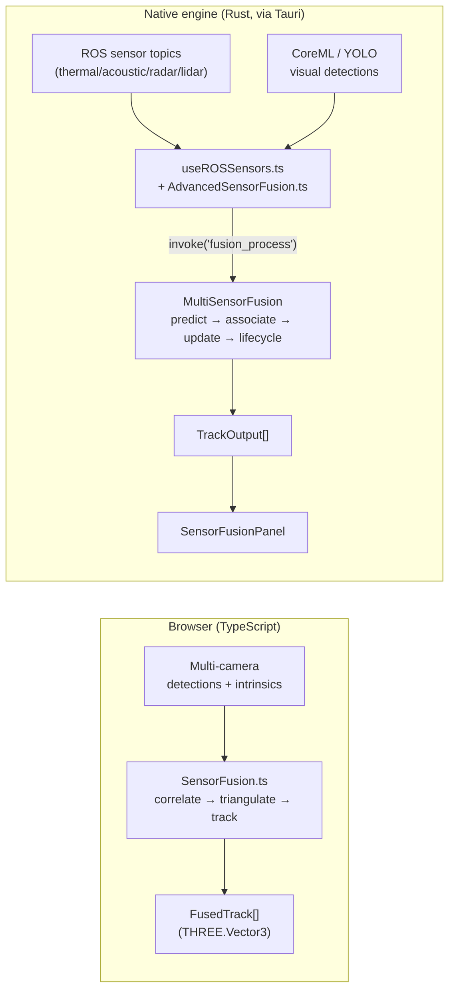
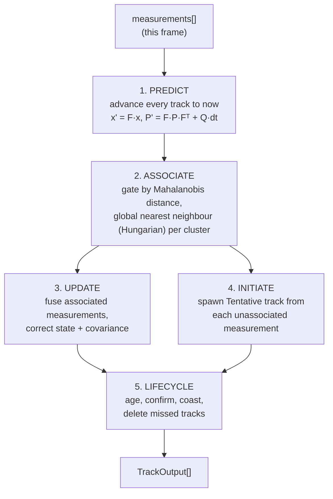
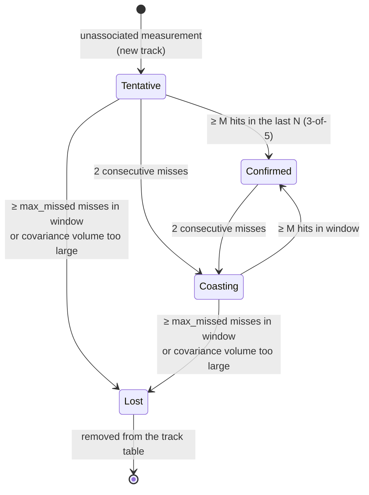
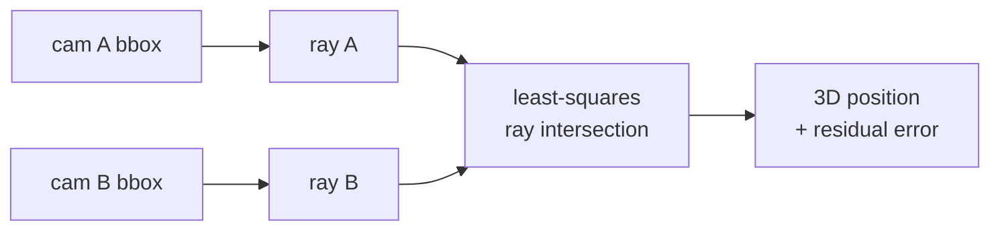

# Sensor Fusion

> Design reference for CREBAIN's multi-target tracking and sensor-fusion subsystems —
> the math, the data contracts, the tuning knobs, and the known limitations.

CREBAIN fuses detections from heterogeneous sensors (visual, thermal, acoustic,
radar, lidar, RF) into a small set of persistent **tracks** — each an estimate of a
target's 3D position, velocity, classification, uncertainty, and threat level. This
document explains how that works, why it is built the way it is, and where the
edges are.

It is written to be read alongside the code. Primary sources:

| File | Role |
|------|------|
| `src-tauri/src/sensor_fusion.rs` | Native multi-modal tracking engine (KF/EKF/UKF/PF/IMM) |
| `src/detection/AdvancedSensorFusion.ts` | TypeScript bridge to the native engine (Tauri IPC + response validation) |
| `src/ros/useROSSensors.ts` | Converts ROS sensor messages into fusion measurements |
| `src/detection/SensorFusion.ts` | Browser-only multi-camera correlation + triangulation |
| `src/detection/types.ts` | Shared detection / track / threat types |
| `src/components/SensorFusionPanel.tsx` | Operator-facing track list and filter selector |

---

## Table of Contents

- [Normative engine and separate camera estimator](#normative-engine-and-separate-camera-estimator)
- [The estimation pipeline](#the-estimation-pipeline)
- [Coordinate frames and the measurement contract](#coordinate-frames-and-the-measurement-contract)
- [Filter algorithms](#filter-algorithms)
- [Data association and gating](#data-association-and-gating)
- [Multi-sensor fusion semantics](#multi-sensor-fusion-semantics)
- [Track lifecycle](#track-lifecycle)
- [Threat assessment](#threat-assessment)
- [Multi-camera triangulation](#multi-camera-triangulation)
- [Configuration and tuning](#configuration-and-tuning)
- [Validation and metrics](#validation-and-metrics)
- [Known limitations and roadmap](#known-limitations-and-roadmap)
- [References](#references)

---

## Normative engine and separate camera estimator

The Rust `MultiSensorFusion` implementation is the sole normative multi-modal
tracking engine for the 0.9 product contract. `AdvancedSensorFusion.ts` is its
validated IPC adapter, not another engine. The browser `SensorFusion.ts` module
is a separate camera-only geometric estimator with a different input, state,
identity, covariance, and output contract. It is not a substitute, oracle, or
parity implementation of `MultiSensorFusion`.



### 1. Native multi-modal engine — `sensor_fusion.rs`

The normative engine. It maintains a recursive Bayesian estimate per target using a
selectable filter (Kalman, Extended Kalman, Unscented Kalman, Particle, or IMM),
associates incoming measurements to tracks with a Mahalanobis gate, and manages the
full track lifecycle. It runs in Rust for performance and numerical control, and is
reached from the UI over Tauri IPC. This is the engine the **Sensor Fusion panel**
displays and the one this document is mostly about.

### 2. Browser multi-camera engine — `SensorFusion.ts`

A self-contained TypeScript estimator for the special case of **several pose- and
FOV-configured RGB cameras observing the same scene**. It correlates 2D detections across cameras,
triangulates a 3D position from the back-projected rays, and runs a lightweight
track manager. It exists so the 3D viewer can show fused camera tracks without a
round trip to the native backend.

Browser estimates must remain typed and labeled separately: they cannot be
serialized as native `TrackOutput`, counted as native filter evidence, or enter
the optional Galadriel producer without an explicit future versioned conversion
and validation campaign. The 0.9 migration disposition is therefore to retain
both modules under their distinct names and contracts, remove language such as
“two implementations,” and reject any downstream claim of numerical parity.
If camera estimates later enter native fusion, that must occur as bounded,
frame-identified measurements at the native ingress—not by merging tracker
state or IDs.

The viewer keeps display retention separate from fusion work. Native detection
callbacks enter a bounded one-shot coalescer (at most 64 pending cameras); each
batch carries a unique frame ID, strictly increasing epoch, and a measurement
timestamp derived from the detections rather than a render-time restamp.
Consuming the batch clears it, so a retained camera overlay or restored scene
snapshot cannot replay an old observation. The browser estimator rejects
replayed/out-of-order identities and stale/future batches, filters incoherent
measurements, rejects malformed camera geometry and non-finite, out-of-range,
oversized, or frame-inconsistent detections before correlation, accepts at most
512 detections, and caps dense assignment at 128 groups × 128 live tracks.
`FusionStats.lastFrameStatus` and its drop/rejection counters expose every
capacity or input degradation; the policy is deterministic and does not imply
native-engine parity. Coasting browser tracks remain visible as predictions but
are excluded from the current-frame observed set and are not emitted downstream
as fresh visual measurements. A current single-camera track likewise retains
only a local origin placeholder with infinite triangulation error; only a finite
multi-camera triangulation may cross the viewer-to-native visual-measurement
boundary. Parallel or ill-conditioned rays may retain an assumed-range point for
local display, but their error remains infinite. A later single-camera update
also invalidates the freshness of any older finite triangulation, so stale 3D
positions cannot be republished at a new observation timestamp.

The remainder of this document treats the native engine as normative and calls
out the browser estimator explicitly in
[Multi-camera triangulation](#multi-camera-triangulation).

---

## The estimation pipeline

Each call to `fusion_process(measurements, timestamp_ms)` runs one cycle of a
standard recursive multi-target tracker:



1. **Predict** — every existing track is advanced from its last update to the
   current frame time using the constant-velocity motion model. `dt` is computed
   from a monotonic frame clock, integrated in ≤1 s substeps, and capped at 60 s
   of work so variable-rate gaps do not create one huge linearization step.
2. **Associate** — see [Data association and gating](#data-association-and-gating).
3. **Update** — associated measurements correct the track's state and shrink its
   covariance through the selected filter.
4. **Initiate** — measurements that matched no track seed a new `Tentative` track
   (subject to `MAX_FUSION_TRACKS`).
5. **Lifecycle** — tracks are aged, promoted, coasted, or deleted (see
   [Track lifecycle](#track-lifecycle)).

The **state vector** is 6-dimensional: `x = [px, py, pz, vx, vy, vz]` (position in
meters, velocity in m/s, common world frame). The engine **observes position only**
(the measurement matrix is `H = [I₃ | 0₃]`); velocity is inferred by the filter
from the position sequence.

---

## Coordinate frames and the measurement contract

> **This is the single most important contract to get right.** A coordinate-frame
> mismatch silently corrupts every track for the affected modality.

A `SensorMeasurement` carries a `position`, an optional Cartesian `velocity` seed,
an optional `source_frame_id` copied from sensor ingress, and a diagonal
measurement-noise `covariance`. The frame of `position` and `covariance` is
**selected by modality**:

| Modality | `position` frame | `covariance` units | Notes |
|----------|------------------|--------------------|-------|
| `radar` | **polar** `[range_m, azimuth_rad, elevation_rad]` | `[m², rad², rad²]` | Native radar geometry; consumed directly by the EKF polar model |
| `lidar` | Cartesian `[x, y, z]` m | `[m², m², m²]` | A precise 3D centroid — **not** a polar sensor |
| `visual` | Cartesian `[x, y, z]` m | `[m², m², m²]` | From triangulation / projection |
| `thermal` | Cartesian `[x, y, z]` m | `[m², m², m²]` | |
| `acoustic` | Cartesian `[x, y, z]` m | `[m², m², m²]` | DOA + range estimate, converted on the producer side |
| `radiofrequency` | Cartesian `[x, y, z]` m | `[m², m², m²]` | RF bearing/multilateration fix, converted on the producer side |

`velocity`, when present, is **always Cartesian** `[vx, vy, vz]` and is only used to
seed a new track's initial velocity. Radar producers project the scalar radial
velocity onto the line of sight before sending it.

The frame is interpreted in Rust by two helpers:

- `measurement_position_cartesian()` — used for association and track initiation.
  For `radar` it converts polar → Cartesian; for everything else it passes
  `[x, y, z]` through.
- `measurement_position_polar()` — returns `Some([range, az, el])` **only for
  radar**, feeding the EKF polar update; `None` otherwise.

`source_frame_id` is provenance, not a conversion request. Fusion does not
transform a measurement merely because the string names a frame. In the optional
Galadriel evidence path, a common projection is attached only when this string
already equals the selected registry frame's canonical ENU identity and the
modality's registry transform chain is empty. Missing/different identity or any
transform step yields explicitly incomparable evidence. String equality is not
cryptographic sensor authentication or proof that calibration was applied.

Input validation bounds both representation and computation before filter work:
one batch contains at most 512 measurements; Cartesian coordinates and radar
range are bounded to 10,000,000 m; each optional Cartesian velocity component to
100,000 m/s; diagonal variances to `(0, 1e12]`; metadata to 64 entries with each
numeric magnitude at most `1e12`; and measurement strings to 256 bytes. Radar
angles retain their documented polar-domain limits. These are safety/computation
ceilings, not statements that values near them are physically meaningful.

The renderer supplies a monotonic sensor/header-domain frame clock. Tracks from
one visual detector pass share one captured timestamp. Every measurement in a
nonempty native cycle must have a timestamp exactly equal to the enclosing frame
timestamp; a mixed-time, lagged, future, replayed/nonadvancing, or out-of-order
measurement rejects the whole frame before prediction or other fusion state mutation. The
renderer therefore partitions each drained buffer into ascending exact-time
groups and invokes native fusion once per group; choosing the newest input as a
frame time never authorizes older inputs in that batch. Groups at or below the
committed high-water are dropped and explicitly counted. A failed group and all
later drained groups are likewise counted as upstream loss, because retrying an
IPC result with unknown mutation status could duplicate an accepted update. An
empty cycle may reuse the prior stamp after at least one admitted measurement.
Before that first admission the renderer submits no empty closure, so timestamp
zero remains available to a legitimate epoch-zero measurement. The active native
path clamps only an empty neutral frame to the registry applicability floor.
Renderer high-water state is committed only after native success. The engine
does not retrodict or approximate out-of-sequence measurements.

ROS measurements use their stable subscribed topic as `sensor_id`, with modality
and source frame retained separately. Array position is never an identity:
reordering or repeating a payload therefore cannot turn one physical capture
into independent evidence. Browser visual timestamps use a wall clock and are
not admitted while ROS header-clock subscriptions are active; such observations
are counted as dropped instead of mixing wall and simulation time in one native
prediction epoch.

> **Historical note.** Radar/lidar measurements were previously converted
> spherical→Cartesian on the TypeScript side *and* re-interpreted as polar in Rust,
> a double conversion that corrupted both modalities. The contract above (radar
> stays polar end-to-end; lidar is Cartesian) is the corrected design — see the
> regression tests `radar_measurement_creates_cartesian_track_from_polar_input` and
> `lidar_centroid_is_treated_as_cartesian_not_polar`.

**Producers must emit the frame that matches their modality.** Two consequences
worth internalizing:

- A sensor that natively reports angles (radar) should keep them as angles so the
  EKF can model the (curved) polar error correctly. Converting to Cartesian first
  and then trusting a diagonal Cartesian covariance throws away the real error
  shape.
- A sensor that natively reports a metric 3D point (lidar) must **not** be routed
  through a polar conversion — doing so fabricates angular error and discards its
  main advantage.

---

## Filter algorithms

All five filters are instances of **recursive Bayesian estimation**: they keep a
Gaussian belief `(x, P)` and alternate a *predict* (time update) with an *update*
(measurement update). They differ only in how they handle nonlinearity and
multi-modality.

```text
PREDICT:   x' = F·x                 P' = F·P·Fᵀ + Q
UPDATE:    y  = z − H·x'            (innovation)
           S  = H·P'·Hᵀ + R         (innovation covariance)
           K  = P'·Hᵀ·S⁻¹           (Kalman gain)
           x  = x' + K·y            P = (I − K·H)·P'  [Joseph form below]
```

`F` is the constant-velocity transition (`position += velocity·dt`); `Q` is the
process noise (un-modeled acceleration / maneuvers); `R` is the per-sensor
measurement noise.

| Filter | Selector | Best for | Cost | How it handles nonlinearity |
|--------|----------|----------|------|------------------------------|
| **Kalman (KF)** | `Kalman` | Linear, Cartesian, constant-velocity targets | Lowest | N/A — assumes linear models |
| **Extended Kalman (EKF)** | `ExtendedKalman` *(default)* | Radar / polar measurements with mild nonlinearity | Low | First-order Jacobian linearization about the estimate |
| **Unscented Kalman (UKF)** | `UnscentedKalman` | Stronger nonlinearity than EKF tolerates | Medium | Deterministic sigma points through the true model (derivative-free) |
| **Particle (PF)** | `Particle` | Non-Gaussian / multi-modal posteriors | High (`O(N)` per track) | Weighted Monte-Carlo sample set |
| **IMM** | `IMM` | Maneuvering targets switching dynamics | Medium | Bank of models mixed by a Markov chain |

### Numerical hardening

The covariance update uses the **Joseph stabilized form** in the KF and EKF paths:

```text
P = (I − K·H)·P·(I − K·H)ᵀ + K·R·Kᵀ
```

This is algebraically equal to `(I − K·H)·P` for the optimal gain, but is a sum of
two symmetric positive-semidefinite terms, so it **preserves symmetry and PSD under
finite-precision arithmetic** — the property that keeps the UKF's Cholesky
decomposition from failing and the Mahalanobis gate well-defined. The UKF
additionally symmetrizes `P` after each update. As defense-in-depth, the sigma-point
generator retains a diagonal fallback when Cholesky still fails, and `TrackOutput`
clamps any negative covariance diagonal before reporting uncertainty.

### EKF polar model (radar)

For radar, the measurement function maps Cartesian state to polar observation:

```text
h(x) = [ √(x²+y²+z²),  atan2(y, x),  asin(z / range) ]   →  [range, azimuth, elevation]
```

The EKF linearizes `h` with its analytic Jacobian, guards the range singularity at
the origin (`range = max(√(x²+y²+z²), 1e-6)`), and wraps the azimuth innovation to
`(−π, π]` so a measurement near the ±π boundary does not produce a spurious 2π jump.

### IMM details

The IMM runs a two-model bank — a **constant-velocity (CV)** model and a
**coordinated-turn (CT)** model (fixed turn-rate magnitude `OMEGA_CT ≈ 0.3 rad/s`,
with the rotation degenerating exactly to CV when `|ω·dt|` is below a small guard so
straight-line motion is unaffected). It mixes their estimates each cycle via a fixed
Markov transition matrix (`[[0.95, 0.05], [0.10, 0.90]]`), updates the mode
probabilities from each model's Gaussian innovation likelihood, and outputs a
moment-matched combined estimate. The likelihood uses the correct 3-D
multivariate-Gaussian normalizer `√((2π)³·det S)`. Both modes apply the same
per-measurement `R` for their innovation covariance and their state update.

---

## Data association and gating

Before any filter update, the engine decides **which measurement updates which
track**. This is a two-stage process.

### Gating

For a track with predicted position `Hx` and innovation covariance `S = HPHᵀ + R`,
a candidate measurement `z` is gated by its Mahalanobis distance to that track.
Folding the measurement noise `R` into `S` (rather than gating on the track
covariance alone) is what makes this a proper Mahalanobis gate: it keeps the gate
from collapsing once `P` shrinks below `R` for a confident track, which would
otherwise reject ~1σ-valid measurements and spawn duplicate tracks.

A measurement is admissible when the **squared** Mahalanobis distance
`d² = (z − Hx)ᵀ S⁻¹ (z − Hx)` is below `association_threshold`. Because `d²` is
χ²-distributed with degrees of freedom equal to the **measurement** dimension (3 for
position), the threshold is a χ²(3) quantile: the default `11.345` is the 99 % gate
(`9.348` ≈ 97.5 %, `7.815` ≈ 95 %). Raising it admits more candidates (more clutter,
fewer missed associations); lowering it tightens the gate.

If `S` is singular (degenerate covariance — rare in practice since `Q, R > 0`), the
gate falls back to a Euclidean distance normalized by a nominal per-axis sigma so it
stays on the same unitless scale as the Mahalanobis branch.

The gate runs in the **Cartesian** position frame, so each measurement's noise `R`
must be supplied in that frame. Cartesian modalities use their diagonal covariance
directly; radar's noise is polar `[m², rad², rad²]`, so it is propagated into
Cartesian via the polar→Cartesian Jacobian
(`R_cart = J⁻¹ R J⁻ᵀ`, `J = ∂(range,az,el)/∂(x,y,z)`) before being folded into `S`.
Skipping this conversion would add `rad²` to `m²` and badly under-estimate
cross-range uncertainty — an angular 1σ at range `R` spans ≈ `R·σ_angle` in
cross-range, not `σ_angle` metres.

### Assignment

CREBAIN uses **global (Hungarian) assignment** over the gated cost matrix. Co-located
same-class measurements are first clustered (union-find), then a one-to-one
track↔cluster assignment is solved with a dependency-free Kuhn–Munkres solver on the
squared-Mahalanobis (χ²-gated) cost matrix — out-of-gate pairs carry an effectively
infinite cost so they are never assigned. This replaces the earlier greedy
nearest-neighbour scheme: it enforces a global one-to-one constraint, so an early pick
can no longer "steal" a measurement that optimally belonged to another track in dense
or crossing scenes, while the clustering step preserves multi-sensor fusion (N
co-located returns from N sensors still all reach the one track). JPDA/MHT remain
possible future tiers.

---

## Multi-sensor fusion semantics

When several measurements (e.g. radar + thermal) associate to one track in a single
frame, the engine applies each conditionally independent return **sequentially**
through its own measurement model and covariance `R`—an information-form
(inverse-covariance) update—rather than pre-averaging. Within one co-located
association cluster, records sharing the exact `(sensor_id, modality,
timestamp_ms, source_frame_id)` correlation identity contribute only one effective
update. The representative has the smallest Cartesian `R` trace, then deterministic
confidence/covariance/position tie-breakers. This prevents repeated post-processing
of one capture from falsely collapsing covariance or over-concentrating IMM mode
probabilities. Different sensor identities remain independent contributors, and
the same sensor may contribute again at the next exact frame timestamp.

Each retained sensor is weighted by its actual precision: a centimetre-accurate
lidar centroid dominates a tens-of-metres acoustic bearing regardless of their
reported confidences. For conditionally independent same-time measurements this
sequential update is mathematically equivalent to the batch information-form
posterior `x̂ = (ΣCᵢ⁻¹)⁻¹ ΣCᵢ⁻¹xᵢ`; measurements are applied in order of increasing
`R`-trace for determinism on the (re-linearised) EKF polar path.

Detector **confidence is not used as a fusion weight**. `track.confidence` is derived
*after* the updates — the maximum contributing measurement confidence plus a small
per-extra-modality boost — purely for display and threat logic.

---

## Track lifecycle

A track moves through four states, driven by a **sliding-window M-of-N** rule. Each
track carries a `hit_history` bitmask of its last `N` association opportunities
(bit 0 = most recent frame, 1 = hit, 0 = miss), advanced once per frame. The
transitions below reflect the actual Rust implementation in `update_track`,
`update_hit_history`, and `handle_missed_detections` (defaults:
`min_confirmation_hits = 3` (M), `confirmation_window = 5` (N), so **3-of-5**;
`max_missed_detections = 5` misses within the window; `max_position_cov_volume = 1e6`).



- **Tentative** → **Confirmed** once `popcount(hit_history & N) ≥ min_confirmation_hits`
  (M hits in the last N opportunities). Misses are counted only over the *filled*
  slots (`opportunities` is its own per-track counter, incremented once per frame
  the track existed and capped at N — deriving it as `age + missed_detections`
  undercounts, which is exactly why the independent counter exists), so a
  brand-new track is never deleted on its first frames for not-yet-observed
  window bits.
  Confirmation latches: a Confirmed track that briefly dips below M hits (with < 2
  consecutive misses) stays Confirmed rather than flickering.
- Any live track → **Coasting** once it accumulates `≥ 2` *consecutive* missed frames.
  A coasting track keeps being *predicted* forward by its motion model (the
  covariance grows), which is what bridges short occlusions and sensor dropouts.
- Any live track → **Lost** when its window misses reach `max_missed_detections`, **or**
  when its position-covariance volume (3×3 position-block determinant) exceeds
  `max_position_cov_volume` — at which point it is **removed** from the table (and its
  per-track PF/IMM filter state is freed). The covariance-volume guard deletes a track
  whose uncertainty has grown unbounded even if it never formally times out on misses.
- A coasting track that is re-associated returns to Confirmed once it again has M hits
  in the window.

At **birth**, a track is created by *single-point initiation*: its position is the
measurement and its velocity is unknown. The velocity block of the initial covariance
is therefore seeded with a deliberately **wide** prior
(`INITIAL_VELOCITY_VARIANCE_M2_S2`, σ_v ≈ 20 m/s), not a tight one. A position-only
measurement (radar without Doppler, lidar, visual) carries no velocity information, so
an over-confident birth velocity would make the constant-velocity prediction reject
the next frame of a genuinely moving target through the (correctly tightened) χ²(3)
gate — fragmenting one target into duplicate tracks. The wide prior only ever eases
the *first* post-birth association; returns that are far in absolute terms are still
gated out.

---

## Threat assessment

Each track is assigned an integer **threat level from 1 to 4** (there is no level 0).
A single canonical formula is implemented identically in Rust
(`calculate_threat_level`) and TypeScript (`getThreatLevel`, `src/detection/types.ts`):

| Class | Level |
|-------|-------|
| drone / uav | 4 if confidence > 0.8, 3 if > 0.5, else 2 |
| aircraft / helicopter | 2 |
| bird | 1 |
| unknown / unrecognized | 3 if confidence > 0.7, else 2 |

Drone threat is **graduated** by confidence: a low-confidence (≤ 0.5) single-sensor
drone hypothesis stays "guarded" (2) to avoid flooding the operator with amber from
uncorroborated returns, rising to "elevated" (3) and then "severe" (4) as confidence
(e.g. from multi-sensor corroboration) grows. A confidently-tracked but unidentified
object is treated as "elevated" (3). All thresholds are strict `>`. Crucially, the
**same raw label is bucketed identically on both engines**: the Rust
`map_to_detection_class` mirrors the TypeScript `mapToDetectionClass`, so a label is
resolved to its canonical class once, the same way, before the shared formula runs.
Colors: `1` green (minimal), `2` blue (guarded), `3` amber (elevated), `4` red
(severe).

> A compound or unrecognized label (e.g. `"fpv-drone"`) resolves to `unknown` on
> both engines — not `drone` — because the shared mapping is exact-match. Extending
> the recognized vocabulary is a `mapToDetectionClass`/`map_to_detection_class`
> enhancement that automatically keeps both engines in step.

---

## Multi-camera triangulation

The browser engine (`SensorFusion.ts`) turns 2D detections from multiple cameras into
3D tracks. A bounding-box center from a single camera is **not** a 3D point — it is a
*bearing*, a ray from the camera center through the back-projected pixel. A 3D
position requires triangulating rays from two or more viewpoints.



The solver minimizes the summed squared perpendicular distance from a point to each
ray using the projector `(I − ddᵀ)`, giving the normal equations

```text
( Σᵢ (I − dᵢdᵢᵀ) ) · X = Σᵢ (I − dᵢdᵢᵀ) · oᵢ
```

where `dᵢ` is each ray's unit direction and `oᵢ` its origin (the camera center). The
implementation:

- derives each ray from the bbox center using camera FOV + aspect (a calibrated
  intrinsic/extrinsic path is supported by the types but not yet populated);
- refuses two rays from the same camera (no parallax → biases the solve);
- falls back to an assumed fixed range along each ray when the rays are
  near-parallel and the linear system is ill-conditioned.

> **Conditioning caveat.** When the baseline is small or the target is distant, the
> depth direction becomes nearly unobservable and triangulation error grows roughly
> as `range² / baseline`. The fixed-range fallback is a placeholder, not a
> measurement; treat triangulated depth from near-parallel rays as weakly determined.

> **Cross-camera correlation.** Beyond class, confidence, and timestamp, the browser
> engine applies a geometric gate: it computes the closest-approach distance between
> the two cameras' world-space rays and rejects a correspondence whose rays miss by
> more than `DEFAULT_RAY_GATE_DISTANCE_M`, or whose mutual nearest point falls behind a
> camera (cheirality). This stops two different same-class drones seen by two cameras
> from being merged into one phantom triangulation. The gate falls back to
> class/temporal correlation only when camera geometry or frame dimensions are
> unavailable.

---

## Configuration and tuning

The native engine is configured through `FusionConfig`
(`fusion_init` / `fusion_set_config`):

| Parameter | Default | Meaning | Tuning guidance |
|-----------|---------|---------|-----------------|
| `algorithm` | `ExtendedKalman` | Filter family | EKF for radar; KF for clean Cartesian; UKF for strong nonlinearity; IMM for maneuvering; PF only when genuinely multi-modal |
| `process_noise` (Q) | `1.0` | Un-modeled dynamics / maneuver intensity | ↑ to track agile targets (snappier, noisier); ↓ to smooth steady targets (laggier, risk of divergence on a maneuver) |
| `measurement_noise` (R) | `2.0` | Default sensor uncertainty | Overridden per-measurement by each modality's `covariance` |
| `association_threshold` | `11.345` | χ²(3) gate on the **squared** Mahalanobis distance (≈99%) | ↑ admits more candidates (more clutter, fewer missed associations); ↓ tightens the gate |
| `max_missed_detections` | `5` | Misses **within the confirmation window** before a track is deleted (must be ≤ `confirmation_window`) | ↑ to ride through longer occlusions; ↓ to drop stale tracks faster |
| `min_confirmation_hits` | `3` | Hits within the window (M) before Tentative → Confirmed | ↑ to suppress false tracks from clutter; ↓ for faster confirmation |
| `confirmation_window` | `5` | Sliding-window size N (in `[1, 32]`) for the M-of-N rule | the textbook radar value is 3-of-5; ↑ N for more averaging over intermittent detections |
| `max_position_cov_volume` | `1e6` | Position-block covariance-determinant ceiling (m⁶); a track exceeding it is deleted | ↓ to drop diverging tracks sooner; ↑ to tolerate higher position uncertainty |
| `particle_count` | `100` | Particles per track (PF only) | ↑ samples the posterior more densely at `O(N)` cost; the default is an implementation setting, not a measured accuracy or real-time optimum |
| `emit_innovations` | `false` | Emit compatible observations into the legacy drain/local-JSONL buffer | The explicit live `process_frame` evidence API constructs frozen-v1 observations independently; PF/IMM still emit none |
| `emit_innovation_research` | `false` | Add raw innovation/covariance research fields | Diagnostic only; changes the canonical deployment-config digest |

`FusionConfig` rejects unknown fields and validates every bound. In an enabled
Galadriel deployment, the effective fully materialized compact JSON is SHA-256
pinned to both the environment and selected registry context. Presence of
`CREBAIN_PID_JSONL` forces `emit_innovations=true` before hashing. Runtime
`fusion_init` becomes a readiness-only call that ignores UI defaults, while
`fusion_set_config` accepts only the already pinned digest; neither replaces the
active startup-loaded engine. See
[GALADRIEL_PRODUCER.md](GALADRIEL_PRODUCER.md).

Per-modality measurement covariances are carried or set by the producers in
`useROSSensors.ts`: LIDAR preserves the required positive finite three-axis
covariance from `ros/msg/LidarDetection.msg`; radar uses good range / coarse angle
defaults (`[0.5 m², (1°)², (1.5°)²]`); thermal uses `[2, 2, 2]` m²; and acoustic
uses `[10, 10, 10]` m². These are source contracts and defaults, not measured
accuracy claims.

The **fusion rate** (`fusionRateHz`, default 10 Hz, clamped to 1–60 Hz) is set on the
ROS hook; measurements are buffered between cycles, with a backpressure guard that
drops the oldest measurements if a topic floods. Malformed detections and buffer
loss are counted and passed to native admission. If the registry limit is below
the 512-item renderer/native ceiling, native admission additionally removes the
oldest inputs. The active producer retains the newest bounded set, permanently
degrades the epoch, and marks the frame summary degraded/truncated. At the active
track limit it drops complete deterministic overflow birth clusters before the
final association plan and closes the frame with the same flags.

---

## Validation and metrics

The engine ships with Rust unit and multi-frame scenario tests
(`cargo test --locked --manifest-path src-tauri/Cargo.toml sensor_fusion`) covering the
predict/update math, the track lifecycle,
polar radar integration, the lidar Cartesian contract, algorithm switching, and
Joseph-form covariance stability. NCP-feature tests additionally cover the
frozen-prior ledger, deterministic outcome/miss ordering, one-per-track/modality
v1 selection, strict per-channel timestamps, source-frame projection refusal,
numeric/registry/track-cap bounds, invalid-gate refusal, sparse/all-infinite
assignment, queue and upstream loss, and monitor summaries. These remain
component tests. The browser engine and ROS bridge have Vitest coverage for
malformed/buffer loss, same-frame visual stamps, monotonic empty/data cycles, and
commit-on-success (`bun run test:run`).

The preregistered, versioned protocol for any future numeric or accuracy claim is
[`FUSION_VALIDATION_PROTOCOL.md`](FUSION_VALIDATION_PROTOCOL.md). No protocol run
or acceptance result is claimed by 0.9.0. Its preregistered measures include:

- **NEES / NIS** (normalized estimation / innovation error squared): test whether the
  reported covariance is *honest*. A consistent filter yields NEES averaging the state
  dimension and NIS averaging the measurement dimension, both within χ² bounds. A
  chronically small NIS is the signature of an overconfident filter (e.g. from
  confidence-weighted fusion dropping cross-correlations).
- **OSPA / GOSPA**: a principled set-distance between estimated and true target sets,
  decomposable into localization error plus missed/false-target (cardinality) error.
  GOSPA is preferred because the components separate cleanly.
- **CLEAR-MOT (MOTA / MOTP)** and **ID-switch / track-purity** counts: identity-aware
  accuracy. Report ID switches alongside MOTA — MOTA is detection-dominated and hides
  the label swaps that would misdirect an interceptor.

These must be run as the preregistered Monte-Carlo sweep over scripted
ground-truth scenarios—not a selected happy-path run.

---

## Known limitations and roadmap

Most of this roadmap has now been implemented; the table records each item's
status and preserves the remaining scientific and deployment gaps.

| # | Item | Status |
|---|------|--------|
| 1 | Global nearest-neighbour (Hungarian) assignment over the gated cost matrix, with co-located-measurement clustering | ✅ Implemented |
| 2 | Information-form / covariance-weighted sequential independent-return fusion (each measurement its own `R`; one effective return per correlated capture identity) | ✅ Implemented |
| 3 | Sliding-window **M-of-N** confirmation + covariance-volume deletion | ✅ Implemented |
| 4 | Per-measurement `R` threaded into every filter update (KF / EKF / UKF / PF / IMM) | ✅ Implemented |
| 5 | **Per-measurement timestamps / OOSM** — baseline filter uses one monotonic frame time | ⬜ **Open** — every nonempty native frame now requires exact advancing co-temporal stamps and rejects mixed-time/replayed/OOSM input before mutation, but per-measurement prediction and retrodiction remain deferred |
| 6 | CV + **Coordinated-Turn** IMM (two-model bank) | ✅ Implemented (CT added; a constant-acceleration mode is still deferred) |
| 7 | Geometric (skew-ray closest-approach + cheirality) cross-camera gate in the browser engine | ✅ Implemented |
| 8 | **Diagonal-only measurement covariances** at the TS↔Rust boundary | ⬜ **Open** — full 3×3 covariances (incl. the polar→Cartesian Jacobian cross-terms and Doppler) |
| 9 | Registry-driven calibration and transform-chain execution | ⬜ **Open** — the producer supports identity-only already-canonical ENU projection; referenced artifacts are not loaded or hashed |
| 10 | Deployed Galadriel receiver/assembler, heartbeat deadline, loss/reorder/restart/saturation evidence | ⬜ **Open** — producer queues/codecs are component-tested only |
| 11 | Wire-visible numeric upstream/track-cap loss accounting | ⬜ **Open** — producer logs the count and latches degraded/truncated, but the frozen frame-summary schema carries flags rather than the loss count |
| 12 | Target combined-load bounds for maximum sparse/dense association | ⬜ **Open** — component tests bound and short-circuit the 512×1,024 mechanics; deployed latency/deadline evidence is absent |

### Remaining work

Rows 1–4, 6, and 7 are implemented. Rows 9–12 deliberately preserve the live
producer's current deployment, projection, loss-accounting, and timing limits.
The recovered agent transcript has been moved to
[`docs/archive/SENSOR_FUSION_AGENT_SPECS.md`](archive/SENSOR_FUSION_AGENT_SPECS.md)
for provenance only; it is historical, contains superseded and unsafe instructions,
and must not be used as an implementation plan. Two items are deliberately deferred:

1. **Per-measurement timestamps / OOSM** (row 5). Predict each track to each
   measurement's own time within a batch; full out-of-sequence-measurement (OOSM)
   retrodiction is a larger feature — **defer and document** (no recovered spec).
2. **Full 3×3 measurement covariances** (row 8) across the TS↔Rust boundary, including
   the polar→Cartesian Jacobian cross-terms and Doppler off-diagonals.

> **Gotchas for whoever picks this up.** Radar measurement `R` is polar
> (`[m², rad², rad²]`); the association gate converts it to Cartesian, and
> `create_track` now seeds the birth position covariance through the same
> polar→Cartesian Jacobian congruence (regression-tested), so the historical
> polar-units-as-Cartesian birth bug is fixed — keep it that way when touching
> full covariances. When a gate seems too tight, fix the *scenario realism*
> (e.g. the single-point birth velocity prior), not the threshold. The browser
> `triangulatePosition` now solves the perpendicular least-squares projector
> normal equations and ray-gates with a cheirality (behind-camera) check; the
> old algebraic-distance/no-cheirality caveat no longer applies.

---

## References

The design and the improvements above are grounded in standard multi-target tracking
and estimation literature.

**Estimation / Kalman family**
- Kalman filter — predict/update, Joseph-form covariance, numerical stability: <https://en.wikipedia.org/wiki/Kalman_filter>
- Extended Kalman filter — Jacobian linearization and divergence modes: <https://en.wikipedia.org/wiki/Extended_Kalman_filter>
- Unscented transform — sigma points, derivative-free accuracy: <https://en.wikipedia.org/wiki/Unscented_transform>
- R. Labbe, *Kalman and Bayesian Filters in Python* — CV model, discretized process noise: <https://github.com/rlabbe/Kalman-and-Bayesian-Filters-in-Python>

**Particle filter / IMM**
- Particle filter — SIR/bootstrap weights, degeneracy, resampling: <https://en.wikipedia.org/wiki/Particle_filter>
- Genovese, *The Interacting Multiple Model Algorithm* — JHU/APL Technical Digest: <https://secwww.jhuapl.edu/techdigest/Content/techdigest/pdf/V22-N04/22-04-Genovese.pdf>

**Data association**
- Mahalanobis distance — χ² gating and confidence ellipsoids: <https://en.wikipedia.org/wiki/Mahalanobis_distance>
- Radar tracker — gating, NN vs GNN vs JPDA/MHT, M-of-N, coasting: <https://en.wikipedia.org/wiki/Radar_tracker>
- Hungarian algorithm — optimal one-to-one assignment: <https://en.wikipedia.org/wiki/Hungarian_algorithm>
- Joint Probabilistic Data Association Filter: <https://en.wikipedia.org/wiki/Joint_Probabilistic_Data_Association_Filter>

**Multi-sensor fusion**
- Covariance intersection — conservative fusion of correlated estimates: <https://en.wikipedia.org/wiki/Covariance_intersection>
- Inverse-variance (information-form) weighting: <https://en.wikipedia.org/wiki/Inverse-variance_weighting>
- Out-of-sequence measurement handling (MathWorks): <https://www.mathworks.com/help/fusion/ug/introduciton-to-out-of-sequence-measurement-handling.html>

**Lifecycle / metrics**
- Track algorithm — tentative/confirmed, M-of-N: <https://en.wikipedia.org/wiki/Track_algorithm>
- Rahmathullah, García-Fernández, Svensson — *Generalized Optimal Sub-Pattern Assignment (GOSPA)*: <https://arxiv.org/abs/1601.05585>
- Bernardin & Stiefelhagen — *CLEAR MOT metrics*: <https://link.springer.com/content/pdf/10.1155/2008/246309.pdf>

**Multi-view geometry**
- Triangulation (computer vision) — midpoint / DLT, degeneracy: <https://en.wikipedia.org/wiki/Triangulation_(computer_vision)>
- Epipolar geometry — fundamental matrix, correspondence test: <https://en.wikipedia.org/wiki/Epipolar_geometry>
- Hartley & Zisserman, *Multiple View Geometry*, Ch. 8: <https://www.robots.ox.ac.uk/~vgg/hzbook/hzbook1/HZepipolar.pdf>


## Galadriel-oriented innovation JSONL (`emit_innovations`)

`FusionConfig.emit_innovations = true` records a minimal observation after an
associated measurement actually corrects a Kalman-family filter. Setting the
trusted-process environment variable `CREBAIN_PID_JSONL=<path>` enables that flag
at fusion initialization and appends newline-delimited records with
`track_id`, `timestamp_ms`, `seq`, `modality`, `nis`, and `dof`.
The environment variable does not enable the separate research-field option;
default JSONL lines therefore omit raw innovation/covariance fields. They also
carry no schema-version, realm, authentication, or ACL envelope.

The repository proves local serialization/parsing and basic NIS consistency. It
does **not** prove a live Galadriel reader, cross-process correlation, PID control,
an NCP session, deployment ACLs, or a negotiated/versioned streaming protocol.
Treat the file as best-effort local instrumentation: the operator owns the path,
errors are logged, and the file may contain sensitive track/timing data. Use a
regular local file only. Without an active producer, append/flush is synchronous
inside the blocking fusion job after the fusion lock is released, so slow or
special storage can still delay the command. With the producer active, JSONL
copies use a separate capacity-16 drop-new frame channel; archive admission never
waits for channel capacity or file I/O; admission failure latches producer
degradation before summary admission; and the writer thread performs blocking
I/O. An `ncp`-feature startup preflights a
configured sink. The worker validates and serializes the complete batch before
writing; write/flush failure latches degradation and stops the worker, although
a mid-write OS failure can leave part of the already-validated batch. Exit waits
two seconds for that thread but
cannot abort a blocked standard thread. This archive channel is separate from
the four NCP lanes and their counters/timeouts.

This local file is independent of the live producer. When the `ncp` feature and
exact runtime opt-in are both active, `fusion_process` instead also wraps the
same compatible observations in strict sidecar envelopes and emits a complete
monitor ledger to two named-perception routes. That wiring does not upgrade a
JSONL test into receiver, ACL, or delivery evidence; see
[GALADRIEL_PRODUCER.md](GALADRIEL_PRODUCER.md).

Semantics:

- `nis = yᵀS⁻¹y` uses the state entering that measurement update. Independent
  co-located follow-up measurements therefore see the sequentially conditioned
  state; correlated same-capture shadows never receive another update.
- Track birth has no prior innovation and emits nothing. A skipped update with an
  unusable innovation covariance also emits nothing.
- Visual/thermal/acoustic/lidar use Cartesian metres. EKF radar NIS derives from
  the polar `[m, rad, rad]` residual; non-EKF radar uses its Cartesian conversion.
- Particle and IMM filters do not emit these records because this implementation
  has no single compatible innovation covariance for them.
