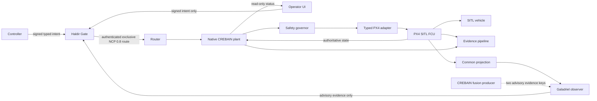

# System Context, Trust Boundaries, and Claims

## Current L0 reality

The renderer owns visualization and local physics. Its ROS connection surface is
a frozen telemetry-only facade; generic renderer/ROS Zenoh publish, service, setpoint,
mode, arm, takeoff, and land methods have been removed. Guidance is a disabled-
by-default local preview whose proposals explicitly carry `NoAuthority`; the UI
exposes no intercept or abort action. Former Waypoint and Gazebo controllers,
native transport write/spawn handlers, and their registrations are removed.

Gazebo/model-state subscriptions, local scene/physics mutations, and the
development NCP scene hook remain available for simulation and are not flight
authority. The Rust NCP action/control adapter remains feature-gated with
unregistered Tauri commands. A different `ncp`-feature component can, after an
exact runtime opt-in and registry/config/executable preflight, emit advisory
fusion evidence on only the `galadriel-pid` and `galadriel-monitor` keys. It has
no action/FCU capability and does not establish a live Galadriel receiver,
authenticated deployment, or Haldir→NCP→native-plant→FCU authority chain.

A separate dependency-free `crebain-plant-authority` workspace package and
`crebain-plantd` process now provide an inactive draft contract-v1 validator,
an inert lifecycle/channel foundation, a non-consuming retained whole-snapshot
register, a closed immutable in-memory vehicle-health candidate, a
profile-bound classifier for eight ages captured at one checked read, and a
passive generation-bound monotonic expiry guard. It also provides an unwired
receipt-anchored active command deadline-monitor candidate and an inert
exact-profile safe-action situation-dispatch candidate over a closed intent
vocabulary. Contract v1
uses closed action/frame/unit types, distinct producer and plant-local time,
and draft instantaneous-speed/TTL bounds, but has no wire format and its profile/frame are
unapproved. A separate profile-neutral finite-m/s kernel and digest-bound
JavaScript/Rust corpus cover exact ENU↔NED and FLU↔FRD velocity-axis
conventions only at the same local origin/datum or rigid-body reference point,
and reject local↔body routes without attitude. They carry no frame-instance
identity and do not select a profile, run during admission, or establish
attitude, points/covariance, Three.js, time, or FCU semantics. The typed health
path binds declared profile/vehicle/source/epoch/generation/frame-instance
identity, strict per-channel source sequence, closed state, SI local vectors, and
plant-monotonic ages into one coherent retained commit. The separate classifier
consumes that observation, rejects zero caller-proposed exclusive limits or
exact-profile mismatch, and reports only whether each captured age is strictly
below or at/beyond its limit. It does not read a clock, aggregate health,
interpret unknown/unavailable state, implement the draft ODD's inclusive
`<=200 ms` condition, or establish current/apply-time freshness. Its structural
profile/source binding is not approval or authentication, and it proves no real
FCU sampling or aggregation coherence. The
safe-action candidate copies caller-proposed opaque nonzero situation codes
into an owned fixed 255-slot table, rejects an empty, oversized, or duplicate
proposal, requires an exact full profile match, and has no default row. It does
not bind the supplied rows into the profile digest, classify plant state or triggers,
resolve precedence, consume health/lifecycle/time, or convert an intent into an
action or adapter call. The binary can only self-check; it has no command
ingress, authenticated health collector, approved age/state policy, active
operational watchdog integration, governor, approved and content-bound safe-action policy with an
authoritative classifier, NCP link, apply-time consumer, or FCU adapter.
Generic snapshot storage remains disconnected
mechanics. The expiry guard has no timer, callback, refresh, command payload,
or adapter hook. The separate active monitor derives tickets only from validated
plant receipt time and a nonzero local TTL proposal no greater than the request.
One named worker owns one active slot/no queue; replacement requires the exact
profile/session/generation and a strictly greater sequence, while regression or
`now >= deadline` wins before replacement, shutdown, or a caller-reported
generation mismatch. A newer sequence with an older receipt also
terminalizes. The copyable candidate can mint multiple tickets, so non-clone
ticket ownership is per monitor only. Its sticky terminal evidence can record
command age and detection lateness, poison, worker panic, reported mismatch, or
shutdown; poisoned synchronization carries no exact active key. It does not
authenticate admission, enforce one global monitor, observe lifecycle
rotation autonomously, revoke output, select/apply a safe action, call an
adapter, qualify suspend behavior, reserve scheduling capacity, or prove
wake-to-effect latency. These components do not make the process a final applier
and do not change the L0 claim.

Those facts are inventoried in
[`baselines/phase0-command-surfaces.json`](baselines/phase0-command-surfaces.json)
and are why the current claim remains L0.

## Target L1 context

## Trust domains

| Domain | Allowed privilege at L1 | Must not possess |
|---|---|---|
| Native plant | Sole final FCU writer; freshness, health, safety and watchdog enforcement | Rendering, arbitrary topic/service API, policy-authoring role |
| Haldir Gate | Sole publisher of the final authenticated command route | FCU credential or plant callback |
| NCP router | Exact identity/route transport and bounded delivery | Policy inference or actuator access |
| Typed FCU adapter | Narrow stack-specific transactions and authoritative acknowledgments | Generic ROS/Zenoh publishing |
| FCU | Inner-loop stabilization, estimator, fence and independent failsafes | Trust in UI delivery claims |
| Controller | Signed intent under lease/session constraints | Final-route or FCU credentials |
| Operator renderer | Read-only telemetry/status and signed intent UX | Generic ROS, Zenoh, Gazebo, native transport, or private Gate credentials |
| Fusion/perception producer | Telemetry and derived evidence on exact routes after deployment opt-in | Command authority, generic publisher, or final-route credentials |
| Galadriel | Quality-tagged advisory observation | Command/final-route capability |
| Simulation tools | Separate dev-sim binary/profile/identity | Presence or credentials in secure SITL/HIL/field artifacts |
| Evidence store | Bounded asynchronous append/verification | Ability to block plant watchdog or safe action |

Every crossing authenticates identity, validates a typed schema, enforces bounds,
and emits explicit acceptance or rejection evidence. A renderer compromise must
not produce motion.

## Controlled claim vocabulary

| Term | Meaning |
|---|---|
| Implemented | Code exists; no build or behavior claim follows. |
| Compiled | One named source/configuration built. |
| Unit-tested | Isolated behavior passed in one named configuration. |
| Integrated | Named components interacted in a declared topology. |
| Delivered | A transport or callback accepted bytes; receiver validation is unknown. |
| Accepted | The receiver validated the message/profile/session. |
| Authorized | Haldir admitted a request under authenticated policy and state. |
| Attempted | The plant asked the typed adapter/FCU to apply an action. |
| FCU-accepted | Authoritative FCU acknowledgment/state confirmed acceptance. |
| Observed | Authoritative vehicle/plant state showed the expected effect. |
| Expired | Plant-local monotonic age invalidated authority before write. |
| Safe state | The ODD-selected action was requested and observed, or the independent FCU fallback was observed. |
| HIL-tested / field-tested | Executed only under the named hardware/configuration and approved ODD. |

Transport success is never “applied.” UI connection is never “authorized.” A
producer counter named `published` means its local Zenoh put completed; it is not
receiver delivery or acceptance. A missing observer is never “nominal.”
Simulation success is never flight evidence.

## Non-negotiable L1 invariants

One final applier; one final-route publisher; conjunctive authorization;
plant-local expiry; typed frames/units/time; no stale resurrection; bounded
queues/work; independent FCU containment; uncensored evidence; and no unresolved
P0 hazard.
