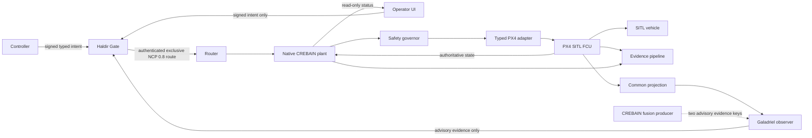

# System Context, Trust Boundaries, and Claims

## Current L0 reality

The renderer owns visualization and local physics. Its ROS connection surface is
a frozen telemetry-only facade; generic renderer/ROS Zenoh publish, service, setpoint,
mode, arm, takeoff, and land methods have been removed. Guidance is a disabled-
by-default local preview whose proposals explicitly carry `NoAuthority`; the UI
exposes no intercept or abort action. Former Waypoint and Gazebo controllers,
native transport write/spawn handlers, and their registrations are removed.

Gazebo/model-state subscriptions, local scene/physics mutations, and the
development NCP scene hook remain available for simulation and are not flight
authority. The Rust NCP action/control adapter remains feature-gated with
unregistered Tauri commands. A different `ncp`-feature component can, after an
exact runtime opt-in and registry/config/executable preflight, emit advisory
fusion evidence on only the `galadriel-pid` and `galadriel-monitor` keys. It has
no action/FCU capability and does not establish a live Galadriel receiver,
authenticated deployment, or Haldir→NCP→native-plant→FCU authority chain.

A separate dependency-free `crebain-plant-authority` workspace package and
`crebain-plantd` process now provide an inactive draft contract-v1 validator,
an inert lifecycle/channel foundation, a non-consuming retained whole-snapshot
register, a closed immutable in-memory vehicle-health candidate, and a passive
generation-bound monotonic expiry guard. Contract v1
uses closed action/frame/unit types, distinct producer and plant-local time,
and draft instantaneous-speed/TTL bounds, but has no wire format and its profile/frame are
unapproved. A separate profile-neutral finite-m/s kernel and digest-bound
JavaScript/Rust corpus cover exact ENU↔NED and FLU↔FRD velocity-axis
conventions only at the same local origin/datum or rigid-body reference point,
and reject local↔body routes without attitude. They carry no frame-instance
identity and do not select a profile, run during admission, or establish
attitude, points/covariance, Three.js, time, or FCU semantics. The typed health
path binds declared profile/vehicle/source/epoch/generation/frame-instance
identity, strict per-channel source sequence, closed state, SI local vectors, and
plant-monotonic ages into one coherent retained commit. Its structural source
identity is not authenticated, it proves no real FCU sampling or aggregation
coherence, and it defines no freshness threshold or healthy/safe verdict. The
binary can only self-check; it has no command ingress, authenticated health
collector, active watchdog, governor, safe-action profile, NCP link, apply-time
consumer, or FCU adapter. Generic snapshot storage remains disconnected
mechanics. The expiry guard has no timer, callback, refresh, command payload,
or adapter hook. Their existence does not make the process a final applier and
does not change the L0 claim.

Those facts are inventoried in
[`baselines/phase0-command-surfaces.json`](baselines/phase0-command-surfaces.json)
and are why the current claim remains L0.

## Target L1 context

## Trust domains

| Domain | Allowed privilege at L1 | Must not possess |
|---|---|---|
| Native plant | Sole final FCU writer; freshness, health, safety and watchdog enforcement | Rendering, arbitrary topic/service API, policy-authoring role |
| Haldir Gate | Sole publisher of the final authenticated command route | FCU credential or plant callback |
| NCP router | Exact identity/route transport and bounded delivery | Policy inference or actuator access |
| Typed FCU adapter | Narrow stack-specific transactions and authoritative acknowledgments | Generic ROS/Zenoh publishing |
| FCU | Inner-loop stabilization, estimator, fence and independent failsafes | Trust in UI delivery claims |
| Controller | Signed intent under lease/session constraints | Final-route or FCU credentials |
| Operator renderer | Read-only telemetry/status and signed intent UX | Generic ROS, Zenoh, Gazebo, native transport, or private Gate credentials |
| Fusion/perception producer | Telemetry and derived evidence on exact routes after deployment opt-in | Command authority, generic publisher, or final-route credentials |
| Galadriel | Quality-tagged advisory observation | Command/final-route capability |
| Simulation tools | Separate dev-sim binary/profile/identity | Presence or credentials in secure SITL/HIL/field artifacts |
| Evidence store | Bounded asynchronous append/verification | Ability to block plant watchdog or safe action |

Every crossing authenticates identity, validates a typed schema, enforces bounds,
and emits explicit acceptance or rejection evidence. A renderer compromise must
not produce motion.

## Controlled claim vocabulary

| Term | Meaning |
|---|---|
| Implemented | Code exists; no build or behavior claim follows. |
| Compiled | One named source/configuration built. |
| Unit-tested | Isolated behavior passed in one named configuration. |
| Integrated | Named components interacted in a declared topology. |
| Delivered | A transport or callback accepted bytes; receiver validation is unknown. |
| Accepted | The receiver validated the message/profile/session. |
| Authorized | Haldir admitted a request under authenticated policy and state. |
| Attempted | The plant asked the typed adapter/FCU to apply an action. |
| FCU-accepted | Authoritative FCU acknowledgment/state confirmed acceptance. |
| Observed | Authoritative vehicle/plant state showed the expected effect. |
| Expired | Plant-local monotonic age invalidated authority before write. |
| Safe state | The ODD-selected action was requested and observed, or the independent FCU fallback was observed. |
| HIL-tested / field-tested | Executed only under the named hardware/configuration and approved ODD. |

Transport success is never “applied.” UI connection is never “authorized.” A
producer counter named `published` means its local Zenoh put completed; it is not
receiver delivery or acceptance. A missing observer is never “nominal.”
Simulation success is never flight evidence.

## Non-negotiable L1 invariants

One final applier; one final-route publisher; conjunctive authorization;
plant-local expiry; typed frames/units/time; no stale resurrection; bounded
queues/work; independent FCU containment; uncensored evidence; and no unresolved
P0 hazard.
