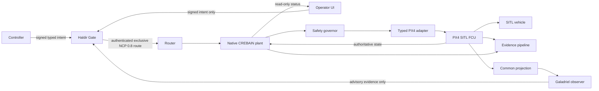

# System Context, Trust Boundaries, and Claims

## Current L0 reality

The renderer owns visualization and local physics. Its ROS connection surface is
a frozen telemetry-only facade; generic ROS/Zenoh publish, service, setpoint,
mode, arm, takeoff, and land methods have been removed. Guidance is a disabled-
by-default local preview whose proposals explicitly carry `NoAuthority`; the UI
exposes no intercept or abort action. Former Waypoint and Gazebo controllers,
native transport write/spawn handlers, and their registrations are removed.

Gazebo/model-state subscriptions, local scene/physics mutations, and the
development NCP scene hook remain available for simulation and are not flight
authority. The Rust NCP adapter remains feature-gated with unregistered Tauri
commands. There is still no live Haldir→NCP→native-plant→FCU authority chain.

Those facts are inventoried in
[`baselines/phase0-command-surfaces.json`](baselines/phase0-command-surfaces.json)
and are why the current claim remains L0.

## Target L1 context

## Trust domains

| Domain | Allowed privilege at L1 | Must not possess |
|---|---|---|
| Native plant | Sole final FCU writer; freshness, health, safety and watchdog enforcement | Rendering, arbitrary topic/service API, policy-authoring role |
| Haldir Gate | Sole publisher of the final authenticated command route | FCU credential or plant callback |
| NCP router | Exact identity/route transport and bounded delivery | Policy inference or actuator access |
| Typed FCU adapter | Narrow stack-specific transactions and authoritative acknowledgments | Generic ROS/Zenoh publishing |
| FCU | Inner-loop stabilization, estimator, fence and independent failsafes | Trust in UI delivery claims |
| Controller | Signed intent under lease/session constraints | Final-route or FCU credentials |
| Operator renderer | Read-only telemetry/status and signed intent UX | Generic ROS, Zenoh, Gazebo, native transport, or private Gate credentials |
| Fusion/perception | Telemetry and derived evidence | Command authority |
| Galadriel | Quality-tagged advisory observation | Command/final-route capability |
| Simulation tools | Separate dev-sim binary/profile/identity | Presence or credentials in secure SITL/HIL/field artifacts |
| Evidence store | Bounded asynchronous append/verification | Ability to block plant watchdog or safe action |

Every crossing authenticates identity, validates a typed schema, enforces bounds,
and emits explicit acceptance or rejection evidence. A renderer compromise must
not produce motion.

## Controlled claim vocabulary

| Term | Meaning |
|---|---|
| Implemented | Code exists; no build or behavior claim follows. |
| Compiled | One named source/configuration built. |
| Unit-tested | Isolated behavior passed in one named configuration. |
| Integrated | Named components interacted in a declared topology. |
| Delivered | A transport or callback accepted bytes; receiver validation is unknown. |
| Accepted | The receiver validated the message/profile/session. |
| Authorized | Haldir admitted a request under authenticated policy and state. |
| Attempted | The plant asked the typed adapter/FCU to apply an action. |
| FCU-accepted | Authoritative FCU acknowledgment/state confirmed acceptance. |
| Observed | Authoritative vehicle/plant state showed the expected effect. |
| Expired | Plant-local monotonic age invalidated authority before write. |
| Safe state | The ODD-selected action was requested and observed, or the independent FCU fallback was observed. |
| HIL-tested / field-tested | Executed only under the named hardware/configuration and approved ODD. |

Transport success is never “applied.” UI connection is never “authorized.” A
missing observer is never “nominal.” Simulation success is never flight evidence.

## Non-negotiable L1 invariants

One final applier; one final-route publisher; conjunctive authorization;
plant-local expiry; typed frames/units/time; no stale resurrection; bounded
queues/work; independent FCU containment; uncensored evidence; and no unresolved
P0 hazard.
