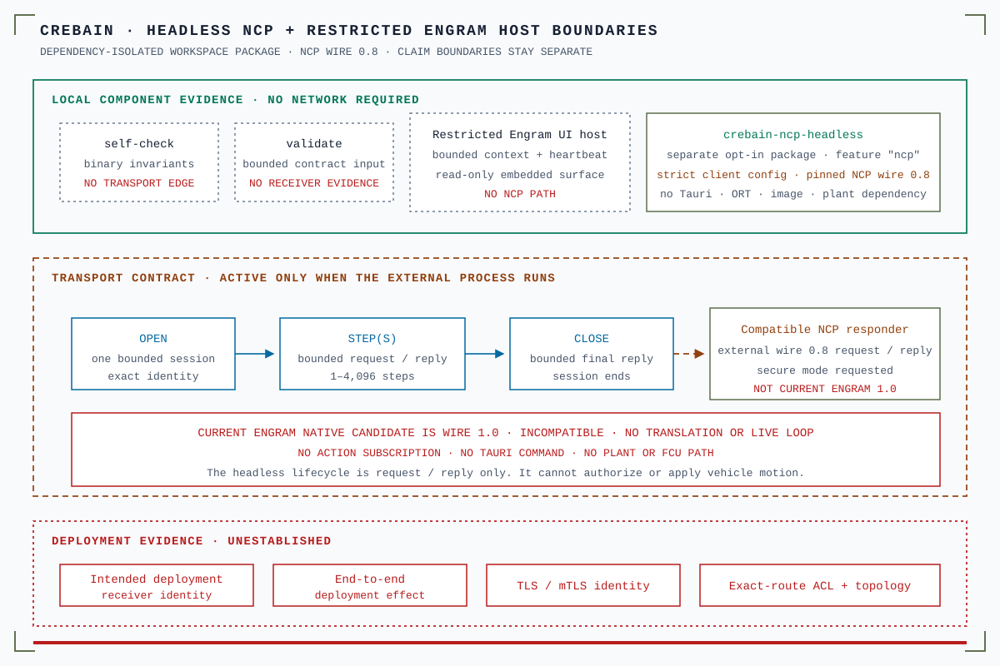

# Engram host integration

CREBAIN remains a standalone browser and Tauri application. Engram host API 1.0
adds an optional restricted browser surface. The manifest version tracks the
CREBAIN release, not the date this embedding was introduced.

<p align="center">
  
</p>

Text alternative: The feature-gated `crebain-ncp-headless` process uses
strict-client-config NCP wire 0.8 without Tauri, inference, image, or plant dependencies.
It bounds open, 1–4,096 steps, and close against a compatible external responder.
Self-check and validation do not cross the transport boundary. The separate
Engram UI host is read-only and has no NCP path. Current Engram wire 1.0 is
incompatible, and no translator or live loop exists. A successful, validated
RPC reply shows that one compatible responder replied. It does not prove
receiver identity, end-to-end effect, TLS, ACL, scientific validity, or
deployment readiness.

## Start CREBAIN

Run this command from the CREBAIN repository:

```bash
bun run dev
```

The development server uses `http://127.0.0.1:5173`.
Engram starts no CREBAIN process.
Engram does not stop the process when it closes the view.

## Embedded boundary

Engram adds `engramHost=1`, `hostOrigin`, and `hostNonce` to the frame URL.
The embedded-mode latch applies for the document lifetime.
Malformed host parameters do not restore standalone capabilities.

Embedded mode disables these paths:

- CREBAIN Tauri commands and native backend paths
- native detection and fusion
- external telemetry
- artifact ingress and export
- local drone physics and simulation updates
- sensor placement, scene editing, and deployment controls
- the development NCP command harness
- NCP action or control
- plant control

The Performance and Sensor Fusion panels start collapsed in embedded mode.
Their standalone defaults remain expanded. The embedded panels are read-only.
View navigation, orbit, focus, grid, and feed display remain available.

## Host protocol

The `engram.host.v1` protocol uses exact, bounded messages.
CREBAIN accepts a fixed primitive `host.context` schema. It requires exact
envelope keys and plain or null prototypes. It measures the 8 KiB limit on the
envelope that it normalizes locally.
Engram applies a separate generic traversal to CREBAIN messages. That traversal
bounds 128 nodes, 32 entries per container, four nesting levels, and
1,024-character strings.
CREBAIN accepts at most 32 expected-peer messages in a rolling one-second
window. It revokes the bridge on the next message.
Engram creates a fresh document context nonce after each frame load.
CREBAIN accepts context from the exact parent, origin, extension, and session.
CREBAIN echoes the accepted document nonce in status.

These limits bound accepted state and parser amplification.
The browser creates each `MessageEvent` before CREBAIN parses it.
The bridge does not isolate hostile iframe CPU or message-clone memory.

Engram continues health challenges after readiness.
CREBAIN increments a heartbeat sequence for each accepted challenge.
Engram relocks the frame when replies stop.

CREBAIN probes the harmless, host-owned Engram `get_extension_host_security` command.
CREBAIN does not register this command.
Engram unlocks the frame only when native Engram inter-process communication
(IPC) is inaccessible.
On supported Tauri targets, the local-window capability policy is the primary
boundary. The probe is an unattested peer report and a diagnostic canary.
Browser readiness proves no Tauri capability denial.

Engram blocks this remote iframe on Linux and Android.
Tauri cannot isolate iframe IPC from the parent on those targets.

## Security and authority boundary

The nonce and document challenge correlate a frame.
They do not authenticate or attest the process, repository revision, or build.
The loopback port can be occupied by another local process.
Do not send secrets or authority through the host protocol.

The protocol accepts no host command.
It does not enable NCP, a closed loop, artifact exchange, or plant authority.

The dependency-isolated `crebain-ncp-headless` process is not part of this host
protocol. Engram does not start, configure, or control it. Its networked mode
requires a compatible external NCP wire-0.8 responder. The `engram/ncp` default
realm is only routing text and does not establish current Engram compatibility.

CREBAIN pins the latest immutable NCP release, `v0.8.0` (wire `0.8`). The NCP
`1.0.0-rc.1` candidate uses wire `1.0` and compact proto contract hash
`163acc57d8a62b66`. It is unreleased, release-blocked, and incompatible with
wire `0.8`. No native-1.0 role is certified. Engram's native-1.0 migration
worktree is neither an installed artifact nor a live certification result. No
translator or live CREBAIN↔current-Engram loop exists.

## Validation

Run these focused gates:

```bash
bun run typecheck
bun run test:run -- src/integrations/__tests__/engramHost.test.ts
bun run lint
bun run format:check
```

The cross-repository decisions and acceptance evidence are in Engram's
`docs/EXTENSION_HOST_QUALITY_LEDGER.md`.
