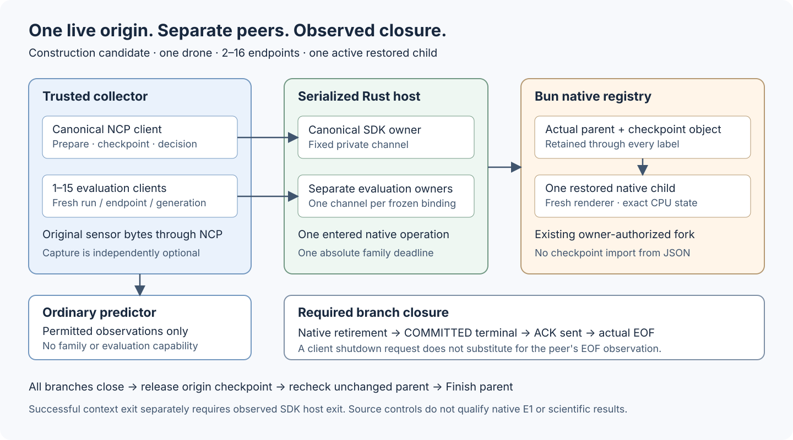

# Optional live checkpoint family

This optional application exposes the existing native checkpoint owner through a separate typed NCP application.
It supports one canonical trajectory and a prospectively frozen roster of restored continuations.
The admitted environment still contains one drone and zero city solids.
The ordinary [sensor application](README.md) remains independently usable.

The family keeps the actual originating checkpoint object and native parent alive until every admitted continuation closes.
Ordinary predictors receive immutable sensor observations without checkpoint selectors, evaluation methods, or family channels.
No Engram, Prisoma, Galadriel, capture, or monitor process is mandatory.



Text alternative: The trusted collector owns separate canonical and evaluation channels.
Each channel binds one real NCP SDK owner in a serialized Rust host.
The shared Bun registry retains the actual native parent and checkpoint.
One restored child exists at a time.
Its terminal must commit, transmit its acknowledgment, and reach actual channel EOF before another child starts.
The parent remains live until every child closes and the checkpoint releases.

[Open the original SVG](../../assets/diagrams/ncp-checkpoint-family.svg?raw=1).

## Current scope

| Surface | Scope |
| --- | --- |
| Public application | Closed canonical and evaluation roles on distinct NCP bindings |
| Checkpoint authority | Existing live native parent and exact owner-returned checkpoint object |
| Restoration | Existing native fork with exact CPU reconstruction and fresh current static rendering |
| Evaluation | One frozen pressure source, three complete ticks, and 400 original binary64 samples |
| Source controls | Typed contracts, SDK lifecycle, actual private channels, synthetic native owners, and process cleanup |
| Native family qualification | Installed one-drone E1 cases used exact CREBAIN `50f1e214a19f6778d581f1ebef375df3b4602ba9` |
| E1 experiment | Eight qualification cases and 112 study episodes completed. The forecast result is null or inconclusive. |

The [dated E1 evidence](https://github.com/sepahead/prisoma/blob/88ee414837d771a630bfa567d709e4175bb92fae/integrations/agent-bridge/evidence/E1_NATIVE_2026-09-23.md) binds the installed source, original captures, restored labels, and result.
The three- and sixteen-endpoint construction controls retain their separate scope.
The one-drone E1 result does not establish general predictor quality, policy benefit, or many-entity checkpoint qualification.

The historical sensor, M1, and neural results retain their original scopes.
They do not qualify this new family lifetime, checkpoint application, or evaluation operation.
The construction dependency remains the exact [selected NCP revision](contracts/dependency-source.v1.json).
Its `dependency_ready=false` field remains unchanged.

## Fixed roles and live authority

The [family descriptor](contracts/family.application.descriptor.v1.json) binds the [complete application schema](contracts/family.application.schema.v1.json).
The generator derives unchanged sensor types from their existing owner.
The [composition](contracts/family.composition.v1.json) names every mandatory role and keeps external peers optional.
All checkpoint-import, imported-object, and import-metadata types remain uninhabited.

The trusted host freezes one canonical binding and one through fifteen evaluation bindings before launch.
Each binding has distinct run, endpoint, and generation UUIDs.
Each endpoint gets its own SDK Owner, Client, and Unix socket pair.
Native evaluation owners are created serially after reservation; dormant endpoints still consume their declared transport resources.

The canonical checkpoint operation invokes the existing native `checkpoint()` method.
The Bun registry retains the exact returned object, its parent, and a newly issued selector.
Native `fork()` receives that original object.
Copied native handles, exported audit JSON, caller hashes, and declared source IDs cannot create registry authority.

A serialized selector remains reusable inside its authorized live family.
Unknown, foreign, released, or retired selectors fail closed.
Each branch reservation binds one frozen recipient and can create only one native child.
Finishing the family destroys that authority; checkpoint restoration after parent Finish is unsupported.

The canonical role adds four typed commands to ordinary sensor advancement:

| Command | Required boundary |
| --- | --- |
| `checkpoint` | Accepted landmark tick, exact sensor batch, and released observation buffers |
| `commit_decision` | Retained checkpoint, original forecast-artifact digest, and one frozen label case |
| `reserve_branch` | Actual committed final canonical advance and the next frozen branch |
| `release_checkpoint` | Every frozen child terminal committed, acknowledged by its owner, and closed through actual EOF |

The evaluation role restores its reserved child, accepts its frozen continuation, and evaluates its declared pressure window.
Its first action must equal the branch's frozen target.
Later actions hold that endpoint's accepted action digest.
It exposes no arbitrary invocation, executable selection, file access, checkpoint import, or alternate evaluator.

## State, identity, and equivalence

The native origin plan keeps its original `ncp-<run_id>` engine identity.
The restored branch has a fresh NCP binding, native owner UUID, and graphics generation.
`BranchAncestry` preserves both identities without rewriting the origin plan.
Its `origin_plan_digest` hashes the native plan bytes; it differs from the public typed family-plan digest.

The restored result joins the originating checkpoint, landmark batch, accepted action-history position, decision commitment, and final selected execution.
Preparation compares the complete admitted CPU state and current static pixel identities against the retained checkpoint.
The origin's CPU state includes the native owner's admitted dynamics, controller, thermal, acoustic, and random-state domain.
It does not include desktop state, arbitrary extensions, or a saved GPU process.

The first restored native predecessor is the checkpoint's accepted native batch.
The first endpoint-local sensor predecessor is absent.
The protocol predecessor is that endpoint's own preparation result.
These three meanings remain distinct.

The canonical final advance includes `canonical_final_state` before its result commits.
The trusted host then binds the exact actual COMMITTED stamp as `selected_execution`.
A branch cannot reserve against an uncommitted summary.
Same-action evaluation requires equality with that final CPU digest.

Before parent Finish, the native owner rechecks the full canonical checkpoint audit against its retained final audit.
A parent mutation during labeling fails the terminal operation.
Fresh renderers reconstruct the current static view; they do not restore GPU history or guarantee future pixel equality across arbitrary runtimes.
Installed native controls must establish the claimed continuation equivalence on the selected runtime.

The landmark and final tick must each align with every configured camera period.
The evaluation window ends at the final tick and contains exactly three complete pressure windows.
At 16,000 samples per second and 120 body ticks per second, those windows contain 400 samples.
This arithmetic does not itself establish a native observation.

## Pressure target and forecast commitments

The owner-selected [target function](contracts/pressure-window-rms.semantic.v1.json) defines every ordered numerical operation.
Its canonical SHA-256 is `2587d58265dfec6decf9d2255a410ca195a337e1bbf1020ccaac4f37ee6c1505`.
Samples are original little-endian binary64 pressure values in pascals, abbreviated Pa.

Let `p[i]` denote pressure sample `i`, in original order, for `0 ≤ i < 400`.
Let `m = max(abs(p[i]))`.
The all-zero case returns positive zero.
Otherwise, sequential Neumaier compensated addition accumulates `(p[i] / m)²` using the artifact's exact parentheses.
The result is `m × sqrt(accumulated / 400)`, in Pa.
Every sample and intermediate must remain finite.
Reassociation, fused operations, sorting, and replacement samples are unsupported.

The evaluation response binds all three source and availability ticks, sample extents, typed manifests, byte manifests, and payload digests.
It also binds the 3,200 original concatenated bytes, accepted action, final sensor batch, and final CPU state.
The independent Python client reopens NCP payloads and repeats the exact ordered arithmetic.
Eight original-byte stress vectors exercise selected-runtime numerical agreement; they do not qualify all platform square-root implementations.

`forecast_commitment_digest` binds original artifact bytes independently of `selected_case_id`.
The latter identifies the actual canonical collection action.
Development collection can remain neutral while a forecast artifact commits several frozen candidate models.
Model selection cannot retrospectively change which action collected those development observations.

CREBAIN does not interpret a predictor's artifact or attest its scientific validity.
The experiment owner must validate its closed artifact, original-byte digest, input lineage, and pre-label publication order.
It must not recreate another language's floating-point JSON and treat that serialization as the original commitment.

## Install and call the optional family

Use the [reader installation](python/README.md) and the exact construction prerequisites first.
The family installer requires explicit Node and browser selections because checkpoint reconstruction requires cameras.
Choose a fresh absolute runtime directory outside both source checkouts:

```sh
python3 integrations/ncp-force-ground-sensors/install_runtime.py \
  --family \
  --ncp-source /operator/selected/NCP \
  --output /operator/runtimes/crebain-family \
  --bun /absolute/path/to/bun \
  --node /absolute/path/to/node \
  --browser-root /absolute/path/to/playwright-browsers
```

`InstalledFamilyRuntime` accepts only `crebain.installed-checkpoint-family-runtime.v1`.
Its fixed producer is `crebain-ncp-checkpoint-family`; its fixed bridge is `bridge/family-main.ts`.
Ordinary installed manifests and family manifests reject each other's selectors.
Discovery and byte verification grant no native-readiness or loaded-code attestation.

The host supplies an immutable `FamilyPlan`, fresh bindings, and the frozen branch roster.
`family_contract.new_binding()` creates one fresh family binding.
`family_contract.decode("FamilyPlan", configuration)` checks a closed configuration; decoding does not restore a checkpoint.
The family body uses the family composition digest from `family_contract.COMPOSITION_DIGEST`.

This calling pattern assumes a prospectively frozen plan and an explicit prefix target:

```python
from hashlib import sha256
from crebain_ncp_sensors.family_owned import family_session
from crebain_ncp_sensors.runtime import InstalledFamilyRuntime

runtime = InstalledFamilyRuntime.open("/operator/runtimes/crebain-family")
labels = []
with family_session(runtime, frozen_plan) as family:
    parent = family.canonical
    for tick in range(1, frozen_plan.landmark_tick + 1):
        with parent.advance(prefix_target if tick == 1 else None) as batch:
            observe_prefix(batch.observation)
    checkpoint = parent.checkpoint()
    artifact_bytes, collection_case = commit_forecasts()
    parent.commit_decision(sha256(artifact_bytes).hexdigest(), collection_case)
    start = frozen_plan.landmark_tick + 1
    for tick in range(start, frozen_plan.body.planned_ticks + 1):
        with parent.advance(parent.decision.selected_target if tick == start else None):
            pass
    for specification in frozen_plan.branches:
        branch = family.reserve(specification.case_id)
        branch.prepare()
        for tick in range(start, frozen_plan.body.planned_ticks + 1):
            with branch.advance(specification.target if tick == start else None):
                pass
        labels.append(branch.evaluate())
        branch.finish()
    parent.release_checkpoint()

assert family.process_exit["cleanup_confirmed"]
```

`observe_prefix` and `commit_forecasts` belong to the trusted experiment host.
The host must give predictors only their permitted observations and detached forecast inputs.
The privileged family object and `labels` must remain outside ordinary predictor input.
This is capability separation between trusted components, not isolation from malicious Python introspection.

Batch contexts release every sensor buffer after complete validation.
Normal family-context exit finishes the parent and waits for the shared producer's actual exit.
An incomplete roster, unreleased checkpoint, or overdue caller cannot produce successful completion.
`FamilySession` also accepts already-owned streams and a real endpoint-shutdown callback for hosts with independent process custody.

Optional `exchanges` supplies one trusted capture function per frozen endpoint.
Each function follows the ordinary [original-frame capture contract](python/README.md#capture-original-ncp-exchanges).
It must return within the host's bound and retain original request and response bytes when capture is required.
Neither buffer release nor protocol acknowledgment establishes durable capture.

## Commitment, acknowledgment, and retirement

The SDK owns protocol commitment and replay.
After `Owner.process()` returns, the host validates its exact COMMITTED response before recording a stamp.
A successful native callback alone cannot establish that stamp.
Exact duplicate requests and terminal acknowledgments remain SDK replays, without another native effect.

Branch closure has four separate facts:

1. Native branch retirement completes.
2. The typed terminal result commits.
3. The host writes and flushes the exact terminal ACK response.
4. The selected endpoint produces actual EOF with no remaining SDK obligations.

The host waits for the closing endpoint while charging at most one pending frame to each other endpoint.
Malformed input and early EOF still fail immediately.
A stuck endpoint cannot renew the family deadline.
No client closure flag or diagnostic line can release a branch reservation.

Python preserves the full `last_committed` response before attempting its acknowledgment.
`last_acknowledged` advances only after the client observes the exact ACK response.
`channel_shutdown_requested` records a real host-side shutdown request; it does not assert that the peer observed EOF.
ACK loss therefore preserves an observed terminal without returning successful family completion.

Each branch terminal keeps `shared_family_process_retirement="pending"`.
The canonical terminal requires actual Bun exit but keeps `sdk_host_process_retirement="pending"`.
The outer guardian must observe the SDK host exit before the context can succeed.
Public `process_exit`, bounded `diagnostics`, and `diagnostics_truncated` become available after context exit.

The guardian retains host-side socket duplicates so caller loss can shut down every endpoint.
The Rust child receives only selected service descriptors, with close-on-exec set before Bun starts.
The bootstrap validates the complete descriptor roster before adopting any descriptor.
Read-only rejection leaves inherited descriptors untouched until process exit.
Partial adoption closes only descriptors whose ownership has transferred.

The bootstrap runs before threads, signal handlers, or helpers can reassign those descriptors.
One private Rust capsule performs the unavoidable ownership transfer.
The application library retains `unsafe_code=forbid`; the bootstrap crate allows unsafe code only inside that capsule.
Its exact `libc=0.2.189` dependency remains locked and auditable.

Primary, local-retirement, and process-cleanup failures remain separate exception objects.
Every local endpoint is attempted even when another endpoint's close fails.
Process cleanup still runs after pre-yield preparation failure or local client failure.
Emergency termination targets only the directly owned unreaped process and never confirms descendant retirement.

The production Bun boundary emits one advisory `CREBAIN_FAMILY_FAILURE_V1` line after failure.
Its aggregate member zero identifies the primary failure; member one identifies the separate cleanup failure when both occur.
The bounded graph preserves these immediate members before inspecting deeper causes.
It admits eight nodes, eight edges, four cause levels, and 128 ASCII-prefix characters per message.
The final UTF-8 line, including its prefix and newline, cannot exceed 4,096 bytes.
Truncation and unavailable property inspection remain explicit.
Own accessors and coercion hooks are never invoked; throwing Proxy descriptor traps cannot replace the primary failure.
Proxy execution itself remains trusted in-process code, without a containment guarantee.
Diagnostic transmission waits at most one second and cannot change the nonzero failure status or establish retirement.

This lifetime assumes trusted, schedulable cleanup owners.
It does not provide hostile-code containment or guarantee cleanup after arbitrary simultaneous kills, suspension, or operating-system failure.

## Resource and time bounds

Let `B` be the frozen branch count, with `1 ≤ B ≤ 15`.
The endpoint count is `E = B + 1`, with `2 ≤ E ≤ 16`.
Let `F = 65,536` bytes be the frame ceiling and `C = 32,768` bytes the chunk ceiling.
Let `D` be the conservative sum of all selected sensor extents, including 134 pressure samples per microphone.
That sum bounds every due batch and must not exceed 32 MiB.

| Resource | Bound or accounting |
| --- | --- |
| SDK logical working extents | `E × (1,261,568 + 1,085,440)` bytes for owners and clients |
| Additional encoded frame queues | `2 × E × F` bytes; each ingress worker has one outstanding frame |
| Serialized bridge scratch allowance | `10 × F + 2 × C`; fixed request, response, binary64, and chunk copies |
| Ingress thread stack requests | `E × 256 KiB`; platform rounding and guards are separate |
| Live original sensor bytes | At most `D`; native advances cannot overlap |
| Python batch assembly allowance | `3 × D + C`; caller-retained observations require a separate budget |
| Native owners | Parent plus at most one child; unresolved cleanup retains its slot |
| Native checkpoints | One origin and one temporary checkpoint, each within the existing 64 MiB CPU bound |
| Checkpoint metadata | Two simultaneous 1 MiB native reservations |
| Native reconstruction staging | Existing 32 MiB raw-byte bound |
| Native render references | Existing 512 KiB bound per live native owner |
| Evaluation bytes | One 3,200-byte native window and one independent 3,200-byte Python window |
| Family diagnostics | 128 KiB retained prefix; separate 1 MiB observed-output ceiling |
| Private channels | `E` distinct NCP socket pairs, one guardian lifetime channel, and one selected Bun channel |

At sixteen endpoints, SDK logical extents total 37,552,128 bytes, and additional frame queues total 2,097,152 bytes.
These are encoded allowances and declared cardinality limits, not preallocated physical memory or a total process-RSS bound.
Bounded decoded objects, native engines, renderer allocations, operating-system buffers, and allocator overhead remain separate.
The source gate does not qualify maximum-scene memory use.

The family retains at most fifteen typed branch records and sixteen endpoint records.
Each application result and terminal has a 32,768-byte encoded ceiling.
The original-byte evaluation window releases after acknowledged validation in Python and native branch retirement in Bun.
Caller-owned capture, labels, and observation retention need independent host quotas.

Five actions with two fresh siblings consume ten branches.
Five additional reverse-order checks consume the remaining five branches.
Another qualification unit needs another prospectively frozen family and fresh identities.
Repeated siblings do not increase the number of independent experimental episodes.

The guardian starts one nonrenewable execution deadline before preparation, bounded by 600 seconds.
Individual operations use their remaining family interval and the existing 60-second transfer, 30-second graphics, and 45-second retirement ceilings.
Repeated frames, partial reads, ACK retries, and dormant endpoints cannot reset these limits.
The guardian has a separate 205-second cleanup ceiling; native family qualification must exercise that complete chain.
These bounds allow failure; they do not promise that every admitted workload finishes in time.

## Design decisions and controls

| Approach | Assumption and benefit | Failure mode | Decisive experiment | Decision |
| --- | --- | --- | --- | --- |
| Imported checkpoint JSON | Portable bytes can recreate native authority. | Contradicts the current owner-issued handle boundary. | Copied bytes must not create a live registry entry. | Reject |
| Replay a scenario as restoration | Matching state bytes imply authorized ancestry. | A fresh replay lacks the originating restore capability. | State agreement cannot validate a foreign checkpoint selector. | Reject |
| One peer with branch labels | Application metadata can replace fresh bindings. | Conflates run, generation, and endpoint ownership. | Reused binding cannot become a distinct branch. | Reject |
| Separate process per branch | A new delegation protocol transfers live authority. | Adds a broker and unresolved delegation lifetimes. | Interrupted delegation must retain origin authority and reservations. | Defer |
| Dynamic endpoint transfer | Late channel creation reduces dormant resources. | Adds registration and descriptor-transfer states. | Partial transfer must close both ends without releasing unknown authority. | Defer |
| Fixed live family | A bounded roster is known before execution. | Dormant channels consume resources; parent must remain live. | Actual sixteen-endpoint completion and every early-closure negative control. | Select |

For final-state verification, a final sensor batch alone omits CPU state.
A peer-supplied digest lacks an execution join, and an extra audit channel duplicates authority.
A new seal operation could work but adds a phase.
The selected final `FamilyAdvanced` summary binds the actual COMMITTED result, followed by a full parent audit at terminal closure.

For failure diagnostics, fixed text discards causes, and unrestricted stacks or JSON can execute accessors or exceed output bounds.
Another protocol result would mix advisory diagnostics with the closed execution channel.
A separate sidecar adds publication and cleanup lifetimes.
The selected bounded stderr graph retains primary and cleanup identities without adding authority or changing protocol responses.
An actual executable control injects distinct operation and cleanup failures before importing the production entrypoint.

Descriptor alternatives included standard-stream multiplexing, a listener, `/dev/fd` aliases, and a broader unsafe allowance.
Each adds routing, races, hidden duplicates, or a wider trust boundary.
The selected separate bootstrap crate keeps one audited ownership capsule and preserves the application library's unsafe prohibition.

Terminal-order alternatives included a caller closure flag, another closure RPC, sleeps, and diagnostic polling.
None independently establishes the peer's actual EOF.
Bounded host scheduling uses existing SDK ACK replay and retains the absolute deadline.

| Review lens | Required evidence |
| --- | --- |
| Scientific validity | Selected native checkpoint and continuation equivalence; predictor evaluation remains separate |
| Runtime correctness | Actual commitment, ACK transmission, EOF, noninterference, and process exit |
| Security and provenance | Existing live authority, closed typed roles, fixed installed bytes, and exact descriptor custody |
| Evidence and generalization | Retained failures, boundary controls, maximum endpoint roster, and unchanged scientific thresholds |
| Maintainability | Generated schemas, reused SDK buffers, unchanged native fork semantics, and independent Python validation |

The maximum-roster control initially exposed a partial-frame stall in the new Bun family reader.
It requested 12,185 bytes while only 8,188 bytes were buffered, repeatedly receiving no data.
The corrected reader consumes available bounded fragments without enlarging the frame or time limits.
The ordinary sensor bridge remains unchanged.

Maintained controls cover exact-bound fragmented frames, premature EOF, stalled bodies, foreign bindings, replay, ACK loss, and delayed branch closure.
They also cover copied native handles, restored-state mismatches, parent mutation, clock regression, partial descriptor adoption, and cleanup failures.
Actual sixteen-channel custody controls exercise caller loss and shared-socket shutdown without observer signals.
Synthetic native owners never substitute for the required native qualification.

Run the complete applicable source gate with the explicitly selected dependency:

```sh
CREBAIN_SENSOR_NCP_SOURCE=/operator/selected/NCP bun run validate:with-ncp-sensors
```

The optional construction gate checks every generator, both Rust workspace members, Bun contracts, and all Python controls.
It builds both selected producer binaries before actual socket controls.
The aggregate also runs the complete standalone repository gate.
Publication requires that gate and independent review; installed native evidence requires a subsequent immutable artifact campaign.
