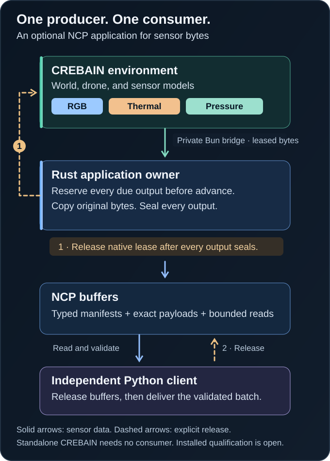

# Optional typed sensor application

This construction candidate exposes CREBAIN observations through the independently installed NCP modular SDK.
It preserves the existing standalone entrypoint and force-ground physics.
The admitted environment contains exactly one simulated drone and zero city solids.

The Rust owner admits each request and reserves every due output before engine mutation.
Its private Bun bridge owns the existing environment and graphics processes.
The independent Python client validates and reads complete sensor batches through NCP.
Cross-project observations use NCP buffers exclusively.

<p align="center">
  
</p>

Text alternative: The Rust owner reserves every due output before engine advance.
The native observation lease remains live until all outputs seal.
Python validates the complete batch, releases the NCP buffers, then invokes the caller's local recorder.
These separate releases establish no durable capture claim.

[Open the original SVG](../../assets/diagrams/ncp-sensor-transfer.svg).

The application has no capture, monitor, neural, or experiment role.
Engram remains optional.
Prisoma capture and Galadriel record-only monitoring require separate composition qualification.
Their absence does not prevent standalone CREBAIN use.

## Construction and qualification

The construction dependency is exact NCP commit `9ae64ac1a77c9cd0612284992a8711220428a6e3`.
Its exact tree and 41 consumed source files appear in [the dependency contract](contracts/dependency-source.v1.json).
The dependency contract retains `dependency_ready=false`.
A source checkout, build, synthetic test, or private channel handshake does not establish installed qualification.

Select the dependency explicitly before running the construction gate:

```sh
python3 integrations/ncp-force-ground-sensors/check.py --ncp-source /operator/selected/NCP
```

The selected path is trusted operator configuration.
The gate rejects revision or source drift before copying or building.
It creates a fresh relative composition and uses the locked dependencies offline.
It never searches siblings, downloads NCP, or changes the selected checkout.
The caller needs the repository's installed Bun, Node, Rust, and Python tools.

The construction gate checks Rust, Bun, independent Python, exact numeric commitments, and bounded private-channel behavior.
The standalone `validate:all` command keeps its existing prerequisites.
For typed sensor changes, select the dependency explicitly and run both scopes:

```sh
CREBAIN_SENSOR_NCP_SOURCE=/operator/selected/NCP bun run validate:with-ncp-sensors
```

The aggregate runs the sensor gate first, so missing or drifting source fails before the longer standalone gate.
The component command is `bun run validate:ncp-sensors`.
Neither command skips missing prerequisites or searches for an alternative SDK.

A cold Cargo cache requires an explicit preparation step before the offline gate:

```sh
python3 integrations/ncp-force-ground-sensors/compose.py --ncp-source /operator/selected/NCP --output /operator/new/sensor-prefetch
cargo fetch --locked --manifest-path /operator/new/sensor-prefetch/application/Cargo.toml
```

The output directory must be new.
Composition checks the exact dependency before Cargo fetches locked registry packages.
The gate creates another fresh composition and retains offline Cargo execution.

The [hosted construction workflow](../../.github/workflows/ncp-sensors.yml) runs on pushes and pull requests.
It selects Node 26.7.0, Bun 1.3.14, Rust 1.91.1, and Python 3.14.6.
Its NCP checkout has an explicit repository, commit, and directory outside the CREBAIN source tree.
It runs every construction control and audits the composed Rust graph with the existing cargo-deny policy.
These Linux source controls prepare no Metal renderer and grant no installed-runtime qualification.
Publishing this integration requires the exact NCP commit to pass its owning bootstrap and become publicly available.

The [native engineering run](evidence/m1-transfer-2026-09-09.json) passed on September 9, 2026, at CREBAIN commit `8060fba6ec5230ed747292e9064dc46ee1fca31a`.
An independent Python reader received all 24 ticks, 44 payloads, 168 chunks, and 4,326,400 bytes through NCP.
Every reopened payload matched its complete producer byte commitment. The terminal confirmed engine retirement; all 13 observed process identities retired.

| Modality | Received data | Raw bytes |
| --- | --- | --- |
| RGB | 12 frames × 320 × 240 pixels × 4 bytes | 3,686,400 |
| Thermal radiance | 8 frames × 160 × 120 values × 4 bytes | 614,400 |
| Pressure | 3,200 samples × 8 bytes | 25,600 |

The 24 body ticks represent 0.2 simulated second at 120 ticks per second.
The unpaced session took 6.62 seconds, including preparation, transfer, local file synchronization, and retirement.
This result does not establish real-time performance, an independent renderer oracle, or durable Prisoma capture.

The [first run](evidence/m1-preparation-2026-09-09.json) failed during preparation and remains retained.
The graphics worker adds `workerRuntime`; the bridge's diagnostic schema had omitted that field.
A regression using the worker's field roster reproduced the rejection. The corrected schema requires its three closed fields.
The successful run kept the original workload, deadlines, and payload requirements.
The [launcher prerequisite roster](launcher-prerequisites.v1.json) keeps those requirements separate.
Renderer isolation, maximum-scale memory, failure recovery, and complete installed qualification remain open.
All original scientific and operational failures remain retained.
The final 70 requirements remain open.

## Closed application contract

[The schema](contracts/application.schema.v1.json) defines every public field and rejects unknown fields.
[The application descriptor](contracts/application.descriptor.v1.json) binds that schema and its encoded metadata limits.
[Commitments](contracts/commitments.v1.json) use fixed application discriminators inside the existing NCP profile digest domain.
They add no generic digest domain.

Continuous fields use finite binary64 values and preserve negative zero.
The existing NCP digest projects admitted integer and floating representations to the same binary64 value.
Negative zero retains its distinct bit pattern.
Integer fields remain exact integers.
The private bridge encodes continuous fields as closed sixteen-digit binary64 bit words.
For example, negative zero is `{"f64":"8000000000000000"}`.

| Operation | Required behavior |
| --- | --- |
| Prepare | Bind the resolved source, plan, scene, engine owner, and complete sorted sensor catalog. Acquire no tick-zero observation. |
| Advance | Admit the next tick and predecessor batch. Reserve all due payloads before scheduling or advancing. |
| Read | Return one existing NCP buffer chunk, with its exact manifest and payload identity. |
| Release | Explicitly release a selected buffer. An acknowledgement never frees payloads. |
| Finish | Require the full planned horizon, no live buffers, and confirmed engine retirement. |
| Abort | Retire the engine. Unresolved cleanup never becomes successful termination. |

Targets remain inside the prepared controller neighborhood.
Roll and pitch stay within ±0.1 radian.
Wrapped heading displacement stays within ±0.2 radian; absolute heading stays within ±π.
Altitude displacement stays within ±0.5 meter.
Held targets name the accepted set-target request digest.

The world uses meters, Three.js y-up coordinates, and z-forward orientation.
Body tick `k` occurs at rational time `k/120` seconds.
Pressure uses 16,000 samples per second.
Its half-open window is `[floor((k−1)16000/120), floor(k16000/120))`.
The 133, 133, 134 cadence is adjacent across all 7,200 admitted ticks.
This bounded enumeration is an engineering check, not a formal refinement proof.

| Modality | Tensor | Bytes |
| --- | --- | --- |
| RGB | Bottom-left RGBA8 sRGB, shape `[H,W,4]` | `4HW` |
| Thermal | Bottom-left little-endian binary32 radiance, shape `[H,W]`, W/(m² sr) | `4HW` |
| Pressure | Little-endian binary64 pascals, shape `[S]` | `8S` |

The source admits four cameras per modality and four microphones.
RGB dimensions stop at 1,280; thermal dimensions stop at 320.
The maximum configured due batch contains 27,857,088 raw bytes and 856 chunks.
Each payload stays within the existing 8 MiB buffer limit.
These logical extents exclude renderer memory, process RSS, encoded observations, and caller retention.

Each actual native observation remains leased until every due NCP output seals.
The bridge projects only original sensor bytes.
It excludes privileged control, CPU reference, checkpoint, and counterfactual records.
The exact native lease digest identifies the source JSON; clients do not recanonicalize that engine-owned digest.

A failed transfer preserves the prior complete application batch and retires the unknown suffix.
Committing an exact NCP outcome does not establish application success.
A generic indeterminate outcome does not attest CREBAIN's executed tick.
This slice defines no partial-terminal success.

## Lifetime and controls

The private process uses one owner-created Unix socket pair.
Each partial read and write receives the remaining absolute operation deadline.
One 60-second deadline spans native advance, every chunk read, and lease release.
Retirement has a separate 45-second deadline.
Unknown I/O shuts down both socket directions and admits no later engine operation.
After environment preparation, the bridge writes one closed private runtime receipt before announcing prepared.
The inherited stderr line starts with `CREBAIN_SENSOR_RUNTIME_V1 ` and stays within 4,096 bytes.
It joins the run, source, owner, scene, graphics plan, reported browser strings, and reported browser and worker PIDs.
Missing or malformed diagnostics and failed receipt writes retire the bridge before prepared publication.
The five-second receipt-write deadline does not replace the separate retirement deadline.
These are browser-reported strings, without loaded-code, hardware, or process-signal authority.
The internal diagnostic also requires the Node worker's name, bounded version, and bounded absolute executable path.
These fields grant no execution authority. The public receipt omits this local worker metadata.
The trusted launcher must retain and independently join this receipt; ordinary sensor clients receive no diagnostic side channel.
Retirement joins pending preparation and active environment work.
Emergency termination of the directly owned child never confirms renderer-family cleanup.

The [Python client](python/README.md) validates all due payloads before releasing them and invoking its local recorder.
A recorder failure cannot recover released buffers or establish durable capture.

The frozen [M1 workload](contracts/m1.workload.v1.json) has 24 ticks and two target actions.
It expects twelve RGB frames, eight thermal frames, 3,200 pressure samples, and 4,326,400 raw bytes.
Its historical capture case and `capture_reserved_bytes` describe a later prerequisite.
They grant this standalone slice no Prisoma capture qualification.

| Review lens | Selected boundary |
| --- | --- |
| Simplicity | Existing Rust SDK owner plus the project-owned Bun engine. |
| Maintainability | Fixed generated DTOs and small schema interpreters. |
| Usability | Explicit prepare, next tick, read, release, and finish operations. |
| Independence | Python checks semantics and bytes without Rust bindings. |
| Time | Integer clocks and exact source-body ticks. |
| Numerics | Explicit units, endian order, shape arithmetic, and signed zero. |
| Identity | Distinct source, scene, catalog, manifest, request, and batch joins. |
| Resources | Complete output demand before mutation; one outstanding batch. |
| Failure | Unknown suffix retirement and immutable prior complete outcomes. |
| Scientific scope | Transport controls supply no calibration or physical-validity claim. |

Considered alternatives included a new TypeScript SDK, scalar summaries, inline base64, direct engine access, file polling, and borrowed leases.
Each either expanded the dependency surface or weakened independent typing, bounded storage, or NCP-only transfer.
An asynchronous runtime and blocking pipe workers also added unnecessary lifecycle complexity.
The selected socket pair retains the existing synchronous ownership model.
