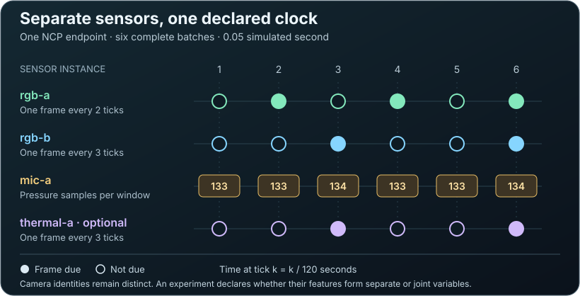

# Optional typed sensor application

This construction candidate exposes CREBAIN observations through the independently installed NCP modular SDK.
It preserves the existing standalone entrypoint and force-ground physics.
The admitted environment contains exactly one simulated drone and zero city solids.

The Rust owner admits each request and reserves every due output before engine mutation.
Its private Bun bridge owns the existing environment and graphics processes.
It starts graphics only when cameras are configured.
The independent Python client validates and reads complete sensor batches through NCP.
Cross-project observations use NCP buffers exclusively.
The [Python reader](python/README.md) installs as an optional package with its exact NCP v1 dependency and owned contract resources.

<p align="center">
  
</p>

Text alternative: The Rust owner reserves every due output before engine advance.
The native observation lease remains live until all outputs seal.
The incremental Python client exposes a complete validated batch while its source buffers remain live.
The caller can inspect observations and choose the next action before explicit release.
The scheduled helper releases buffers before invoking its local recorder.
An optional host exchange function can capture original NCP frames before dispatch and before the client receives each response.
This includes every sensor read before its source buffer is released.
These separate releases establish no durable capture claim.

[Open the original SVG](../../assets/diagrams/ncp-sensor-transfer.svg).

The application has no capture, monitor, neural, or experiment role.
Engram remains optional.
The host can select Prisoma transcript capture independently; its native evidence appears below.
Galadriel record-only monitoring requires separate composition qualification.
Their absence does not prevent standalone CREBAIN use.

## Select the sensors you need

Each modality admits zero through four sensor instances.
The selected roster must contain at least one sensor overall.
An empty `rgbCameras`, `thermalCameras`, or `microphones` list disables that modality's observation channels.
Thermal and acoustic model settings remain explicit parts of simulator state.
With both camera lists empty, the native path requires no Node executable, Chromium process, or GPU renderer.
The producer's `--node ABSOLUTE_PATH` argument is required only for camera selections.
When present, it follows `--bun ABSOLUTE_PATH` and precedes `--bridge ABSOLUTE_PATH`.
The private runtime receipt records `graphics=null` and `identity_scope=graphics-unselected-by-camera-roster` for camera-free preparation.
These observations describe the selected process path; they do not attest arbitrary host activity.

| Example selection | Sensor instances | Modalities |
| --- | --- | --- |
| One RGB camera and one microphone | 2 | RGB, acoustic |
| Two RGB cameras and one microphone | 3 | RGB, acoustic |
| Two RGB cameras, one microphone, and one thermal camera | 4 | RGB, acoustic, thermal |
| Four microphones | 4 | Acoustic |

Each instance retains its own catalog identity, configuration, and observation schedule.
For example, `rgb:front` and `rgb:rear` identify different cameras.
They can have different capture periods and dimensions.
An unconfigured modality has no catalog entry or payload.
A configured camera that is not due has an explicit `not_due` slot.
A missing expected observation fails the batch; it never becomes a zero-valued sample.

NCP owns message exchange and buffer lifetime.
CREBAIN owns dynamics, sensor models, and original observation bytes.
Prisoma owns experiment design, feature encoding, source grouping, targets, and statistical assumptions.
The optional PID-rs library owns its estimators; no PID dependency enters this sensor client.
Two cameras need not become two PID variables, but any grouping must remain explicit and traceable.

The initial planned PID case uses RGB and acoustic observations, with thermal optional.
Microphones produce pressure samples in pascals at 16 kHz through the [declared acoustic model](../../docs/NATIVE_ENVIRONMENT.md#microphone-pressure-model).
Shared causes, clocks, or simulator noise do not establish independent sources or experimental replicates.
The four-instance limits belong to this CREBAIN application, not to NCP or PID-rs.
Larger rosters require separately qualified application and estimator bounds.

Radar, LiDAR, inertial, and contact sensor applications remain future work.
They need typed contracts and actual forward models; Gaussian-splat geometry alone does not define radar returns.

### Native sensor selection

Four [frozen native cases](evidence/selected-sensors-native-2026-09-09.json) passed on the selected M4 Max runtime at commit `660e065`.
Each ran six body ticks, or 0.05 simulated second, through one producer and an independent Python reader.
They used the existing M1 drone, force-ground physics, sensor models, and initial target.

| Selected sensors | RGB frames | Thermal frames | Pressure samples | Raw bytes |
| --- | --- | --- | --- | --- |
| One RGB camera, one microphone | 3 | 0 | 800 | 928,000 |
| Two RGB cameras, one microphone | 5 | 0 | 800 | 1,542,400 |
| Two RGB cameras, one microphone, one thermal camera | 5 | 2 | 800 | 1,696,000 |
| One RGB camera | 3 | 0 | 0 | 921,600 |



Text alternative: `rgb-a` returns frames at ticks 2, 4, and 6; `rgb-b` returns frames at ticks 3 and 6.
The microphone returns 133, 133, 134, 133, 133, and 134 samples.
The optional thermal camera returns frames at ticks 3 and 6.
Each tick has a complete batch, including configured cameras whose observations are not due.

[Open the original timing SVG](../../assets/diagrams/sensor-instance-timing.svg?raw=1).

The two RGB cameras retained distinct catalog identities, viewpoints, and periods.
The camera-only case returned three valid batches with no due payloads.
Every reopened payload matched its complete producer byte commitment.
All 68 observed build and runtime process identities retired; source, runtime, and index bytes remained unchanged during native execution.

The unpaced sessions took 2.42–3.56 seconds each, including preparation, transfer, file synchronization, and retirement.
These selected cases do not establish real-time performance, sensor calibration, independent statistical replicates, or a PID result.
No case loaded Prisoma, Galadriel, Engram, or PID-rs.

### Native microphone-only runs

Two [frozen microphone-only cases](evidence/camera-free-native-2026-09-12.json) passed through standalone CREBAIN, NCP, and optional Prisoma recording on September 12, 2026.
Each route ran the same six physics ticks with the same initial target and sensor settings.
Every microphone retained its identity and returned 800 samples in six consecutive windows.
Complete pressure bytes agreed across the three routes for each case.

| Microphones | Payloads per route | Samples per route | Raw bytes per route | Captured NCP exchanges |
| --- | --- | --- | --- | --- |
| One | 6 | 800 | 6,400 | 40 |
| Two | 12 | 1,600 | 12,800 | 64 |

The final column describes each Prisoma transcript.
Both transcripts replayed eight canonical commands and 28 events.
No route supplied a Node launcher; NCP runtime receipts recorded `graphics=null`.
All 14 observed campaign process identities retired.

The native producer used CREBAIN `54bd49c` and NCP `233de82`.
The installed CREBAIN Python reader remained at `6c9f09a`; its module and schema bytes matched the selected source.
The evidence record preserves complete identities, payload hashes, and two corrected private-harness failures.
These runs establish bounded composition behavior, without acoustic calibration, statistical independence, a PID result, or real-time qualification.

## Construction and qualification

The construction dependency is exact NCP commit `233de821a5b67a34aa7721f900c09ab73a61ba88`.
Its exact tree and 41 consumed source files appear in [the dependency contract](contracts/dependency-source.v1.json).
The dependency contract retains `dependency_ready=false`.
A source checkout, build, synthetic test, or private channel handshake does not establish installed qualification.

The September 9 native runs use NCP `9ae64ac1a77c9cd0612284992a8711220428a6e3`.
Their source identities remain unchanged by this construction update.
The September 12 microphone-only runs use the current selected dependency, NCP `233de821a5b67a34aa7721f900c09ab73a61ba88`.

Select the dependency explicitly before running the construction gate:

```sh
python3 integrations/ncp-force-ground-sensors/check.py --ncp-source /operator/selected/NCP
```

The selected path is trusted operator configuration.
The gate rejects revision or source drift before copying or building.
It creates a fresh relative composition and uses the locked dependencies offline.
It never searches siblings, downloads NCP, or changes the selected checkout.
The caller needs the repository's installed Bun, Node, Rust, and Python tools.

The construction gate checks Rust, Bun, independent Python, exact numeric commitments, and bounded private-channel behavior.
The standalone `validate:all` command keeps its existing prerequisites.
For typed sensor changes, select the dependency explicitly and run both scopes:

```sh
CREBAIN_SENSOR_NCP_SOURCE=/operator/selected/NCP bun run validate:with-ncp-sensors
```

The aggregate runs the sensor gate first, so missing or drifting source fails before the longer standalone gate.
The component command is `bun run validate:ncp-sensors`.
Neither command skips missing prerequisites or searches for an alternative SDK.

A cold Cargo cache requires an explicit preparation step before the offline gate:

```sh
python3 integrations/ncp-force-ground-sensors/compose.py --ncp-source /operator/selected/NCP --output /operator/new/sensor-prefetch
cargo fetch --locked --manifest-path /operator/new/sensor-prefetch/application/Cargo.toml
```

The output directory must be new.
Composition checks the exact dependency before Cargo fetches locked registry packages.
The gate creates another fresh composition and retains offline Cargo execution.

The [hosted construction workflow](../../.github/workflows/ncp-sensors.yml) runs on pushes and pull requests.
It selects Node 26.7.0, Bun 1.3.14, Rust 1.91.1, and Python 3.14.6.
Its NCP checkout has an explicit repository, commit, and directory outside the CREBAIN source tree.
It runs every construction control and audits the composed Rust graph with the existing cargo-deny policy.
These Linux source controls prepare no Metal renderer and grant no installed-runtime qualification.
Publishing this integration requires the exact NCP commit to pass its owning bootstrap and become publicly available.

The [native engineering run](evidence/m1-transfer-2026-09-09.json) passed on September 9, 2026, at CREBAIN commit `8060fba6ec5230ed747292e9064dc46ee1fca31a`.
An independent Python reader received all 24 ticks, 44 payloads, 168 chunks, and 4,326,400 bytes through NCP.
Every reopened payload matched its complete producer byte commitment. The terminal confirmed engine retirement; all 13 observed process identities retired.

| Modality | Received data | Raw bytes |
| --- | --- | --- |
| RGB | 12 frames × 320 × 240 pixels × 4 bytes | 3,686,400 |
| Thermal radiance | 8 frames × 160 × 120 values × 4 bytes | 614,400 |
| Pressure | 3,200 samples × 8 bytes | 25,600 |

The 24 body ticks represent 0.2 simulated second at 120 ticks per second.
The unpaced session took 6.62 seconds, including preparation, transfer, local file synchronization, and retirement.
This result does not establish real-time performance, an independent renderer oracle, or durable Prisoma capture.

The [first run](evidence/m1-preparation-2026-09-09.json) failed during preparation and remains retained.
The graphics worker adds `workerRuntime`; the bridge's diagnostic schema had omitted that field.
A regression using the worker's field roster reproduced the rejection. The corrected schema requires its three closed fields.
The successful run kept the original workload, deadlines, and payload requirements.
The [launcher prerequisite roster](launcher-prerequisites.v1.json) keeps those requirements separate.
Renderer isolation, maximum-scale memory, failure recovery, and complete installed qualification remain open.
All original scientific and operational failures remain retained.
The final 70 requirements remain open.

### Observation-driven steps

The [incremental native runs](evidence/incremental-native-2026-09-09.json) used commit `5e62c3e7b4faf72211658991354650f8ab643e52` and the same NCP dependency.
Both called `SensorSession` directly with the M1 scene, sensor roster, and 24-tick horizon.
Each received and reopened all 44 payloads, totaling 4,326,400 raw bytes.

| Case | Next action | Observed result |
| --- | --- | --- |
| Scheduled control | Original M1 targets | Complete transfer and terminal; 7.20-second session |
| Pressure feedback | Previous pressure window selects the next pitch target | Complete transfer and terminal; 6.47-second session |

The pressure case computed each window's mean in pascals.
A nonnegative mean selected +0.015 radians of pitch for the next tick; a negative mean selected −0.015 radians.
Roll, heading, altitude, and armed state retained the initial target values.
An independent exact-rational calculation verified all 23 decisions against retained pressure bytes and original request frames.
The negative branch occurred twelve times; the nonnegative branch occurred eleven times.

Both sessions exported each complete batch before releasing its source buffers.
All observed process identities retired: fourteen for the scheduled case and sixteen for the pressure case.
The fixed policy tests interface causality. It supplies no tracking, world-model, or stability result.
These unpaced durations include preparation, transfer, file synchronization, and retirement; they are not a comparative latency benchmark.
The [Python calling guide](python/README.md#adaptive-steps-and-capture-ordering) defines batch ownership and optional capture ordering.

### Optional transcript capture

`SensorSession` and `run_session` accept one host-supplied exchange function.
The [capture example](python/README.md#capture-original-ncp-exchanges) uses Prisoma without adding it to CREBAIN's dependencies.
The SDK validates all replies and acknowledgements through the selected function.
Capture failure stops the client and preserves its observed prefix without retry.
The host retains responsibility for process cleanup and callback resource bounds.
Synthetic controls cover complete transfer, failures around execution, malformed replies, refused acknowledgements, and capture before release.
These controls qualify the source interface; native evidence requires its separate run and retained bytes.

The [native capture run](evidence/captured-native-2026-09-09.json) used CREBAIN `04edafc`, Prisoma `3282a17`, and the unchanged NCP dependency.
It completed the same 24-tick pressure-sign workload on the selected M4 Max runtime.
An independent reader reconstructed all 44 sensor payloads from the journal and checked every read before source-buffer release.

| Captured quantity | Observed value |
| --- | --- |
| Raw RGB, thermal, and pressure bytes | 4,326,400 |
| Original NCP exchanges | 476 request-response pairs |
| Journal records | 954: header, 952 original frames, and terminal |
| Journal file | 6,669,600 bytes |
| Unpaced session | 11.21 seconds for 0.2 simulated second |
| Observed process identities | All thirteen retired |

The complete workflow uses 238 operations: preparation, 24 advances, 168 reads, 44 releases, and finish.
Their acknowledgements add 238 exchanges.
All 23 next-action decisions passed the existing exact-rational pressure check.
The negative branch occurred twelve times; the nonnegative branch occurred eleven times.

The journal admits a fixed logical quota before producer launch and synchronizes original frames through the host exchange function.
Here, frames are original NCP JSON payloads; transport length prefixes are not journal records.
Its completion remains separate from application validity and physical disk-space reservation.
All 44 raw payloads also matched the earlier pressure-sign run byte for byte.
This comparison covers one fixed workload and does not establish sensor accuracy.
The duration includes preparation, simulation, transfer, file synchronization, transcript verification, and producer retirement.
It does not establish a comparative latency result or real-time execution.
Registry-installed host qualification, native lifetime faults, canonical experiment-event binding, and world-model quality remain open.

## Closed application contract

[The schema](contracts/application.schema.v1.json) defines every public field and rejects unknown fields.
[The application descriptor](contracts/application.descriptor.v1.json) binds that schema and its encoded metadata limits.
[Commitments](contracts/commitments.v1.json) use fixed application discriminators inside the existing NCP profile digest domain.
They add no generic digest domain.

Continuous fields use finite binary64 values and preserve negative zero.
The existing NCP digest projects admitted integer and floating representations to the same binary64 value.
Negative zero retains its distinct bit pattern.
Integer fields remain exact integers.
The private bridge encodes continuous fields as closed sixteen-digit binary64 bit words.
For example, negative zero is `{"f64":"8000000000000000"}`.

| Operation | Required behavior |
| --- | --- |
| Prepare | Bind the resolved source, plan, scene, engine owner, and complete sorted sensor catalog. Acquire no tick-zero observation. |
| Advance | Admit the next tick and predecessor batch. Reserve all due payloads before scheduling or advancing. |
| Read | Return one existing NCP buffer chunk, with its exact manifest and payload identity. |
| Release | Explicitly release a selected buffer. An acknowledgement never frees payloads. |
| Finish | Require the full planned horizon, no live buffers, and confirmed engine retirement. |
| Abort | Retire the engine. Unresolved cleanup never becomes successful termination. |

Targets remain inside the prepared controller neighborhood.
Roll and pitch stay within ±0.1 radian.
Wrapped heading displacement stays within ±0.2 radian; absolute heading stays within ±π.
Altitude displacement stays within ±0.5 meter.
Held targets name the accepted set-target request digest.

The world uses meters, Three.js y-up coordinates, and z-forward orientation.
Body tick `k` occurs at rational time `k/120` seconds.
Pressure uses 16,000 samples per second.
Its half-open window is `[floor((k−1)16000/120), floor(k16000/120))`.
The 133, 133, 134 cadence is adjacent across all 7,200 admitted ticks.
This bounded enumeration is an engineering check, not a formal refinement proof.

| Modality | Tensor | Bytes |
| --- | --- | --- |
| RGB | Bottom-left RGBA8 sRGB, shape `[H,W,4]` | `4HW` |
| Thermal | Bottom-left little-endian binary32 radiance, shape `[H,W]`, W/(m² sr) | `4HW` |
| Pressure | Little-endian binary64 pascals, shape `[S]` | `8S` |

The source admits up to four cameras per modality and four microphones, with at least one sensor overall.
RGB dimensions stop at 1,280; thermal dimensions stop at 320.
The maximum configured due batch contains 27,857,088 raw bytes and 856 chunks.
Each payload stays within the existing 8 MiB buffer limit.
These logical extents exclude renderer memory, process RSS, encoded observations, and caller retention.

Each actual native observation remains leased until every due NCP output seals.
The bridge projects only original sensor bytes.
It excludes privileged control, CPU reference, checkpoint, and counterfactual records.
The exact native lease digest identifies the source JSON; clients do not recanonicalize that engine-owned digest.

A failed transfer preserves the prior complete application batch and retires the unknown suffix.
Committing an exact NCP outcome does not establish application success.
A generic indeterminate outcome does not attest CREBAIN's executed tick.
This slice defines no partial-terminal success.

## Lifetime and controls

The private process uses one owner-created Unix socket pair.
Each partial read and write receives the remaining absolute operation deadline.
One 60-second deadline spans native advance, every chunk read, and lease release.
Retirement has a separate 45-second deadline.
Unknown I/O shuts down both socket directions and admits no later engine operation.
After environment preparation, the bridge writes one closed private runtime receipt before announcing prepared.
The inherited stderr line starts with `CREBAIN_SENSOR_RUNTIME_V1 ` and stays within 4,096 bytes.
It joins the run, source, owner, scene, graphics plan, reported browser strings, and reported browser and worker PIDs.
Missing or malformed diagnostics and failed receipt writes retire the bridge before prepared publication.
The five-second receipt-write deadline does not replace the separate retirement deadline.
These are browser-reported strings, without loaded-code, hardware, or process-signal authority.
The internal diagnostic also requires the Node worker's name, bounded version, and bounded absolute executable path.
These fields grant no execution authority. The public receipt omits this local worker metadata.
The trusted launcher must retain and independently join this receipt; ordinary sensor clients receive no diagnostic side channel.
Retirement joins pending preparation and active environment work.
Emergency termination of the directly owned child never confirms renderer-family cleanup.

The [Python client](python/README.md) validates every due payload before exposing a complete batch.
`SensorSession` keeps source buffers live until explicit release or normal batch-context exit.
Its scheduled `run_session` wrapper releases those buffers before invoking its recorder.
A callback cannot establish durable capture without a separately verified capture contract.

The frozen [M1 workload](contracts/m1.workload.v1.json) has 24 ticks and two target actions.
It expects twelve RGB frames, eight thermal frames, 3,200 pressure samples, and 4,326,400 raw bytes.
Its historical capture case and `capture_reserved_bytes` describe a later prerequisite.
They grant this standalone slice no Prisoma capture qualification.

| Review lens | Selected boundary |
| --- | --- |
| Simplicity | Existing Rust SDK owner plus the project-owned Bun engine. |
| Maintainability | Fixed generated DTOs and small schema interpreters. |
| Usability | Explicit prepare, next tick, read, release, and finish operations. |
| Independence | Python checks semantics and bytes without Rust bindings. |
| Time | Integer clocks and exact source-body ticks. |
| Numerics | Explicit units, endian order, shape arithmetic, and signed zero. |
| Identity | Distinct source, scene, catalog, manifest, request, and batch joins. |
| Resources | Complete output demand before mutation; one outstanding batch. |
| Failure | Unknown suffix retirement and immutable prior complete outcomes. |
| Scientific scope | Transport controls supply no calibration or physical-validity claim. |

Considered alternatives included a new TypeScript SDK, scalar summaries, inline base64, direct engine access, file polling, and borrowed leases.
Each either expanded the dependency surface or weakened independent typing, bounded storage, or NCP-only transfer.
An asynchronous runtime and blocking pipe workers also added unnecessary lifecycle complexity.
The selected socket pair retains the existing synchronous ownership model.
