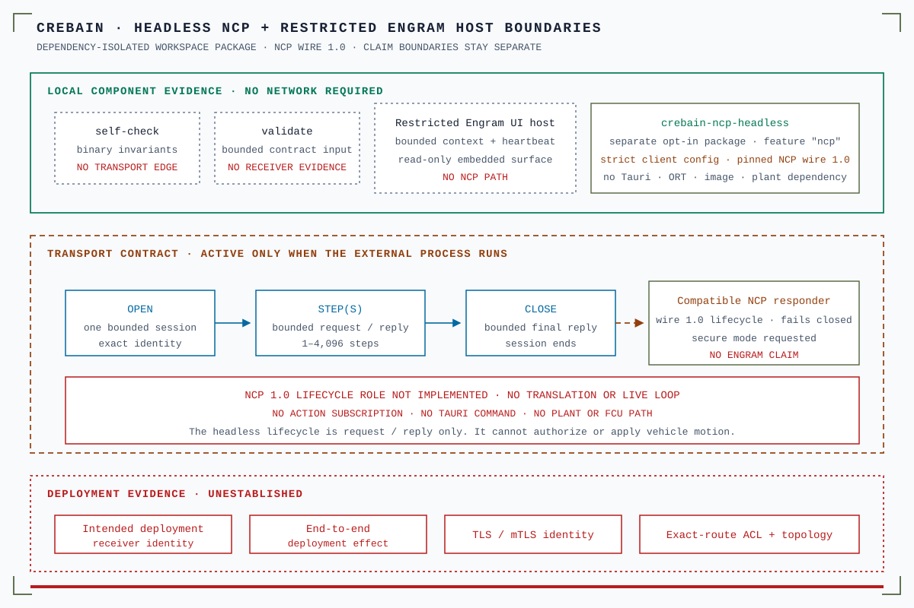

# `src/neuro` — dormant TypeScript NCP glue

<!-- ncp-pin: v1.0.0-rc.1 -->

This directory re-exports the pinned `@sepahead/ncp` package and adds
`guardReplyVersion`, CREBAIN's strict transport wrapper for compatible reply
versions, success kind/session attribution, explicit success status, typed-error
request/session attribution, and NCP scientific-boundary fields.

It is **not imported by any product component or hook today**. No WebSocket is
opened, no session is created, and no always-on CREBAIN↔Engram loop ships from
this directory. The example below is integration guidance, not current product
behavior or performance evidence. A separately gated native Galadriel evidence
producer does not import or activate this TypeScript glue and is not an Engram
action/control loop.

<p align="center">
  
</p>

Text alternative: The feature-gated `crebain-ncp-headless` process uses a strict
client configuration and NCP wire 1.0 (the untagged 1.0.0-rc.1 candidate)
without Tauri, inference, image, or plant dependencies. Self-check and
validation do not cross the transport boundary. Its open, 1–4,096 steps, and
close lifecycle is closed under the candidate, because CREBAIN does not
implement the NCP 1.0 lifecycle role and the pinned ncp-zenoh has no
production-secure identity binding. The separate Engram UI host is read-only and
has no NCP path, and no NCP translator or live CREBAIN↔Engram loop exists. A
validated reply would show only that one compatible responder replied. It would
not prove receiver identity, end-to-end effect, TLS, ACL, scientific validity,
or deployment readiness.

## Single source of truth

NCP wire types, enums, `NeuroSimClient`, and `WebSocketNeuroSim` are owned by
[`sepahead/NCP`](https://github.com/sepahead/NCP). CREBAIN consumes `@sepahead/ncp` at the exact Git commit pinned in
`package.json`. Rust pins `ncp-core` and `ncp-zenoh` to the same commit in
`src-tauri/Cargo.toml`.

Keep `package.json`, `bun.lock`, `src-tauri/Cargo.toml`, and
`src-tauri/Cargo.lock` coherent when upgrading. Do not use incompatible
external Engram examples as the version source. The current CREBAIN pin is the untagged `v1.0.0-rc.1` candidate at commit
`2819dae3b6338bb1df6d105ebb5b7433936a993d` with wire `1.0`.

## Guarded example

Wire 1.0 binds `NeuroSimClient` to a negotiated identity at construction: `new
NeuroSimClient(send, negotiation)`. Every `step`, `run`, and `close` also needs
a `MutationInput` with an operation context and an authority lease, and the
client refuses a mutation for a session it did not open. CREBAIN builds none of
these inputs yet, so this guide shows only the guard composition:

```ts
import { WebSocketNeuroSim, guardReplyVersion } from './neuro'

const transport = new WebSocketNeuroSim('ws://127.0.0.1:28471/api/neurocontrol/ws')
const send = guardReplyVersion(transport.send)
// Each reply's version, kind, session, and generation are checked before a caller sees it.
```

The guard always throws when a success reply lacks a compatible `ncp_version`.
It also throws when the reply lacks the expected kind or session, an explicit
successful `ok` value, or valid scientific-boundary fields. Wire-1.0 typed errors are versioned and carry a registered `code`. When present, `request_kind` and `session_id` must match
the originating request. The SDK then surfaces the denial. There is no
permissive or warning-only mode.

## Transport choices are integration work

- `WebSocketNeuroSim` requires a compatible NCP wire-1.0 responder. The 1.0
  `NeuroSimClient` needs a negotiated identity at construction and a
  `MutationInput` (operation context and authority lease) for every step, run,
  and close; CREBAIN supplies neither yet. No translator or live CREBAIN↔Engram
  loop exists.
- A TypeScript Zenoh `Send` adapter is not implemented here. CREBAIN's robotics
  `ZenohBridge` cannot be assumed to implement NCP query/reply merely because both
  use Zenoh.
- The native Rust NCP module provides a separate feature-gated Zenoh adapter.
  Its action/control Tauri commands also remain unregistered. The same Cargo feature
  contains an independently gated two-route Galadriel evidence producer. See
  [`src-tauri/src/ncp/README.md`](../../src-tauri/src/ncp/README.md).
- The dependency-isolated `crebain-ncp-headless` workspace package builds a
  separate bounded perception process. Its `engram/ncp` default realm does not
  establish compatibility with current Engram.
- Vite development builds separately expose `window.__ncpDrone`, a manual
  in-browser injection harness for wire-shaped command frames. It opens no NCP
  transport or session and is absent from production builds.

For action, a deliberate integration must add a separately reviewed narrow
native plant adapter for the validated `CommandPlant` proposal. The current
callback and TS re-export have no actuator publisher and do not map command
frames to MAVROS.

## Scientific boundary

Returned membrane potential/spikes are raw simulation outputs
(`calibrated_posterior=false`, `is_simulation_output=true`), not a validated
reproduction. A neuro-controller is a control artifact, not a scientific or
safety claim.
